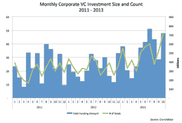
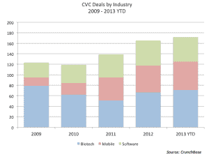
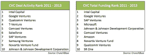
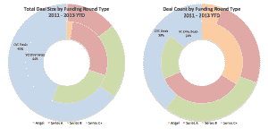
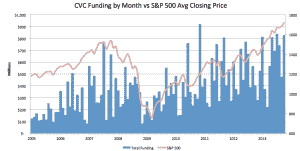

# 企业风险投资者开始变得越来越像私人风投——

> 原文：<https://web.archive.org/web/https://techcrunch.com/2013/11/05/corporate-venture-investors-starting-to-look-a-lot-more-like-private-vcs/>

企业风险投资一直被怀疑地称为“傻钱”，据说对财务表现不太感兴趣，只愿意对战略一致的初创公司下注。然而，CVC 投资在过去几年中大幅增长，许多领先的科技公司正在通过运营越来越像传统私人风投的自主风险投资基金来实现投资多元化。2013 年，CVC 投资的数量和规模都持续上升。2013 年 10 月，CVC 投资者参与了价值超过 7 . 19 亿美元的 48 轮风险投资。这代表了 14%的参与率，是 CrunchBase 数据集中最高的月份。

【T2

过去风投投资的增长往往与商业周期、公司资产负债表的整体实力以及总体风投环境密切相关。因此，CVC 投资在 2013 年上升也就不足为奇了。自 2011 年以来，最活跃的两个 CVC 投资者,[谷歌风投](https://web.archive.org/web/20220813150706/http://www.crunchbase.com/financial-organization/google-ventures)和[英特尔投资](https://web.archive.org/web/20220813150706/http://www.crunchbase.com/financial-organization/intel-capital)一直处于领先地位。2013 年，这两家公司总共进行了 360 轮融资，占 CVC 所有投资的 25%。与 2011 年之前的 CVC 格局相比，这与生物技术热潮形成了巨大的反差，在此期间，[强生&强生](https://web.archive.org/web/20220813150706/http://www.crunchbase.com/financial-organization/johnson-johnson-development-corporation)、[诺华](https://web.archive.org/web/20220813150706/http://www.crunchbase.com/financial-organization/novartis-venture-fund)、[葛兰素史克](https://web.archive.org/web/20220813150706/http://www.crunchbase.com/search?query=SR+One)、[凯泽永久](https://web.archive.org/web/20220813150706/http://www.crunchbase.com/financial-organization/kaiser-permanente-ventures)、[安进](https://web.archive.org/web/20220813150706/http://www.crunchbase.com/company/amgen)和 [MedImmune](https://web.archive.org/web/20220813150706/http://www.crunchbase.com/financial-organization/medimmune-ventures) 都参与了总计至少 1 亿美元的融资。2009 年，CVC 参与的 71 项生物技术交易创下历史新高，而移动和软件 CVC 交易在随后的每一年都在持续增长。这是最近 CVC 资金激增可能改变游戏规则的主要原因。

越来越以科技为导向的风险投资趋势现在与私人风险投资的格局更加一致。近年来，许多大型科技公司都追随谷歌和英特尔的脚步。[微软](https://web.archive.org/web/20220813150706/https://beta.techcrunch.com/2012/07/12/bing-fund-microsoft-launches-its-own-angel-fund-and-incubator-program/)、[通用电气](https://web.archive.org/web/20220813150706/http://www.crunchbase.com/financial-organization/ge-ventures)和[彭博](https://web.archive.org/web/20220813150706/https://beta.techcrunch.com/2013/06/04/bloomberg-beta/)在 2013 年推出了专注于战略投资回报的基金。其他公司风险投资机构，如[高通风险投资](https://web.archive.org/web/20220813150706/http://www.crunchbase.com/financial-organization/qualcomm-ventures)、[康卡斯特风险投资](https://web.archive.org/web/20220813150706/http://www.crunchbase.com/financial-organization/comcast-interactive-capital)和[三星风险投资](https://web.archive.org/web/20220813150706/http://www.crunchbase.com/financial-organization/samsung-ventures)最近也高调参与了对有前途的初创公司的投资，如 [Fitbit](https://web.archive.org/web/20220813150706/https://beta.techcrunch.com/2013/08/13/fitbit-43m/) 、 [Nextdoor](https://web.archive.org/web/20220813150706/https://beta.techcrunch.com/2013/10/29/nextdoor-the-facebook-for-your-neighborhood-lands-60m-from-john-doerr-tiger-global-and-more-to-go-international/) 和 [Pure Storage](https://web.archive.org/web/20220813150706/https://beta.techcrunch.com/2013/08/29/pure-storage-raises-150m-and-sets-for-battle-with-the-storage-giants/) 。虽然私人风险投资可能不欢迎公司现金的涌入，但成功的公司通常可以更快地建立基金，并放弃正常的 SEC 文书工作和外部融资，SAP Ventures 最近推出的 6 . 5 亿美元基金就是证明。也许我们会看到更多像脸书这样的科技公司试图效仿谷歌风投的成功，利用火热的风险投资市场。不管怎样，似乎第一次，企业冒险不再是一种应对行业混乱的保险政策，也不再是一条捷径。

为了比较 CVC 投资者的相对成功，根据 CrunchBase 的数据，整整三分之一从至少一个 CVC 投资者那里获得资金的风险投资公司被收购，相比之下，只有 10%的初创公司只从私人风投那里获得资金。然而，这更多地说明了 CVC 投资者倾向于对成熟的初创企业进行后期投资，而不是真正衡量他们的投资实力。CVC 投资者仍然更喜欢 C 轮或更晚的融资，但不像过去那么多了。自 2011 年以来，39%的 CVC 交易集中在后来的融资轮，占同期 CVC 融资总额的 65%。不足为奇的是，超过一半的非公司风险投资分散在天使轮、A 轮和 B 轮投资中。

发生变化的是，2013 年迄今为止，CVC 轮交易的数量从 27 笔增至逾 100 笔。作为一个比率，A 轮交易处于今年的最高水平。相对于私人风投而言，CVC 交易总体上也有所增长。CVC 2013 年在 Q2 的平均交易规模为 1740 万美元，是上个季度所有其他交易的两倍多。

那么，我们能从 CVC 投资的这些最新趋势中学到什么呢？重要的是要记住，企业冒险的增长总是受制于资产负债表的实力。如下所示，自 2005 年以来，CVC 回合的资金总额密切跟踪标准普尔 500。同样值得注意的是，根据《哈佛商业评论》杂志最近的一篇文章，CVC 项目的平均寿命只有一年左右。公司设立风险投资基金可能更容易，但撤资也容易得多。最后，在企业风险数据*和对构成企业风险投资与直接企业投资的认知方面，存在[明显的差距](https://web.archive.org/web/20220813150706/http://www.globalcorporateventuring.com/article.php/6850/cvc-appears-to-hit-a-data-high)。

尽管有这些因素，但有足够的证据表明，CVC 美元不再只是“傻钱”。寻求后续融资的初创公司应该感到欣慰的是，企业投资者似乎正在介入，填补系列电影的空白。私人风险投资者也应该习惯与公司基金一起投资的想法，并学会相处。

通过查看最新的 CrunchBase 月[月度数据导出](https://web.archive.org/web/20220813150706/http://info.crunchbase.com/about/crunchbase-data-exports/)，你可以亲自了解风投和初创公司在做什么。

* CrunchBase 数据集包括由公司母公司设立的所有知名风险投资实体，以及没有特定风险投资基金的公司(如亚马逊或思科)在 CrunchBase 至少参与了一轮融资的风险投资。

[图片: [Flickr](https://web.archive.org/web/20220813150706/http://www.flickr.com/photos/30559266@N04/9304484918/in/photolist-fbcVcL-8B2isD-9ffdcp-ak1pfg-9tpJPY-dvSZku-882VS3-882W8E-8gQWsa-e37UKu-8mt1k5-87YJWZ-gnryLv-7VpDXf-aL8KoR-bfrg7P-bn7KyG-9hcSpK-aCq85X-bvboGk-fEcQt8-9uSzGV-e6hVY4-9ffhxM-87YMzM-8h5MNM-8h92tY-8h5MzF-dkw7Vg-8gAf4H-7HBYvb-9ffdgp-aCM3dv-8y6CEg-7Zi5QX-8vjiT3-e4VNnX-aPJgYv-7DySWm-7GZQ3V-9Za1wc-8PEruP)