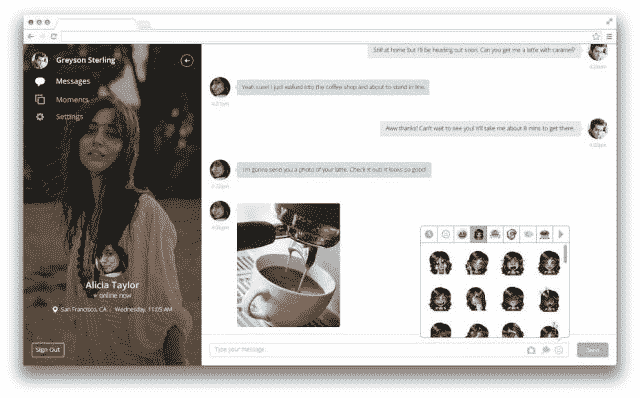

# 情侣应用程序现在允许你在手机和桌面上跟踪你的伴侣 

> 原文：<https://web.archive.org/web/https://techcrunch.com/2013/12/18/couple-now-lets-you-track-down-your-partners-location-recommend-a-date-and-chat-on-the-web/>

支持一夫一妻制的人应该感到兴奋。

两人社交网络 Couple 刚刚推出了一个相对较大的更新，以一种全新的方式整合了位置数据，确保你可以随时监控你的伴侣。

如果通过手机跟踪你的爱人还不够，Couple 还首次推出了一个网络应用程序，让用户可以在桌面上查看他们的时刻并聊天。

在位置方面，Couple 增加了实时信标功能。这允许你向你的伙伴广播你的位置(仅推)，30 分钟后自动停用。创始人 Oleg Kostour 解释说，他希望情侣们能够很容易地找到彼此，但他不想让一个永远在线的定位功能吓跑更年轻、更不忠诚的情侣们使用该应用程序。

更新后，当前用户应该注意到定位操作现在位于第一页的中心，优先于其他一些操作，如拇指吻和实时草图。

与此同时，Couple 还增加了 foursquare 整合功能，用户可以搜索附近的餐馆和其他地方，并向伴侣推荐。最终，Kostour 承诺，合作伙伴将能够创建和共享他们建议去的地方的列表，并保存在历史中供以后参考。

他还解释了为什么该公司在花了近两年的时间只做移动业务后，开始进军桌面领域。

“不管移动有多重要，我们不能忘记大多数人每天在电脑前工作八小时，”科斯图尔说。这种逻辑是有道理的。

也就是说，Couple 现在为网络提供了一个更简单的应用版本，包括聊天和浏览你的时刻的方式。据该公司称，这是向全功能原生桌面应用迈出的第一步。

[夫妇](https://web.archive.org/web/20221206154345/http://www.crunchbase.com/company/couple)于 2012 年从 Y-Combinator 推出，名为 Pair，今年年初更名为 Couple。用户通过该应用程序发送了超过 10 亿条消息。

