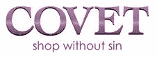
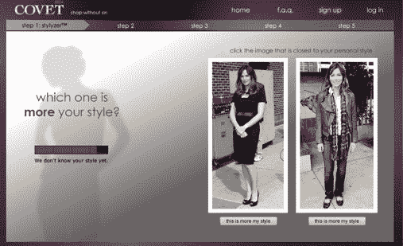
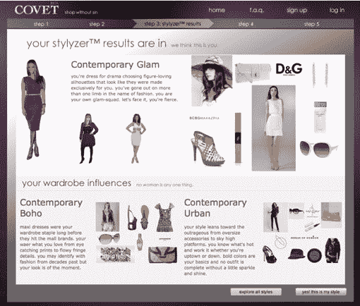

# Covet.com 将成为你的设计师和私人购物者

> 原文：<https://web.archive.org/web/https://techcrunch.com/2009/06/03/covetcom-will-be-your-stylist-and-personal-shopper-in-one/>

# Covet.com 将是你的设计师和私人购物者

在网上购买时装可能是一种压倒性的体验。你不仅可以在像诺德斯特龙和 Saks.com 这样的零售商的电子商务网站上找到无限量的服装，而且还有太多的基于网络的网站提供时尚交易，包括 [Bluefly、](https://web.archive.org/web/20221007194952/http://www.bluefly.com/) [Zappos](https://web.archive.org/web/20221007194952/http://www.bluefly.com/) 和 [ShopBop。我喜欢在名牌和高端服装上淘到物美价廉的东西，但我没有时间去浏览所有这些网站，寻找适合我尺寸和风格的衣服。](https://web.archive.org/web/20221007194952/http://www.shopbop.com/)

带给我们 [Riya](https://web.archive.org/web/20221007194952/http://www.riya.com/) 和视觉购物搜索引擎[Like.com](https://web.archive.org/web/20221007194952/http://www.like.com/)的人们已经推出了[Covet.com，](https://web.archive.org/web/20221007194952/http://www.covet.com/)一个为用户充当免费虚拟个人购物者和伪造型师的网站。Covet 将首先根据你对一系列名人照片和服装的反应来确定你的风格。我发现自己在穿着香奈儿的为安娜·温图尔打扮和穿着紧身裤的林赛·罗韩之间做出了选择。Covet 还通过让用户在代表不同风格的图片之间进行选择来决定你的服装偏好(埃菲尔铁塔对金门大桥，啤酒对香槟)。

在做出一系列决定后，Covet 会要求您指定鞋子和衣服的尺寸，然后根据您的选择给出一个个人资料。风格种类繁多，从前卫的都市风格到运动风格，再到优雅的时装风格，如果 Covet 弄错了，你可以改变它。你也可以编辑你的风格，根据你喜欢的(或讨厌的)品牌、颜色和风格来过滤建议。

一旦你的风格确立，Covet 会每天或每周给你发邮件，告诉你在成千上万的网上商家找到的适合你的风格和你的尺码的衣服和鞋子。电子邮件将包括两个推荐部分:打折商品和全价新货。如果你点击邮件中的商品，你会被带到一个 Covet 登陆页面，在那里你可以点击直接从零售商那里购买商品。Covet 的联合创始人 Munjal Shah 表示，该网站将很快让用户指出建议的商品是否符合他们的风格，Covet 将利用这些知识在未来做出更准确的建议。

Covet 抓取了超过 5000 家零售商的网站，并使用相同的图像识别技术将类似的产品与 Like.com 进行分组。贪图的商业模式也与 Like.com 相似；Covet 以点击付费的方式赚钱。每次用户点击零售商的网站，Covet 都会从中抽取一小部分。同样的模式已经证明[对 Like.com 有利可图，](https://web.archive.org/web/20221007194952/http://www.beta.techcrunch.com/2008/10/21/likecoms-perfect-timing-32-million-series-c-round/)对一家年轻的初创公司显示出稳定的收入增长。2006 年成立的公司[，](https://web.archive.org/web/20221007194952/http://www.beta.techcrunch.com/2006/11/08/riyas-likecom-is-first-true-visual-image-search/)在一年内达到了 100 万美元的年运营率，去年达到了 2000 万美元的收入运营率。沙阿说，Like.com 目前的运营收入远远超过 2000 万美元。

贪图的主要竞争对手是 ShopItToMe.com，另一个网上个性化购物服务。ShopItToMe 要求你只根据品牌和尺码来筛选想要的结果，而 Covet 则根据款式、颜色、品牌、合身程度和尺码来创建个人资料。两者对在线个人购物都很有用，但 Covet 的风格分析为服务增加了一个有趣的转折。我确实认为关于可用产品的日常电子邮件可能会有点垃圾，但这两种服务都允许你选择每周接收一次或两次提醒电子邮件，而不是每天。