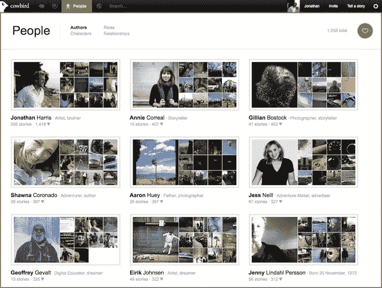
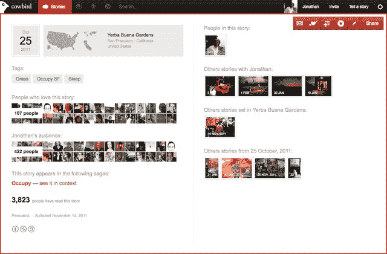

# Cowbird 是一个了不起的故事讲述者的社区，也是热爱互联网的另一个原因 TechCrunch

> 原文：<https://web.archive.org/web/https://techcrunch.com/2012/02/15/cowbird-is-a-community-for-amazing-storytellers-and-another-reason-to-love-the-internet/>

# Cowbird 是一个了不起的故事讲述者的社区，也是热爱互联网的另一个原因

还不熟悉数字故事平台 [Cowbird](https://web.archive.org/web/20221006182500/http://cowbird.com/) ，尽管最近有来自 [Wired](https://web.archive.org/web/20221006182500/http://www.wired.com/geekdad/2012/02/cowbird-stories/) 和 [The Washington Post](https://web.archive.org/web/20221006182500/http://www.washingtonpost.com/lifestyle/style/cowbird-sets-photos-to-song/2012/02/07/gIQAubgV4Q_story.html) 的热情报道？

好吧，如果你像我一样喜欢阅读，看或听一个好故事，你会非常高兴我今天向你介绍这个网站。

顺便说一句:我很高兴我的上一篇 TechCrunch 帖子是关于类似牛鸟的东西，因为这是让我对互联网的存在充满感激的事情之一。

简单来说，Cowbird 是一个你可以去讲述一个你认为值得与更广泛的好故事爱好者社区分享的故事的地方。这个想法是让人们根据他们自己的经验，使用文本、照片和声音或它们的混合来讲述简短的位置标记的故事。你的故事越个人化、越真实，它就越能引起相对较小的牛仔社区的共鸣。

我在下面添加了一些截图，让你了解它的样子。

几周前，当我看到这个项目的创始人，令人作呕的有趣的美国数字艺术家和企业家 Jonathan Harris 在最近的 DLD 会议上谈论牛鸟时，我注册了。从那以后，我每天都会在收件箱里收到一些真正令人惊叹的故事。

这不仅仅是因为故事很棒，还因为 Cowbird 设计精美，简单但互动，是一个似乎一直在运动的仓库，一个欢迎深度的地方。

如果我还没有说服你[请求邀请](https://web.archive.org/web/20221006182500/https://cowbird.com/request-invite/)加入这个项目，你就没有希望了。:)

我说项目了吗？截至昨天，Cowbird 是一家[公司](https://web.archive.org/web/20221006182500/http://blog.cowbird.com/post/17611542231/cowbird-inc-a-love-story)。

我让哈里斯告诉我更多关于牛鸟的事，这是他给我的回复:

> 我们有三个主要目标:第一个目标是创造一个更深入、更持久的自我表达空间，这是你在网上任何地方都找不到的。二是开创一种新形式的参与式新闻，以重大新闻事件背后简单的人的故事为基础。第三是建立一个人类经验的公共图书馆——一种生活经验的维基百科。
> 
> 我们对任何事情都采取缓慢而慎重的态度。未来的作者可以通过告诉我们他们是谁以及他们想讲述什么样的故事来请求邀请。我们亲自联系每一位新作者，欢迎他们加入我们的社区。在 Cowbird 上讲故事对你的要求比在手机上发推文多一点，但我们认为它也回报了更多。
> 
> 是灵魂食物，不是快餐。

看看吧，伙计们，你不会后悔的。

