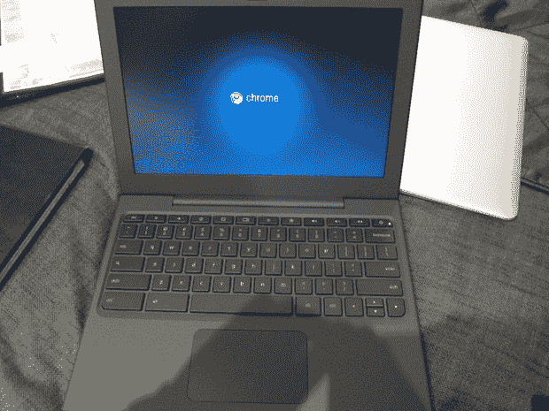
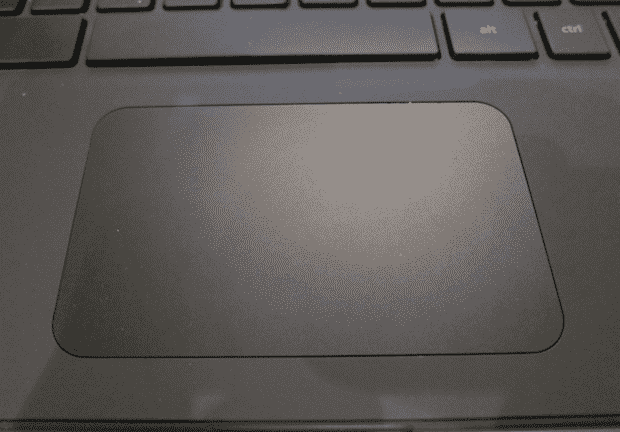
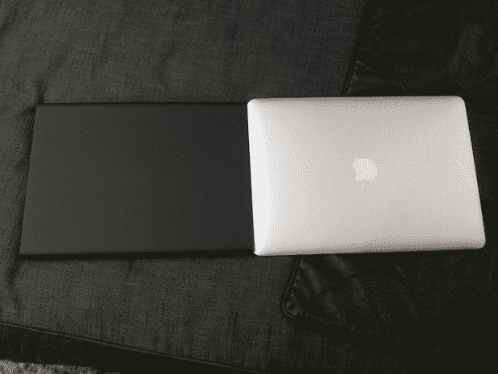
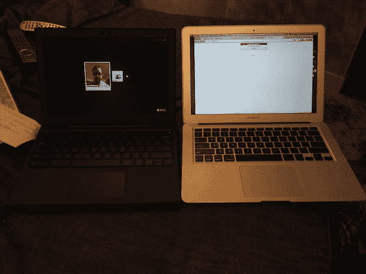

# Cr-48 上路:Chrome 笔记本既闪亮又黯淡

> 原文：<https://web.archive.org/web/https://techcrunch.com/2010/12/12/cr-48-chrome-notebook-review/>

每项技术都有好的和不好的属性。没有什么是完美的。iPhone 也不行。(好吧，至少在美国电话电报公司独占结束之前不会。)但直到三天前，我还从未使用过同时兼具令人疯狂的棒和令人震惊的糟糕属性的产品。欢迎来到这个世界，Cr-48。

现在，谷歌已经明确表示，他们不打算发布这款产品。因此，他们或多或少地要求那些他们发送给他们的人不要将它视为一个完整的产品。但这里几乎不可能避免谈论硬件，因为对我们大多数人来说，它是我们进入 Chrome OS 的第一个也是唯一的入口。另外，我们的读者对这种特殊的设备很感兴趣，所以我要谈谈它。

简单来说:硬件相当差。实际上，也许与其说是坏，不如说是烦人的 T2。但它如此令人讨厌的唯一原因是因为 Chrome OS，即使在其非常早期、相当粗糙的阶段，也是好的 T4。嗯，*潜在的*那好。

Jason 在使用这款设备一天后写下了他最初的想法，而我用它作为我的主要机器已经有三天了。此外，由于我目前正在旅行，我可能会有不同的观点——这是 Chrome 笔记本应该非常适合的。

**设计**

最初，当我把它从盒子里拿出来时，我有点想嘲笑 Cr-48。Jason 将它的外观与旧的 12 英寸 PowerBook G4s 进行了比较。但实际上，我认为它更接近于一台旧的 12 英寸 iBook 和上一代 MacBooks 之一的组合——黑色的那种。事实上，当你打开它并开始在上面打字时，它感觉与那台 MacBook 非常相似。

当然，MacBook 也已经有几年的历史了。与[新款 MacBook Air](https://web.archive.org/web/20230404064607/https://techcrunch.com/2010/10/26/13-inch-macbook-air-review/) 相比，这东西看起来像一只臃肿的狗。一个被某种橡胶毯覆盖着。事实上，它有一个 VGA 端口，一个丑陋的风扇侧格栅，但只有一个 USB 端口，这没有帮助。

但是，这是一个原型设备。所以我们必须放谷歌一马。据我所知，他们还没有说他们的哪个制造伙伴制造了这个东西，但让我们希望这是他们生产的最便宜的设备，这就是它存在的原因。

我真的希望是这样。

**设置**

好吧，所以我把它从盒子里拿出来笑了。但后来我打开了盖子。立刻，这东西启动了。不需要按电源键。15 秒钟后，它带我浏览了一个非常简单易懂的关于如何使用 Chrome OS 的教程。看了几分钟后，我被要求用内置相机(在屏幕上方)给自己拍一张照片(作为我的个人资料图片)，然后我就准备好了。就是这样。

我用我的谷歌账户登录，浏览器启动了。我的书签、扩展和 web 应用都已自动同步。我几乎立刻就准备好了。

现在我被打动了。印象深刻。这绝对是计算机设置的未来。

**触控板**

但当我开始使用 Cr-48 触控板时，这段恋情很快变得不愉快。杰森称之为“狗屎”，但我认为这太客气了。这可能是任何人在过去五年里为一项技术创造的最糟糕的借口。它比我最近记忆中用过的任何其他触控板都差得多，几乎令人难以置信。几周前的那些错误报告现在有意义了。

尽管需求很高，但谷歌根本不卖 Cr-48 也是有道理的。如果他们出售这款带有触控板的产品，谷歌可能永远不会被允许尝试制造另一款品牌产品。如果你觉得我夸张了，就用一个。

每当我指向某个东西并点击向下时，光标就会移动到我原来指向的位置的下方或上方。我现在已经教会自己把目标定得比我想点击的地方稍微高一点或低一点。但我必须猜测它会是哪一个。这是一次冒险。

试图用两个手指双击就更糟糕了。如果你习惯于在 MacBook 上轻松随意地做这件事，这将是你的地狱。为了让它发挥作用，你基本上必须将两个手指举到空中大约一英尺，然后以非常直线的速度快速放下，同时确保它们完全同时击中垫子。好吧，我可能有点夸张了，但真的很糟糕。

双指滚动？如果你喜欢毫无理由地随意跳转到网页的各个部分，那就完美了。

好吧，我已经表达了我的观点。这个触控板是个耻辱。这是令人憎恶的。我不知道是硬件还是软件或者两者都有(可能)，但就是太可怕了。我很想做一件不可思议的事情:[买一只老鼠](https://web.archive.org/web/20230404064607/https://techcrunch.com/2010/07/27/the-mouse-is-dead/)。

**键盘**

继续前进。所以，触控板很快让我的 Chrome OS 体验变得糟糕。但是在我想出一些小技巧来更好地操作(主要是使用优秀的键盘和快捷键)之后，我又回到了正轨。过了一天，我很沮丧。但两天后，我真的真的很喜欢 Chrome OS。甚至是 Cr-48 的某些细节。

例如，每台电脑绝对应该有一个搜索按钮来代替大写锁定。我都不记得上次用大写锁定是什么时候了。然而，它就在那里，就在键盘上的一个重要位置。在 Cr-48 上，我认为搜索键可以和空格键媲美，是我最常按的键。你点击它，它就会启动一个新的选项卡，在 omnibox 中进行搜索。太棒了。

Cr-48 上的窗口切换和全屏模式按钮也很棒。OS X 的 Spaces 本质上允许你进行这种类型的窗口切换，但我认为它在 Chrome OS 上更好，因为一切都被简化了。如果你想打开一个新窗口(相对于新标签)，它将驻留在另一个屏幕上。也就是说，如果你打开了两个以上的窗口，导航就有点棘手了——点击按钮会按顺序在它们之间循环。

全屏模式在 Chrome 上已经存在了一段时间，但键盘快捷键使它比以往任何时候都更容易使用。在较小的屏幕上(如 Cr-48 上的 12 英寸)，它非常漂亮。

**速度**

速度是 Cr-48 的另一个主要弱点。它运行的是英特尔凌动芯片，显然主频为 1.66 GHz。这看起来似乎足够运行网络浏览器了，但事实并非如此。如果你开着闪光灯做任何事就不会了。

当[我们最初报道 Cr-48 用户遇到的 Flash 问题](https://web.archive.org/web/20230404064607/https://techcrunch.com/2010/12/09/chrome-os-notebook-flash/)时，许多我们最喜欢的评论者(他们可能会也可能不会[以开发 Flash 为生](https://web.archive.org/web/20230404064607/https://techcrunch.com/2010/11/11/flasher-on-the-loose/))很快给出了典型的“偏见！”废话。当然，几个小时后，不是别人，正是 Adobe 自己[承认](https://web.archive.org/web/20230404064607/http://blogs.adobe.com/flashplayer/2010/12/flash-player-for-chrome-notebooks.html)Cr-48 上的 Flash 性能是不可接受的，并表示他们正在努力。

很好，因为除了在没有打开其他标签的情况下观看一小段 YouTube 剪辑之外，Flash 在 Cr-48 上基本上是不可用的。这很烦人，因为谷歌已经决定不仅将 Flash 植入 Chrome，还将它植入 Chrome 操作系统。所以像 Flash Block 这样的扩展是你的朋友——或者去 about:plugins，直接禁用 Flash，直到 Adobe 解决了这个问题。

但是，即使除了 Flash 之外，Cr-48 与任何其他现代计算机相比也感觉非常慢。例如，在 WordPress(我现在正在使用的网站)这样的网站上，打字经常滞后。打开新的标签页和窗口要比在普通机器上多花几秒钟。

所有这些似乎都是因为谷歌在 Cr-48 中只包含了 2 GB 的内存。但我有一台只有 2 GB 内存的 MacBook Air，它能飞。谷歌真的需要与他们的 OEM 合作伙伴合作，在这些 Chrome 笔记本开始发货之前解决这个滞后问题。我不得不相信他们会的。

**超越原型**

事实上，在很多方面，Cr-48 让我想起了 G1，这是几年前谷歌(与 HTC)合作推出的第一款安卓手机。很明显，它们都是将快速发展的平台的第一步。Cr-48 甚至有点像摸起来像 G1 的 T4。

我还有一个 G1。现在看看它与较新的 Android 手机相比，是非常幽默的。该平台显然已经走过了漫长的道路。这也让我对 Chrome 笔记本充满了希望。

就目前而言，Cr-48 有两点非常突出:启动时间和电池寿命。两个都很优秀。

Cr-48 从关闭到登录屏幕只需 15 秒。这略高于谷歌宣称的 10 秒大关，但仍然非常非常好。当你登录后，还需要 15 秒左右的时间从网上加载你所有的个人资料和 Chrome 偏好设置。所以你看到的是 30 秒内从零到工作的总时间。

相比之下，新的 MacBook Air 采用了新的固态硬盘，从零到工作只需大约 18 秒。但这还不包括启动 Chrome(或者你在 OS X 上选择的浏览器)并等待它加载页面。这又增加了大约 5 秒钟。所以这两个系统的启动速度非常接近。再说一次，那是在谷歌的原型机上。

但是正如我在上面提到的，空气在 Cr-48 的其他方面都表现出色。

Cr-48 似乎确实比 MacBook Air 强的一个方面是电池寿命。谷歌声称 8 小时，但我认为实际上可能更多。因为我在欧洲，所以我关闭了手机天线(因为威瑞森的连接显然在这里不行)，当连接到 WiFi 时，我看到充满电的电池寿命接近 10 小时。MacBook Air 的电池寿命也很长，但 Cr-48 肯定更好。

再一次，想象一下，当有人真的制作了一个他们打算出售的 Chrome 笔记本时，这意味着什么。Cr-48 有点笨重，但如果他们把它缩小到空气大小，我敢打赌他们仍然可以从系统中获得至少 7 个小时或更多的时间。这似乎是只运行浏览器的一个巨大好处。

**Chrome OS**

最后，我们来谈谈浏览器。当 Chrome OS 被披露比 Chrome 多不了多少时，相当多的人感到震惊——仅此而已。但这种简单正是操作系统的优势。它清除了几层垃圾，这些垃圾是大多数人现在在电脑上从来不用的。

我知道，就我个人而言，现在我在电脑上做的事情大约有 95%是在网络浏览器中完成的。在另外的 5%中，有 4%可能也可以在浏览器中完成(轻度图像编辑、做笔记等)。剩下的百分之一更难，但这些主要是我只需要花一些时间做的事情(iTunes 媒体管理，Photoshop ),并且可以用台式机来做。

问题在于:Chrome 操作系统不会很快完全取代任何人的桌面。但它可能会成为一个非常可行的移动计算解决方案。

即使在目前的测试阶段，Chrome OS 在过去三天里也绝对是一个完美的旅行伴侣(Cr-48 触控板除外)。而且只会越来越好。如果 Chrome(浏览器)的发展有任何迹象的话，它会变得更好*非常*快。

**面板**

正如 Jason 在他的帖子中提到的，Chrome OS 最有趣的事情之一是开发者如何支持它。目前，大多数 Chrome 网络商店应用程序都只是稍微美化了一下的扩展，或者只是已经存在的网络应用程序的链接。与此同时，Chrome OS 最酷的功能之一面板几乎没有被使用。开发人员可以也应该迅速改变这种情况。

**美化**

另一件目前困扰我的事情是，谷歌似乎决心保持一些 Windows 糟糕的美学。更直接:字体看起来像屎。

正是因为这个原因，Mac 上的 Chrome 看起来比 Chrome OS 好得多。随着 Chrome 操作系统的推进，希望谷歌能在这方面做些改进。

此外，顶部工具栏(标签右侧的区域)的外观也很糟糕。谷歌可以也应该在这方面做得更好。

当我们谈到这个话题时，Chrome 已经很危险的主题在 Chrome 操作系统上看起来更加糟糕。谷歌应该只坚持一些简单的颜色选项，并省去所有的废话。不，我不希望我的 Chrome 操作系统看起来像一个冰淇淋蛋糕，就像我不希望 Windows 看起来像一个热狗摊一样。当然，这只是我的看法。

**连通性**

阻碍 Chrome OS 的最大因素基本上不在谷歌的控制之内:WiFi 基础设施。虽然 WiFi 相当普遍，但还远未普及。而 Chrome OS 没有连接就一文不值。我是说，这完全没用。

这正是谷歌与威瑞森合作提供后备 3G 连接的原因。但是除了他们每月免费给你的微不足道的 100 MB 之外，仅仅是为了使用你的电脑，这种连接很快就会变得昂贵。

此外，许多交易将不得不在不同的国家进行，以达到这种连接水平。这就是为什么我的 Cr-48 在欧洲还不能完全上路的原因(这里没有威瑞森)。

那么当你在没有连接的情况下启动 Chrome 笔记本会发生什么呢？那么，你会得到一个错误——一个非常令人困惑的错误。在过去的几天里，这种情况在我身上发生过几次。我启动电脑，输入我的密码，它说我的密码有问题。只是那不是真的。只是我没有连上网络，所以它无法*验证*我的密码(谷歌确实需要更改那里的措辞)。

这里的问题是，如果你在一个有密码的网络上，你必须以访客身份登录到 Chrome OS，连接到网络并填写密码，然后注销并重新登录到你的谷歌账户。一种痛苦。这是很多用户会反复经历的事情。

**联网的电脑**

因此，虽然谷歌首席执行官 Eric Schmidt 说[世界现在已经为 Chrome 操作系统](https://web.archive.org/web/20230404064607/http://googleblog.blogspot.com/2010/12/cloud-computing-latest-chapter-in-epic.html)做好了准备，但我认为我们至少还需要一年——也许几年——才能让这种系统对大多数普通消费者可行。但我认为谷歌现在愿意冒险帮助这一转变，这太棒了。

当然，如果他们领导这个新的计算时代，他们的回报看起来是巨大的。而且风险相当小。即使 Chrome OS 需要一段时间才能起飞，谷歌也有足够的资本让这个项目持续很长时间——就像他们最初对 Android 所做的那样。

在许多方面，智能手机已经并将继续帮助我们实现这一转变。总是连接到网络的假设现在已经成为我们日常生活的一部分。当你不联网时，智能手机有什么用？可能只是为了玩一些游戏。计算机最终也会如此。直到游戏也完全上线——这是 Chrome 网上商店正在努力实现的目标。

我认为没有人不同意始终连接到互联网的计算机是未来，只是谷歌现在用这些机器将它发挥到了极致。要么有网络，要么什么都没有。很大胆。

**价格**

虽然谷歌还没有声明他们(和他们的 OEM 合作伙伴)打算以多少价格出售 Chrome 笔记本，但这个价格将是至关重要的。显然需要低一点。非常低。

如果谷歌想让这些电脑与 Windows 电脑竞争，低于 500 美元的价格应该就能做到。如果他们能以 300 美元左右的价格推出比 Cr-48 更好的硬件，我认为他们将在下个假期销售一吨。

谷歌不断重申他们希望 Chrome 操作系统也能在其他平台上运行。你可以想象运行 Chrome 操作系统的台式机可能非常适合学校和图书馆。谷歌当然可以将谷歌应用捆绑在一起。见鬼，我甚至可以看到他们补贴 Chrome 笔记本电脑的成本，让那些致力于谷歌应用的特定学区的所有学生都可以使用它们。

事实上，Chrome 笔记本的一个大竞争对手可能会是新款 MacBook Airs。两家公司现在都试图[重新定义](https://web.archive.org/web/20230404064607/https://techcrunch.com/2010/10/15/new-macbook-air/)便携式计算到底是什么。不可否认，Air 在外观和手感上都比 Cr-48 性感得多。但也可能要几百美元——在某些情况下甚至可能要贵上一千美元。

同样，这就是为什么谷歌需要确定价格点，并与他们的 OEM 合作伙伴一起确定执行价格。我有些怀疑这是否会发生，但即使是一个平庸的 Chrome 笔记本也应该给低端 Windows 机器带来相当大的压力，至少如此。正如我一年前写的那样，这将是[对微软的挤压](https://web.archive.org/web/20230404064607/https://techcrunch.com/2009/11/23/chrome-os-microsoft-windows/)。

**重新离线**

为了完成这篇文章，我实际上从 Cr-48 搬回了我的 MacBook Air。一个原因是打字速度慢得让我发疯。另一个原因是 Chrome 操作系统的图像插入和图像管理仍然很棘手。所以我回到了一台不仅仅只有浏览器的机器。

这实际上是我三天来第一次大量使用这台机器。看到浏览器缩小成一个窗口有点怪怪的。实际上，我更喜欢全屏显示(这在装有 Chrome 浏览器的 Mac 或 PC 上很容易做到)。有点奇怪的是，我其实不喜欢看到所有的，是的，chrome。有什么意义？

当然，我确实珍惜这种空气相对于 Cr-48 的速度。哦，还有触控板。天哪触控板。真的有用！这是一件美好的事情，我再也不会想当然了。

所以，我现在对谷歌首次推出 Chrome 笔记本颇有微词。既精彩又令人困惑。既是未来，也是噩梦。但它绝对不无聊，这比你现在对很多“新”技术说的还要多。看着它成熟会很好玩。但首先硬件需要成长。

如果我现在可以买 Cr-48，我会买吗？没有。但我会下载 Chrome 操作系统，安装在一些便宜的上网本上。或者甚至是这台 Macbook Air…

