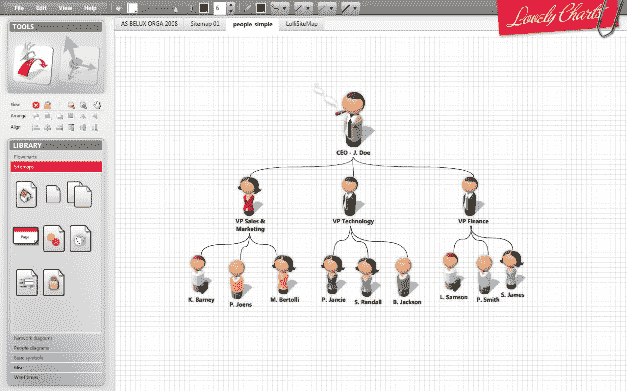
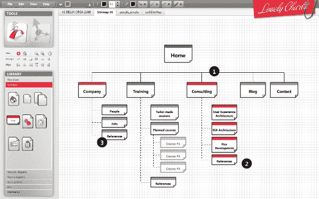

# 使用 lovely charts TechCrunch 在网络上创建令人惊叹的图表

> 原文：<https://web.archive.org/web/http://techcrunch.com/2009/02/09/create-stunning-diagrams-on-the-web-with-lovelycharts/>

# 使用 LovelyCharts 在网络上创建令人惊叹的图表

如果你曾经寻找一个简单、直观的在线图表创建工具，你就会知道找到它有多难。[lovey charts](https://web.archive.org/web/20230202232831/http://www.lovelycharts.com/)是一个全新的应用程序，准备成为令人惊叹的流程图、网站地图和线框的默认在线绘图工具。

像[格里菲](https://web.archive.org/web/20230202232831/http://www.gliffy.com/)、[Flowchart.com](https://web.archive.org/web/20230202232831/http://www.flowchart.com/)和 AutoDesk 的实验性 [Draw](https://web.archive.org/web/20230202232831/http://draw.labs.autodesk.com/ADDraw/draw.html) 项目一样，该应用程序允许你在浏览器中通过拖放功能创建图表和更多内容。LovelyCharts 与其他在线服务的主要区别在于，它实际上让你复杂的流程看起来棒极了。更好的是，它是完全免费的，从上周开始，任何人都可以使用它。

就功能而言，LovelyCharts 几乎涵盖了所有的基础知识，但你真的需要尝试一下，才能感受到这款基于网络的应用有多丰富，即使它的功能集相对简单。您可以绘制、对齐、插入符号和图标、捕捉、缩放、导入和导出等–为了更好地进行概述，请查看[教程](https://web.archive.org/web/20230202232831/http://www.lovelycharts.com/?page=tour)和(由于某种原因不可嵌入)[截屏](https://web.archive.org/web/20230202232831/http://www.lovelycharts.com/screencast.php)。我唯一的抱怨是，该应用程序有时并不总是像我希望的那样快，而且没有办法上传和插入自定义符号，尽管后一个功能正在进行中。

还有一个专业版的 LovelyCharts 可供€29 一年使用，它允许用户维护和合作任意多的图表，并具有完整的历史管理，共享功能和通知设置。

LovelyCharts 主要是一个人的表演，由 RIA 开发人员和用户架构师 jérme Cordiez 从 [This Is Lovely！](https://web.archive.org/web/20230202232831/http://www.thisislovely.com/)。项目完全是自举的，很牛逼。

