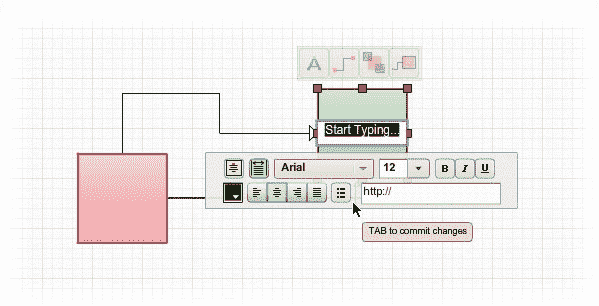

# Creately 向大众发布其简单的图表和设计工具 

> 原文：<https://web.archive.org/web/https://techcrunch.com/2009/09/03/creately-releases-its-simple-diagramming-and-design-tool-to-the-masses/>

# Creately 向大众发布了简单的图表和设计工具

[Creately，](https://web.archive.org/web/20221206000530/http://creately.com/)一款由 [Cinergix](https://web.archive.org/web/20221206000530/http://www.cinergix.com/) 推出并在 2008 年 TechCrunch50 的 Demopit 上展示的在线绘图和设计应用程序，正在向更多公众推出其在线工具(该初创公司一直处于私下测试阶段)。Creately 允许任何人在其网站内创建流程图、线框、网络图、网站地图等，并就此进行协作。

Creately 应用程序的关键是设法利用传统设计和图形软件提供的功能和工具，但将这一功能打包在一个易于使用的应用程序中，允许用户之间的协作。

[的设计特点](https://web.archive.org/web/20221206000530/http://creately.com/features)多种多样，但相对易于使用和直观。例如，[上下文工具栏](https://web.archive.org/web/20221206000530/http://creately.com/help/Contextual-Toolbar)在您点击绘图画布上的任何对象时出现，根据对象及其大小，将提供工具栏内所有常用的操作。合作是设计过程的另一个关键部分，联合创始人 Charanjit Singh 说，所以这家初创公司内置了评论、分享、发布、嵌入和直接发布到 Twitter 的能力。另外，它的许多产品都是免费使用的。

通过此次公开发布，Creately 还公布了其定价模式和货币化战略。Creately 将提供一个免费计划，让用户制作无限量的公共图表，这些图表可以发布在 Creately 上，任何人都可以看到。免费客户被限制为最多 5 个合作者，所有图表将与 Creately 标志发布。图表也可以被嵌入和共享。付费版本将提供无限量的私人托管的图表，不会有 Creately 的标志。但目前还不清楚 Creately 的付费版本将花费多少钱，我们已经联系了该公司以获得进一步的解释。

微软提供了一个设计程序， [Visio，](https://web.archive.org/web/20221206000530/http://office.microsoft.com/en-us/visio/default.aspx)与 Creately 功能相似，但使用起来更复杂，而且不是基于网络的。