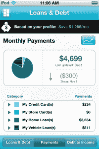

# Credit 芝麻街为 iPhone 带来您的信用评分。免费。

> 原文：<https://web.archive.org/web/http://techcrunch.com/2011/12/14/credit-sesame-brings-your-credit-score-to-the-iphone-for-free/>

个人金融服务【以及科技博客 TechCrunch Disrupt(交易代码:T1)】T2【信用芝麻】交易【交易代码:将于今日发布其[首款移动应用【交易代码:，用户可以通过该应用即时了解当前的财务状况和信用评分。免费。我说的“免费”并不是指*中的“免费”，但如果你不看细则，我们会帮你注册我们的月度服务。*](https://web.archive.org/web/20230209124825/http://itunes.apple.com/app/credit-sesame-the-best-way/id476718980?mt=8)

*我的意思是像在自由中一样自由。*

 *对不熟悉 Credit 芝麻街的人来说，这家年轻的初创公司可以帮助用户更好地了解他们的个人财务状况。但和 Mint 不同，Credit 芝麻街主要关注信用和贷款，Mint 专门调查一个人的银行账户、投资、预算、目标和贷款。这家公司使用与银行相同的技术，能够分析用户的全部债务情况，然后推荐各种贷款和信贷选项，可以为他们省钱。

不过，Credit 芝麻街的销售线索挖掘并不收费，所以它不仅仅是为了创收而将客户信息交给银行和借款人。相反，它只在客户注册了它的一个推荐时才收到付款。

通过新的移动应用程序，客户将能够做许多以前只能通过网站做的事情，包括注册帐户、访问您的财务信息、检查您的信用评分、查看您的可用信用和债务支付等。值得注意的是，当你通过应用程序检查你的信用评分时，它不会影响你的信用，例如，当一家公司为你进行信用检查以确定你是否有资格申请新的信用卡、储蓄卡或贷款时，它会影响你的信用。分数来自 [Experian](https://web.archive.org/web/20230209124825/http://www.experian.com/) 。

目前，消费者可以利用这些信息对他们的财务健康状况有一个大致的了解，但在未来，信用芝麻将提供更具体的指导。(“能给我一张梅西卡吗？”，“我能买这辆车吗？”是我想到一些例子)。

[Credit Sesame](https://web.archive.org/web/20230209124825/http://www.creditsesame.com/) 使用 VeriSign 和 McAfee 认可的银行级安全技术保护您的信息，通过 PIN 码保护移动用户的数据，如果您的手机丢失或被盗，您可以关闭移动访问。此外，尽管该服务在注册时需要您的社会安全号码，但这些信息不会存储在手机上。

据创始人阿德里安·纳扎里(Adrian Nazari)称，这家初创公司帮助三分之二的人找到了“大量”储蓄，即使不是每个人都选择按照它的建议行事。他不会透露用户群的规模，但暗示现在已经达到了六位数。今年 3 月，[公司从 Menlo Ventures](https://web.archive.org/web/20230209124825/https://techcrunch.com/2011/03/09/credit-sesame-raises-6-15-million-helps-users-manage-credits-and-loans/) 获得了 615 万美元，此后一直稳步增长。

这款移动应用首先适用于 iPhone，但 Android 应用将很快推出。你可以[在 iTunes 上从这里](https://web.archive.org/web/20230209124825/http://itunes.apple.com/app/credit-sesame-the-best-way/id476718980?mt=8)下载新应用。*