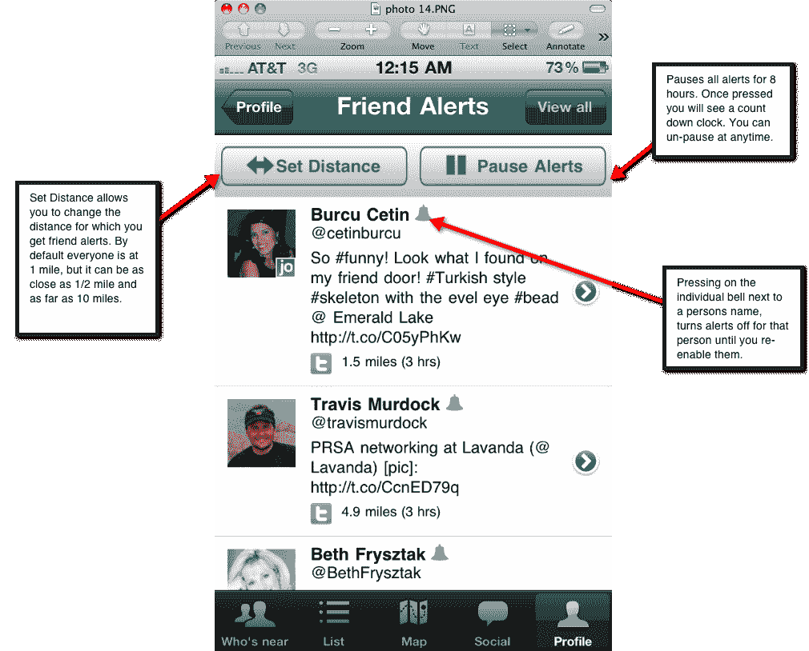

# 当你的朋友在附近时，令人毛骨悚然/令人敬畏的班卓琴应用程序现在会向你发送 Pings

> 原文：<https://web.archive.org/web/http://techcrunch.com/2011/10/27/creepyawesome-banjo-app-now-pings-you-when-your-friends-are-nearby/>

# 当你的朋友在附近时，令人毛骨悚然/令人敬畏的班卓琴应用程序现在会向你发送 Pings

社交发现服务 [Banjo](https://web.archive.org/web/20230205004744/http://ban.jo/) 在今年夏天早些时候推出了 iPhone 和 Android 的跨平台移动应用，它刚刚推出了一种新的方式来跟踪你的朋友在哪里以及他们在做什么:自动朋友提醒。不像你在 Foursquare 上看到的提醒，每当一个朋友在某个地方登记时，你就会收到提醒，这个朋友提醒功能在整个社交网络上都有效。更重要的是，只有当你的朋友实际上在*附近*时，它才会困扰你。

你知道什么最烦人吗？Foursquare 告诉我，当我坐在办公桌前试图完成一些工作时，我在市区的朋友刚刚入住星巴克。我就是不在乎。但是当我外出时，我也很想知道我的朋友在哪里。也许我是那个在星巴克登记入住的人，而我的朋友正在离我家不远的地方为返校购物。*(好吧，是的，我很无聊。如果你有更精彩的生活，请在这里随意插入“酒吧”、“夜总会”或“餐厅”。但是我怎么知道我的朋友就在附近呢？直到现在，我可能都不会。*

跟踪你朋友的活动通常更像是一种手工操作——有点像跟踪者的活动。你必须启动谷歌纬度或苹果新的“寻找我的朋友”应用程序。你必须时刻关注你的脸书、Twitter 和 Foursquare 的更新。更有用的是一种服务，它可以简单地告诉你你的朋友什么时候离你只有一个街区(或者 5 英里远——在 Banjo 中，这个选择取决于你)。

现在的[班卓琴](https://web.archive.org/web/20230205004744/http://ban.jo/)就是这么做的，很牛逼。该服务连接到你的脸书、Twitter、Foursquare 和 Gowalla 账户，当朋友在你指定的半径范围内时，它会向你发送推送通知(在 iOS 和 Android 上)。当你不想被打扰时，你可以完全关闭提醒，或者只需轻轻一点就可以暂停提醒。您甚至可以关闭个别朋友的提醒。简单，但非常有用。

*(请注意，指定警报半径的功能将在几天后推出。然而，朋友提醒他们自己现在是现场直播)。*

刚刚宣布已经拥有 30 万用户的 Banjo ，也可以通过 TwitPic 和 Instagram 上发布的地理标记更新找到附近的人。到目前为止，这些网络仅用于发现目的，而不是提供警报。

该应用可在 iTunes 或安卓市场下载[。](https://web.archive.org/web/20230205004744/http://itunes.apple.com/us/app/ban-jo/id417076117)

