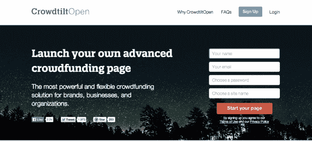

# Crowdtilt 公开推出其开源、可定制的众筹平台，现名为 crowd tilt Open 

> 原文：<https://web.archive.org/web/https://techcrunch.com/2014/02/20/crowdtilt-publicly-launches-its-open-source-customizable-crowdfunding-platform-now-called-crowdtiltopen/>

众筹平台 [Crowdtilt](https://web.archive.org/web/20221006230813/https://www.crowdtilt.com/) 刚刚从 Andreessen Horowitz 和其他人那里获得了 2300 万美元的 B 轮融资，从今天开始向所有感兴趣的企业用户开放其开源、白标平台 [CrowdtiltOpen](https://web.archive.org/web/20221006230813/https://open.crowdtiltopen.com/) 。这款产品[之前被称为 Crowdhoster](https://web.archive.org/web/20221006230813/https://beta.techcrunch.com/2013/08/22/crowdtilt-launches-crowdhoster-a-wordpress-for-crowdfunding-to-let-anyone-create-and-customize-their-own-campaign/) ，已经更名并重新推出，为那些希望更好地定制和自行举办自己的筹款活动的人设计了更多功能。

该公司最初于去年 8 月推出了使用 Crowdtilt API 构建的 Crowdhoster，并进行了私人测试。迄今为止，它已经在其平台上看到了数百个项目，其中一些更值得注意的是 YC 支持的营养替代品初创公司 [Soylent](https://web.archive.org/web/20221006230813/https://campaign.soylent.me/soylent-free-your-body) ，它筹集了超过 210 万美元；软件公司 GNS3 筹集了 30 万美元以上；以及一个名为[免疫项目](https://web.archive.org/web/20221006230813/https://pledge.immunityproject.org/the-free-hiv-aids-vaccine)的健康众筹活动，筹集了超过 45 万美元。

在 12 月讨论 Crowdtilt 的融资时，首席执行官詹姆斯·贝沙拉解释说，他看到了它和 WordPress 之间的许多相似之处，称其为“众筹的 WordPress”，事实上，企业可以添加自己的品牌、徽标，甚至修改开源代码。(另外值得注意的是:WordPress 联合创始人马特·莫楞威格恰好是众筹投资者。)

今天，更名为“ [CrowdtiltOpen](https://web.archive.org/web/20221006230813/https://open.crowdtiltopen.com/) ”的该工具提供了一个扩展的功能集，包括重复计费、直接支付(Visa、MasterCard、Discover、Amex)、完全定制或从提供的主题中进行选择、分析集成(如 Google、AdRoll、Optimizely 等)。)、奖励等级、无时间限制、PCI 合规性、对非营利募捐的支持、多个活动以及如上所述的比特币整合。而且还是开源的。

Crowdtilt 表示，该平台可以免费使用，但将收取每笔交易 2.9%+0.30 美元的标准信用卡处理费。目前，该公司表示，它没有计划对当前的功能集收费(不过，据推测，这可能会随着时间的推移而改变。)

Crowdhoster 注册名单上的 4000 名客户已经被邀请使用新推出的平台，该平台现在对所有人开放。

Beshara 最近解释说，对这个平台的兴趣是最近一轮融资的部分原因，他说企业工具已经“真正开始起飞”，但需要进一步的投资来开发。该公司还在努力将其平台扩展到美国以外，首先瞄准加拿大、英国和澳大利亚等其他英语市场。