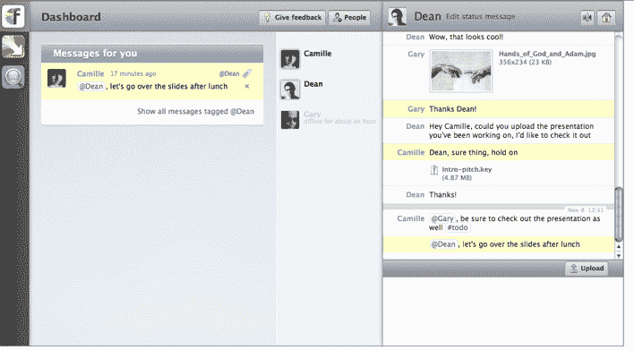

# CrunchFund，Angels Back Flowdock，一个面向团队的群聊应用程序 TechCrunch

> 原文：<https://web.archive.org/web/https://techcrunch.com/2011/11/09/crunchfund-angels-back-flowdock-a-group-chat-application-for-teams/>

# CrunchFund，Angels Back Flowdock，一个团队群聊应用

面向团队和企业的群组聊天应用程序 Flowdock 已经从[吉尔·彭奇纳](https://web.archive.org/web/20221206161904/http://www.crunchbase.com/person/gil-penchina)、[克朗彻基金](https://web.archive.org/web/20221206161904/http://www.crunchbase.com/financial-organization/crunchfund)、[马腾·米科斯](https://web.archive.org/web/20221206161904/http://www.crunchbase.com/person/marten-mickos)和 [IDG 风险投资](https://web.archive.org/web/20221206161904/http://www.crunchbase.com/financial-organization/idg-ventures)获得了 65 万美元的种子资金。

Flowdock 旨在扰乱群聊空间，是一款面向技术团队的协作网络应用。正如我们在[中对 Flowdock 的最初评论](https://web.archive.org/web/20221206161904/http://eu.beta.techcrunch.com/2010/11/10/collaboration-software-flowdock-exits-beta-with-its-evernote-for-conversations/)中所写的，这家初创公司将来自你的项目管理工具(Pivotal Tracker，JIRA)、版本控制系统(GitHub、BitBucket、窑)、客户反馈渠道(Zendesk、电子邮件列表)和许多其他来源的活动汇集到一个单一的流中。然后，团队可以一起解决问题，讨论问题，并在几秒钟内做出反应。

使用这些产品的好处是，它允许开发团队跟踪、存档和处理实时聊天，这是许多协作或聊天应用程序所缺少的关键功能。

例如，使用 Zendesk 的客户服务团队无法自己解决开发问题。他们可以将其升级到开发团队的 Flowdock，然后开发团队可以在几分钟内讨论并解决问题。通常情况下，这种通信是通过电子邮件甚至 Skype 来完成的，需要更长的时间来解决。

该产品可通过网络和桌面应用程序使用，包括实时群聊、上传文件、通知等功能。Flowdock 有 30 天的免费试用，付费计划从每月 19 美元到每月 159 美元不等。

这家初创公司的客户数量已经有所增加，Pivotal Labs、TED conferences 和 Appcelerator 都是它的用户。Flowdock 面临来自 Hipchat 和其他公司的竞争。

