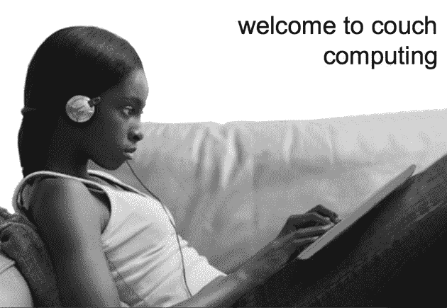
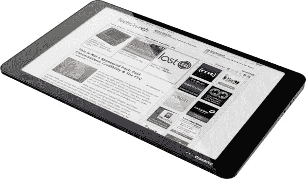
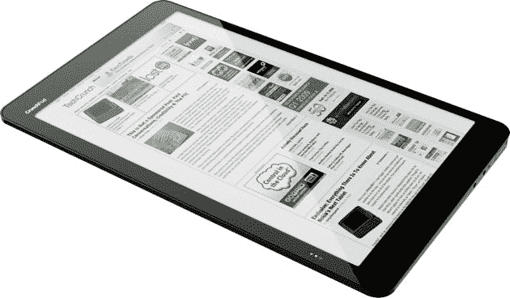
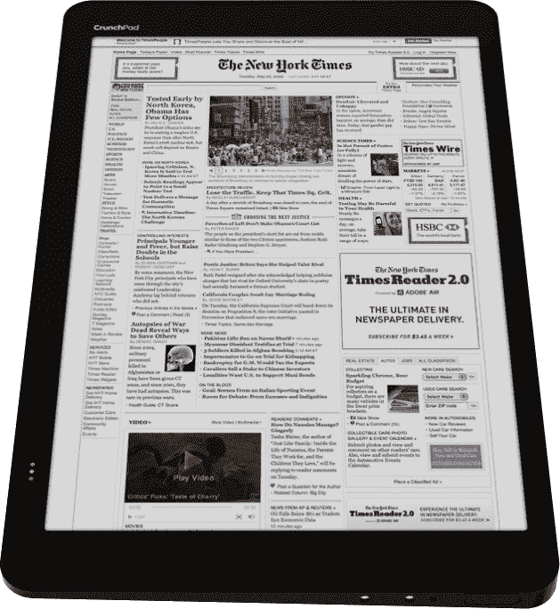

# CrunchPad:发布原型

> 原文：<https://web.archive.org/web/https://techcrunch.com/2009/06/03/crunchpad-the-launch-prototype/>

# CrunchPad:发射原型

自从我们在四月的[最后一次更新以来，我们一直在 CrunchPad 的幕后努力工作，并且几乎已经敲定了设备的最终设计。我们今天在这里展示概念图。再过几周，我们的办公室里就会有第一批工作原型了。](https://web.archive.org/web/20230308122901/https://techcrunch.com/2009/04/10/about-those-new-crunchpad-pictures/)

这个发布原型是从上一个原型向前迈出的又一大步。屏幕现在与外壳齐平，我们已经将整体厚度减少到大约 18 毫米。外壳将是铝制的，比塑料更贵，但更坚固，让我们可以稍微减少设备的整体厚度。

我相信现在的设备实际上比我们去年夏天发布的[原始概念设计](https://web.archive.org/web/20230308122901/https://techcrunch.com/2008/07/21/we-want-a-dead-simple-web-tablet-help-us-build-it/)更好看。将下面的图片与第一个原型[进行比较，你可以看到我们已经走了多远。如果你有兴趣，](https://web.archive.org/web/20230308122901/https://techcrunch.com/2008/08/30/update-on-the-techcrunch-tablet-prototype-a/)[这是原型 B](https://web.archive.org/web/20230308122901/https://techcrunch.com/2009/01/19/techcrunch-tablet-update-prototype-b/) 。原型 C 的照片，这是我们现在向人们展示的设备，[在这里](https://web.archive.org/web/20230308122901/http://www.crunchgear.com/2009/04/09/crunchtablet-hits-the-net-a-little-early/)。

幕后也发生了很多事情。我们的合作伙伴 [Fusion Garage](https://web.archive.org/web/20230308122901/http://www.fusiongarage.com/) 继续推动软件向前发展，我们正在与主要合作伙伴进行深入讨论，以将设备推向市场。如果你想看看以前的 CrunchPad 的运行情况，我们在 YouTube 上有一个以前私人的视频[，展示了我们对用户界面和软件堆栈的最新版本的愿景。这是一个基于 Linux 的操作系统和基于 Webkit 的浏览器。设备直接启动到浏览器。](https://web.archive.org/web/20230308122901/http://www.youtube.com/watch?v=jP-0Nce5oTQ&eurl=http%3A%2F%2Fwww.youtube.com%2Fmy_videos_edit&feature=player_embedded)

下一次我们公开谈论 CrunchPad 将是在 7 月份硅谷的一次特别新闻发布会和用户活动上。如果你想在新消息发布时收到电子邮件，**发送电子邮件至 crunchpad@beta.techcrunch.com，我们会将你列入名单。**

这是 CrunchPad 接近最终的工业设计:

