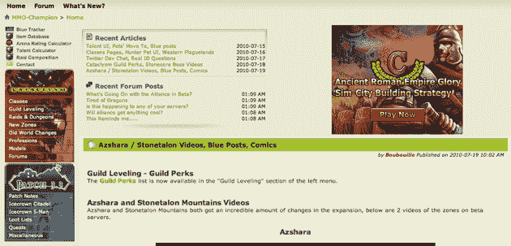

# 在线游戏门户网站“诅咒”收购 MMO 冠军(及其 700 万个独特游戏)

> 原文：<https://web.archive.org/web/https://techcrunch.com/2010/07/19/curse-mmo-champion-wow/>

# 在线游戏门户网站“诅咒”收购 MMO 冠军(及其 700 万个独特的)

 [诅咒](https://web.archive.org/web/20230221164530/http://www.curse.com/)，一家提供各种游戏相关资源、工具和新闻网站的初创公司，已经为其军火库增加了一项新资产:该公司刚刚收购了 [MMO 冠军](https://web.archive.org/web/20230221164530/http://www.mmo-champion.com/)，这是一个非常受欢迎的网站，关注热门大型多人游戏《魔兽世界》的新闻。Curse 将从大联盟博彩公司收购该网站，但没有透露交易的条款，只是说 MMO 冠军创始人杨奇煜·邦特将加入 Curse 团队。

这延续了 Curse 购买有前途和成功的游戏资产的连胜势头，因为它希望将自己确立为严肃游戏玩家事实上的资源。Curse 首席执行官 Hubert Thieblot 表示，根据内部分析，MMO 冠军每月有 8000 万的页面浏览量和 700 万的独立访客。除此之外，Curse 还吸引了 800 万不同的访客。Thieblot 说，在 MMO 冠军和 Curse 的其他网站之间，该公司每月将吸引大约 3 亿次页面浏览。

MMO 冠军网站的访问者会注意到，它并不是一个特别有吸引力的网站——事实上，它完全过时了，它的设计在 2001 年看起来并不格格不入。Curse 知道这一点，Thieblot 说，该公司打算在不久的将来重新设计网站，并计划改善 MMO 冠军论坛，他说这些论坛正在“爆炸”。

Thieblot 在 2005 年创立了 Curse，当时他的父母厌倦了他每天 16 个小时沉迷于《魔兽世界》,把他赶出了家门。从那以后，该公司做得相当不错:它已经筹集了约 1100 万美元的资金，并收购了 DiabloFans.com 等其他热门游戏网站。除了游戏新闻，Curse 还为玩家提供社区论坛、维基、下载档案和其他资源。

它还提供了一个可下载的插件管理器，玩家可以使用它来保持他们的游戏插件最新。该软件的一个更强大的版本需要支付额外费用，该版本包括在多台电脑上同步插件和一键更新等功能。

