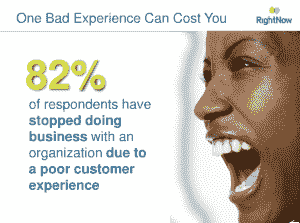

# 研究:82%的美国消费者在糟糕的客户服务后放弃品牌 

> 原文：<https://web.archive.org/web/https://techcrunch.com/2010/10/13/customer-service-rightnow/>

聚光灯——或者说是泛光灯——照耀着糟糕的在线客户服务。来自 [RightNow](https://web.archive.org/web/20221209062446/http://www.rightnow.com/) 和 Harris Interactive 的一份新报告建议，公司应该比以往任何时候都更担心公众对其品牌失败的投诉和报道。报告称，相反，如果他们能提供卓越的体验，他们会赚更多的钱。

【2010 年客户体验影响报告显示，82%的美国消费者表示，由于糟糕的客户服务体验，他们已经*停止*与一家公司做生意。其中，73%的人认为粗鲁的员工是主要的痛点，55%的人说公司未能及时解决他们的问题导致他们离开。

几乎所有接受调查的人(整整 95%)都表示，在经历了糟糕的客户体验后，他们会“采取行动”79%的美国消费者表示，他们会在公共场合和朋友之间透露自己的负面客户体验。在脸书和 Twitter 等社交媒体网站上公开投诉的消费者中，58%的人预计公司会做出回应，42%的人预计公司会在一天内做出回应，但只有 22%的人表示他们在投诉后确实得到了回应。

RightNow 的首席营销官 Jason Mittelstaedt 与 TechCrunch 独家分享了这些见解，这些见解没有发表在他的公司 2010 年的报告中:

2007 年，60%的美国消费者表示，当他们有负面的客户体验时，他们希望与现场代理谈谈。当时，26%的人更喜欢电子邮件，5%的人喜欢聊天，但脸书和推特并没有被企业用来处理投诉和解决问题。今年，83%的美国消费者表示，他们希望与现场代理交谈，66%的人更喜欢电子邮件，12%的人喜欢聊天，7%的人选择社交网站来解决问题。

显然，消费者拥有的数字通信选择越多，他们就越渴望实时的人际互动。

 ***一个饱受糟糕客服代表困扰的公司该怎么办？***

显然，他们无法阻止网上的顾客噪音。尽管杰夫·贾维斯和戴尔早在 2007 年就试图和解，但十年来的抱怨“戴尔地狱”仍在网上和主要商业新闻媒体上被广泛讨论。

本月，谷歌的玛丽莎·梅耶尔在推特上表达了她对达美航空的不满(见下图)——她在那里有大约 47000 名粉丝。

早些时候[关于达美](https://web.archive.org/web/20221209062446/https://beta.techcrunch.com/2010/08/08/delta-flight-1843-from-jfk-to-hell/)和[维珍美国](https://web.archive.org/web/20221209062446/https://beta.techcrunch.com/2010/09/03/the-fundeds-adeo-ressi-arrested-after-virgin-america-incident/)的投诉在这里发表，看到了来自读者的立即和热情的回应。到目前为止，从 JFK 飞往地狱的达美航空 1843 号航班的帖子收到了 1000 个脸书式的同情。

为了公平披露:[消费者权益倡导者博客作者 Christopher Elliot](https://web.archive.org/web/20221209062446/http://onyoursi.de/2010/09/the-customer-service-hall-of-shame-through-the-years-and-the-winner-is/) 报道称，最近收购了 TechCrunch 的 AOL 在 MSN 和 Zogby 进行的耻辱厅调查中一直被列为美国最差的客户服务提供商之一。

RightNow 的 Mittelstaedt 建议，面临客户服务坏名声的公司——尽管它们努力改善内部提供的客户体验——应该专注于在网上创造正面口碑，最重要的是，其次才是正面评论和网上反馈。

换句话说，在现实生活中或通过 Twitter 和脸书更新讨论的朋友和同事的支持，比在 Yelp 或亚马逊等网站上发布的正面用户评论更有可能推动销售(但这些也很重要)。

MIttelstaedt 还建议公司继续在客户服务上投入大量时间和金钱。这不再仅仅是一个操作问题了。投资应该回到底线:85%的美国消费者表示，他们愿意多支付 5%至 25%的费用，以确保卓越的客户体验。

[ ***编者按:*** 在 9 月份的旧金山 TechCrunch Disrupt 上，创业战场竞赛包括来自 [Gri.pe](https://web.archive.org/web/20221209062446/https://beta.techcrunch.com/2010/09/28/gripe/) 和[泰洛](https://web.archive.org/web/20221209062446/https://beta.techcrunch.com/2010/09/28/tello-gives-businesses-consumer-feedback-on-the-fly/)的推介，这些公司使用移动应用程序来放大和组织客户服务投诉和声誉，并帮助公司了解和解决他们的代表如何实时发展的趋势。]