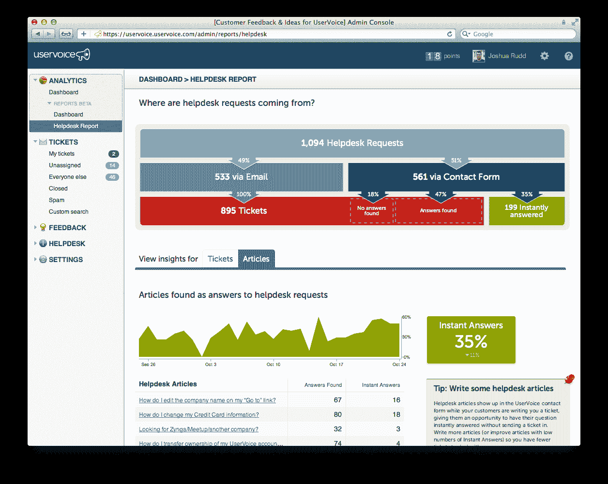

# 客户支持解决方案提供商 UserVoice 推出新的报告工具 

> 原文：<https://web.archive.org/web/http://techcrunch.com/2011/10/25/customer-support-solution-provider-uservoice-launches-new-reporting-tools/>

# 客户支持解决方案提供商 UserVoice 推出新的报告工具

管理客户支持和反馈工具的制造商 UserVoice 今天发布了一个新的报告工具，用于使用其“[即时回答](https://web.archive.org/web/20230203152444/http://uservoice.com/instant-answers)服务的企业。这项服务内置于[用户之声全面服务系统](https://web.archive.org/web/20230203152444/http://uservoice.com/fullservice)，允许公司自动将他们的帮助请求连接到可用的知识库条目，以便对收到的查询提供即时答复。

随着今天报告工具的发布，这些公司现在将能够告诉他们的知识库在向他们的客户提供这些答案方面有多有效。

根据 [UserVoice](https://web.archive.org/web/20230203152444/http://uservoice.com/) 的说法，向知识库(KB)发送客户查询可以为每个帮助台条目帮助解决的问题平均节省 4 美元和 7 分钟的支持时间。公司首席执行官理查德·怀特说，这也使公司的支持流程更加有效，因为许多客户倾向于一遍又一遍地问同样的问题，但很少自己查看公司的知识库。

新推出的报告机制现在将为公司提供更多的洞察力，以了解在 KB 重定向方面什么是有效的，什么是无效的。该工具包括已查看并成功避免提交支持票证的知识库条目的百分比、最常查看的知识库文章以及实际具有匹配知识库文章的支持请求的百分比等指标。

UserVoice 表示，自今年 3 月推出以来，其全套服务系统的账户注册量每月增长 30%以上。[该系统的定价计划](https://web.archive.org/web/20230203152444/http://uservoice.com/plans)从每月 5 美元(含一个代理的系统)开始，到每个代理每月 125 美元(含一个代理)的完全可定制的解决方案。

这家总部位于旧金山的公司成立于 2008 年，已获得 80 万美元的种子和首轮融资。

