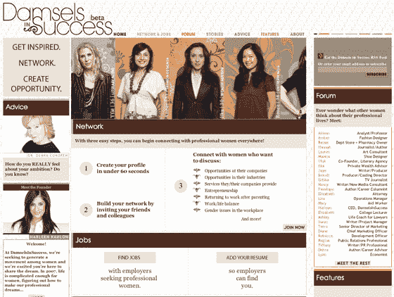

# 成功的少女:职业女性的社交网络 

> 原文：<https://web.archive.org/web/http://www.techcrunch.com:80/2007/08/22/damsels-in-success-networking-for-professional-women/>

# 成功的少女:职业女性网络

 [【成功少女】](https://web.archive.org/web/20221127200708/http://www.damselsinsuccess.com/)正式推出一个专门针对职业女性的网络平台。

该服务的定位不同于通常的社交网络风格的克隆网站，它更像 LinkedIn，而不是 MySpace 和脸书，还加入了一些内容。

成员们可以联系并讨论各种话题，包括工作机会、企业家精神、指导、育儿后重返工作岗位、工作场所的性别问题等。这个论坛由一个由大约 50 名职业女性组成的博客网络补充，她们写博客讨论与职业女性相关的问题。就业委员会还为职业女性和潜在雇主牵线搭桥。

我只想说，作为一名男性，我完全没有资格评判成功的少女。这当然是一个设计良好的网站，有一个聪明的名字。从功能上看，它似乎提供了各种各样的内容，这可能使它成为职业女性的一个引人注目的网站。我会让 TechCrunch 的女性读者在评论中做最终评判。

Damsels in Success 由哈琳·卡伦(Harleen Kahlon)创立，她曾是一名律师和高管招聘人员，总部位于纽约。
