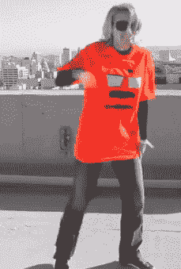

# 一整页都是跳舞的玛丽莎·梅耶尔 gif 

> 原文：<https://web.archive.org/web/http://techcrunch.com/2011/10/25/dancing-marissa/>

# 一整页都是跳舞的玛丽莎·梅耶尔的照片

这绝对不会让[变成](https://web.archive.org/web/20230205055123/http://www.techmeme.com/)。

*跳舞[maris sa](https://web.archive.org/web/20230205055123/http://www.crunchbase.com/person/marissa-mayer)gif via[un crunch。](https://web.archive.org/web/20230205055123/http://uncrunched.com/2011/10/25/san-francisco-celebrities-create-mayor-ed-lee-endorsement-video/)更多上下文[此处](https://web.archive.org/web/20230205055123/http://uncrunched.com/2011/10/25/san-francisco-celebrities-create-mayor-ed-lee-endorsement-video/)。*