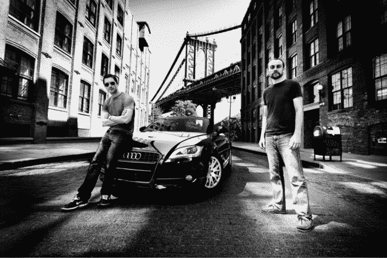
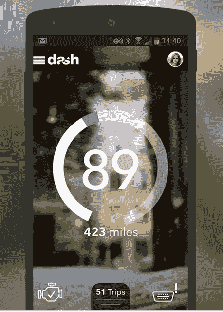
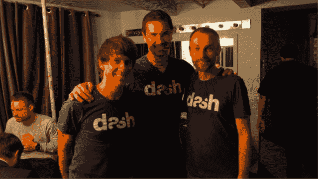

# Dash 的智能驾驶应用程序“汽车 Fitbit”登陆 Android TechCrunch

> 原文：<https://web.archive.org/web/https://techcrunch.com/2014/01/25/dashs-smart-driving-app-a-fitbit-for-cars-arrives-on-android/>

由纽约科技之星(Techstars)支持的初创公司 Dash 希望成为你汽车的 Fitbit，现在[推出了](https://web.archive.org/web/20230129222516/https://play.google.com/store/apps/details?id=com.dashlabs.dash.android)。该产品包括一个硬件设备和智能手机应用程序的组合，该应用程序提供关于您驾驶的实时反馈，行程日志，访问车辆诊断(那个讨厌的“检查引擎”灯，以及谁能修理它！)，显示附近最便宜的汽油在哪里的地图，甚至社交功能。

像市场上的几款“联网汽车”产品一样，Dash 的硬件包含一个 OBD 设备，你可以从 Dash 移动应用程序或 Dash 主页中购买。Dash 软件还可以与任何支持蓝牙功能的 OBD 设备兼容，如果你碰巧已经有一台的话，或者你可以从 Dash 主页上指向的两种设备中进行选择:[亚马逊上售价 10 美元及以上的普通设备](https://web.archive.org/web/20230129222516/http://www.amazon.com/gp/search?ie=UTF8&camp=1789&creative=9325&index=aps&keywords=bluetooth%20OBD&linkCode=ur2&tag=daslab-20)，或者更贵的 69 美元的高级 OBD 链接 LX。

该公司表示，Dash 软件可以在任何一种设备上运行。但高级硬件提供了更好的构建质量、电源管理功能和连接可靠性等。

安装后，该设备通过蓝牙与您的 Android 智能手机连接，以与 Dash 应用程序通信。

无论你在路上还是出门在外，这款应用都能为你提供各种有用的工具。该应用的设计也做得很好——非常现代和干净，这在 Android 上仍然有点令人惊讶，尽管随着开发者开始以其更大的市场份额赢得的尊重对待该平台，这种情况越来越少。

如上所述， [Dash](https://web.archive.org/web/20230129222516/https://dash.by/) 提供了各种“联网汽车”功能，包括跟踪您的行程、观察您的汽油消耗、查找附近的汽油价格、检测碰撞并向紧急服务机构发出警报、了解您汽车的计算机发出的警告信息，甚至找到可以解决问题的可靠机械师。Dash 联合创始人兼首席执行官 Jamyn Edis 解释说，机械师是根据接近度和星级进行排名的。

Edis 和 Brian Langel 在开始 Dash 之前都曾在 HBO 工作，Edis 是 R&D 的副总裁，负责 HBO GO 的技术战略，以及其他使用增强现实、视频搜索、智能电视应用程序、HBO Sports 的 Nike Fuel-like 硬件等的 skunkworks 项目。在此之前，他在埃森哲工作了十年，为各种客户从事大型技术项目和战略，包括 Sprint、英国电信、福克斯互动、MySpace、华纳音乐、PlayStation 等。

与此同时，现任 Dash 首席技术官的兰格此前曾为 HBO GO 构建后端架构，并在 HBO Sports 工作。他还为联合太平洋铁路公司和麦格劳希尔公司工作过。

很长一段时间以来，两人一直希望围绕智能互联设备的理念合作开展一个项目。当该公司在 2012 年 6 月成立时，联网汽车的前景相当贫瘠。

今天，就不一定了。

Edis 解释说:“我们的方法与众不同且新颖之处在于，我们将汽车作为一个平台来处理，我们认为这是一个真正未被充分利用的消费技术平台。”。另外，他补充道，“我们是技术专家。我们热爱数据，我们认为我们可以通过使用数据来改善我们的生活，无论是用 Jawbone 进行体育健身，还是用 Nest 进行家庭和暖通空调。”

Dash 的改进还包括对安全性和整体智能驾驶的关注。在前一种情况下，当应用程序处于“在途”模式时，它会在出现问题时通过听觉警报主动警告你(例如警告你刹车太用力，或其他不良行为)。但是 Dash 不仅仅是一个烦人的机器人“后座司机”，而是将这种体验游戏化，让你与朋友或附近的人竞争，以获得更好的“驾驶分数”。

与此同时，与普锐斯类似，该应用程序将在驾驶时通知你的燃油经济性，让你做出相应的调整。

伊迪丝说，这一切也只是开始。该公司正在开发一系列其他功能，包括基于你的驾驶、位置和其他非个人身份特征的针对性促销，一个 iOS 应用程序，以及围绕其开发者 API 的合作伙伴关系，这将使 Dash 能够与其他智能设备通信，如 Edis 称为“触发服务”的设备或其他智能家居平台。

这家总部位于纽约的七人公司已经从 Techstars、风投(汽车制造商作为有限合伙人)和天使投资人(包括 Foursquare 联合创始人兼首席执行官丹尼斯·克劳利、Makerbot 联合创始人兼首席执行官布雷·佩蒂斯、戴夫·莫兰等人)那里筹集了一轮未披露的七位数种子资金。

Dash 现在在一个日益拥挤的市场上与许多 [ODB 应用](https://web.archive.org/web/20230129222516/https://play.google.com/store/search?q=obd&c=apps)和类似服务竞争，包括 YC 支持的[自动](https://web.archive.org/web/20230129222516/http://www.automatic.com/)(其“链接”加密狗价格稍高，为 99.95 美元)、 [Carvoyant](https://web.archive.org/web/20230129222516/http://www.carvoyant.com/) 、 [CarMD](https://web.archive.org/web/20230129222516/http://www.carmd.com/) 、 [Torque](https://web.archive.org/web/20230129222516/https://play.google.com/store/apps/details?id=org.prowl.torque&hl=en) 、[汽车医生](https://web.archive.org/web/20230129222516/https://play.google.com/store/apps/details?id=com.pnn.obdcardoctor)和许多其他应用。

Dash 应用程序[在 Google Play 上直播](https://web.archive.org/web/20230129222516/https://play.google.com/store/apps/details?id=com.dashlabs.dash.android)。

【YouTube http://www.youtube.com/watch?v=EPAl9qdz9XA？feature = player _ 嵌入式]