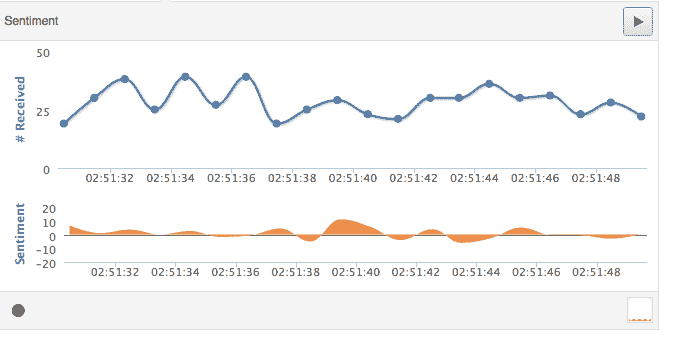
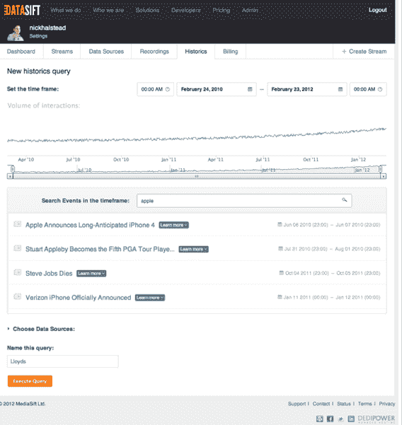
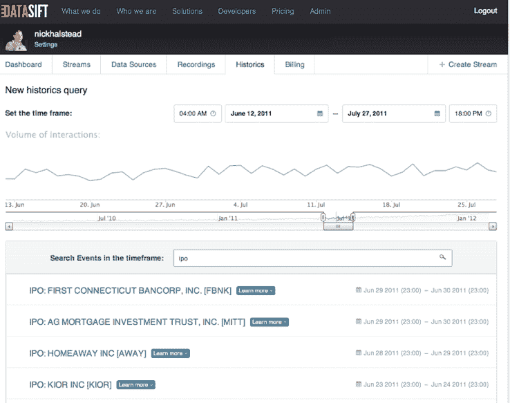

# DataSift 允许访问自 2010 年 1 月以来的 Twitter 历史数据 TechCrunch

> 原文：<https://web.archive.org/web/https://techcrunch.com/2012/02/27/datasift-unlocks-access-to-historical-twitter-data-dating-back-to-january-2010/>

作为 Twitter 的数据合作伙伴之一，data sift(T1)目前为开发者和第三方提供实时访问 Twitter 全部数据的[，即将向生态系统开放一组全新的 Twitter 数据。社交数据平台已经推出了 Historics，这是一个云计算平台，使企业家和企业能够从 Twitter 自 2010 年 1 月以来的公开推文中提取商业见解(我们最初报道了即将推出的](https://web.archive.org/web/20221208073631/https://beta.techcrunch.com/2011/11/16/datasift-launches-powerful-twitter-data-analysis-and-business-intelligence-platform/)[这里](https://web.archive.org/web/20221208073631/https://beta.techcrunch.com/2011/12/07/datasift-historical-tweets/))。

开发者、企业和组织基本上可以使用 DataSift 来挖掘 Twitter 的社交数据。但 DataSift 的特别之处(除了对 Twitter 数据的首要访问)在于，它可以过滤这些社交媒体数据，以获得人口统计信息、在线影响和情绪，无论是积极的还是消极的。正如我们过去报道的那样，DataSift 不限制基于关键字的搜索，允许任何规模的公司定义极其复杂的过滤器，包括位置、性别、情感、语言，甚至基于 Klout 分数的影响力，以提供快速和非常具体的洞察和分析。

目前，DataSift 是唯一一家提供两年前历史推文的公司。正如 AllThingsD 的 Liz Gannes 最近报道的那样， Gnip 是第一家授权转售 Twitter 历史数据的公司，Tweets 仅超过 30 天(以前开发者通常可以访问 7 天的数据)。

借助 DataSift，公司现在可以利用实时和两年多的历史推文来过滤和提取与品牌、企业、金融市场、新闻和舆论相关的见解和趋势。

基本上，DataSift 聚合这些公共社交数据，丰富这些数据，过滤并提供这些数据社交媒体监控、商业智能和 CRM 应用程序。DataSift 丰富了每条推文的细节，包括情绪、主题、网络链接、位置和社交媒体影响，以便公司能够提取意义并创造见解。

正如首席执行官罗伯·拜利向我们解释的那样，历史数据用例的一个例子可能是一家移动手机公司，该公司可能希望了解以前的产品发布是如何进行的，谁在推特上发布了该产品，来自哪些地理区域，以及哪些客户是积极的还是消极的。金融组织可以分析与商业和经济事件相关的流行情绪、趋势和指标，新闻和研究组织可以围绕历史和流行文化事件呈现新趋势。根据贝利的说法，对历史剧的需求很大。近 1000 家公司——包括 100 家财富 500 强公司——已经加入了历史记录的候选名单。

创始人兼首席技术官 Nick Halstead 告诉我们，DataSift 的平台非常强大，可以在一小时内处理整整一个月的 Twitter 数据。他说，目前 DataSift 的存储容量超过了 5pb。

就可用性而言，Historics is 目前作为有限版本提供给现有客户，目前计划于 2012 年 4 月正式上市。这项服务本身既可以是企业订阅，也可以是现收现付服务。

Bailey 告诉我们，2012 年对于这家最近成立的公司来说将是重要的一年，社交数据源的数量将增加 10 倍。我们还将看到一些大客户的声明，以及通过拖放功能等功能使解析这些社交数据的 UI 尽可能易于使用。

