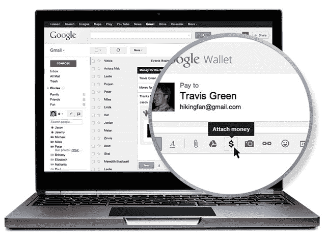

# 千刀万剐的死亡？谷歌钱包挑战贝宝的计划利用了 Chrome、Android、Google+、Gmail 等技术

> 原文：<https://web.archive.org/web/https://techcrunch.com/2013/05/15/death-by-a-thousand-cuts-google-wallets-plan-to-take-on-paypal-leverages-chrome-android-google-gmail-more/>

在今天的谷歌 I/O 开发者大会的一系列声明中，有一个更大的消息，即谷歌如何加紧努力与在线支付巨头，如 PayPal 竞争。它计划通过改进网络、移动网络、运行在 Android 上的移动应用程序等的结账流程来实现这一目标。

这是对 PayPal 的一次千刀万剐，从 Chrome 到 Android，甚至是 Gmail。谷歌还没有完全解决的是，从长远来看，所有这些将如何结合在一起，但你可以看到计划开始形成。

## #1:网络上的谷歌钱包:在 Chrome 中存储支付凭证

让我们从浏览器开始，它是网上购物事实上的家。

结账体验坏了不是新闻。放弃购物车是当今商家最大的痛点之一，主要是因为他们的网站传统上只提供繁琐乏味的表格供购物者填写，以便进行购买。

正如在今天的主题演讲中提到的[，你在网上能做的最难的事情之一就是试着买东西。该公司解释说，这个过程需要大约 21 个步骤。当然，谷歌在这里有点夸张——账单和运输细节通常是相同的，但谷歌计算了每个字段(街道、邮政编码等。)两次。](https://web.archive.org/web/20221210002025/https://beta.techcrunch.com/2013/05/15/live-blog-live-from-the-google-io-2013-keynote/)

话虽如此，移动领域的情况甚至更糟。谷歌指出[在移动设备上放弃购物车](https://web.archive.org/web/20221210002025/https://plus.google.com/100585555255542998765/posts/T53aDoDy49H)的比例现在高达 97%。同样，这似乎很高([这是](https://web.archive.org/web/20221210002025/http://seewhy.com/blog/2012/10/10/97-shopping-cart-abandonment-rate-mobile-devices-concern-you/)该数据的来源)，但谷歌用这些略显夸张的数据说明的趋势并不算高。

相比之下，Monetate 的数据显示，截至 2012 年第四季度，全球购物车废弃率约为 82%。由于越来越多的购物者在手机和其他设备上做研究，该公司已经看到弃车现象的增加——在过去几年中约为[60%](https://web.archive.org/web/20221210002025/http://www.emarketer.com/Article/Retailers-Rethink-Shopping-Cart-Abandonment/1009645)。当他们到达在移动设备上结账的时候，他们现在更有可能放弃并继续前进，因为在移动设备的小屏幕上体验的难度增加了，再加上零售商未能推出移动优化的体验，即使移动购物者的比例继续以创纪录的速度增长。

许多创业公司一直在以各种形式应对这一挑战——以通用购物车为特色的[移动应用](https://web.archive.org/web/20221210002025/https://beta.techcrunch.com/2012/10/26/mobile-shopping-app-best-decision-introduces-a-universal-cart-that-works-across-dozens-of-retailers/)、[原生移动商务店面](https://web.archive.org/web/20221210002025/https://beta.techcrunch.com/2012/10/29/mobicart-m-commerce/)、[移动优化支付流程](https://web.archive.org/web/20221210002025/https://beta.techcrunch.com/2012/06/26/mobile-payments-platform-zooz-partners-with-mobicart-ready-to-raise-series-a/)、[一键移动支付](https://web.archive.org/web/20221210002025/https://beta.techcrunch.com/2012/03/08/clover-raises-5-8m-from-andreessen-horowitz-launches-as-a-one-click-mobile-payments-platform/)、[流内支付](https://web.archive.org/web/20221210002025/https://beta.techcrunch.com/2012/11/20/ribbon-a-bit-ly-with-payments-brings-simplified-checkout-to-any-platform/)等等。

谷歌的计划？利用 Chrome。

Chrome 已经是世界上最受欢迎的浏览器，月活跃用户从一年前的 4.5 亿增加到今天的 7.5 亿。现在，它将通过在 Chrome 中同步你的账单信息和其他细节，开始在浏览器中烘焙更快速的结账体验。

也就是说，当你使用 Chrome 浏览器(包括 Chrome 手机浏览器)访问一个网站时，会自动提示你的账单信息。Chrome 可以使用自动完成功能为你填写信息，比如你的地址、邮政编码、信用卡信息等等。

这个功能是通过一个新的 requestAutocomplete API 引入的，Google 在这里将[描述为“一个有抱负的 web 标准，它将允许用户通过一个命令式 API 来请求浏览器知道的细节，从而绕过表单字段的页面。”](https://web.archive.org/web/20221210002025/https://developers.google.com/events/io/sessions/325582998)

谷歌表示，这将结账流程的步骤从 21 步减少到了 3 步。

总的来说，这是解决在线结账问题的一次有价值的尝试，但它仍然受到一些潜在障碍的影响:网站所有者将不得不在其端实现功能(API)，除非这个“有抱负的”web 标准成为所有浏览器支持的“实际”web 标准，否则它的影响将是有限的。

这个特性还处于早期阶段，但是它被设计成开放的。据推测，如果*没有要求*提供支付信息，该公司至少会支持从用户的谷歌钱包账户中检索支付信息。(理论上，支付信息可以直接保存在 Chrome 或任何其他浏览器中，而不需要钱包账户。)

## #2 网络上的谷歌钱包(嗯，再次):谷歌钱包 API

虽然上面描述了首先将只支持 Chrome 的功能，但谷歌钱包已经找到了一种通过更传统的方式支持网络和移动网络的方法。

除了通过钱包支持在线结账外，去年秋天，[该公司推出了一个谷歌钱包 API](https://web.archive.org/web/20221210002025/http://googlecommerce.blogspot.com/2013/05/fast-and-easy-checkout-for-android-apps.html) ，允许电子商务网站所有者在移动设备上支持通过谷歌钱包结账。然而，这独立于浏览器或移动操作系统，更像是 PayPal 按钮的替代品。

这有点令人困惑，因为有了新的 Chrome 自动完成功能，这两者之间似乎会有一些重叠。网站所有者最终将实现两个 API 来完全支持谷歌用户:一个是通过 Chrome 中的自动填表来加快结账速度(可能会从用户的谷歌钱包中提取支付凭证)，另一个是如果他们希望网站上有一个谷歌钱包按钮，用户可以点击它来完成谷歌钱包结账流程。

哪个更好？这两者将如何联系在一起？目前，谷歌还不能说，只是指出 Chrome autocomplete API 仍处于“早期阶段”,谷歌钱包很可能会以某种方式得到支持。

但是一切都还不确定。

这表明谷歌需要如何将不同的团队整合在一起，以讲述一个更具凝聚力的支付故事。[有传言称](https://web.archive.org/web/20221210002025/http://allthingsd.com/20130510/googles-wallet-plans-for-io-cloud-expansion-on-but-longtime-physical-card-plan-scuttled/)钱包团队过于“孤立”，导致了一些问题。(例如，参见下面的第 5 部分)。

## Android 上的第三大钱包:付费应用、应用内购买&现在，谷歌钱包即时购买 Android API

Android 是[世界上最受欢迎的移动操作系统](https://web.archive.org/web/20221210002025/https://beta.techcrunch.com/2013/05/14/android-nearly-75-of-all-smartphones-shipped-in-q1-samsung-tops-30-mobile-sales-overall-nearly-flat-says-gartner/)，所以谷歌利用这一事实来获取更多用户的支付信息是有意义的。毕竟，今天的用户已经在使用谷歌钱包为 Android 设备购买付费应用程序，以及应用内购买，那么为什么不扩展钱包以支持购买实物商品呢？

这正是谷歌所做的。

有了新的[谷歌钱包即时购买 Android API](https://web.archive.org/web/20221210002025/http://googlecommerce.blogspot.com/2013/05/fast-and-easy-checkout-for-android-apps.html) ，销售实体商品和服务(相对于手机游戏中销售的虚拟商品)的商家和开发商现在可以为他们的客户提供 2 次点击结账。

在发布会上，该公司已经签约了许多新的合作伙伴，包括 [Airbnb](https://web.archive.org/web/20221210002025/https://play.google.com/store/apps/details?id=com.airbnb.android&feature=nav_result#?t=W251bGwsMSwxLDMsImNvbS5haXJibmIuYW5kcm9pZCJd) 、[Booking.com](https://web.archive.org/web/20221210002025/https://play.google.com/store/search?q=booking.com)、 [Expedia](https://web.archive.org/web/20221210002025/https://play.google.com/store/apps/details?id=com.expedia.bookings&hl=en) 、 [Fancy](https://web.archive.org/web/20221210002025/https://play.google.com/store/apps/details?id=com.thefancy.app&feature=search_result#?t=W251bGwsMSwyLDEsImNvbS50aGVmYW5jeS5hcHAiXQ..) 、 [GoPago live POS](https://web.archive.org/web/20221210002025/https://play.google.com/store/apps/details?id=com.pago.android) 、 [NFC Task Launcher](https://web.archive.org/web/20221210002025/https://play.google.com/store/apps/details?id=com.jwsoft.nfcactionlauncher&feature=search_result#?t=W251bGwsMSwyLDEsImNvbS5qd3NvZnQubmZjYWN0aW9ubGF1bmNoZXIiXQ..) 、 [Priceline](https://web.archive.org/web/20221210002025/https://play.google.com/store/apps/details?id=com.priceline.android.negotiator&feature=nav_result#?t=W251bGwsMSwyLDNd) 、[Rue La La La](https://web.archive.org/web/20221210002025/https://play.google.com/store/apps/details?id=com.retailconvergence.ruelala&hl=en)、 [Tabbedout](https://web.archive.org/web/20221210002025/https://play.google.com/store/apps/details?id=com.atxinnovation.tabbedout&feature=search_result#?t=W251bGwsMSwyLDEsImNvbS5hdHhpbm5vdmF0aW9uLnRhYmJlZG91dCJd) 、[优步](https://web.archive.org/web/20221210002025/https://play.google.com/store/apps/details?id=com.ubercab&feature=search_result#?t=W251bGwsMSwxLDEsImNvbS51YmVyY2FiIl0.)和[wrap](https://web.archive.org/web/20221210002025/https://play.google.com/store/apps/details?id=com.wrapp.android&feature=search_result#?t=W251bGwsMSwyLDEsImNvbS53cmFwcC5hbmRyb2lkIl0.)

【YouTube http://www.youtube.com/watch?v=TSIztv65g2w？feature = player _ 嵌入式]

该服务还与 Google+相结合，允许用户注册并登录应用程序，类似于脸书连接，然后点击结账，无需输入账单或运输信息。

## # 4:Gmail 中的谷歌钱包:“附上”钱

推翻贝宝的另一个手段是个人对个人的支付——比如，付给保姆钱或者付给你爸爸你借的钱。如今，精通数字技术的人们仍然主要依靠贝宝来实现这一目标。

谷歌在这里的计划？利用 Gmail。

这真的很简单和巧妙。熟悉的电子邮件“附件”图标刚刚成为谷歌钱包的另一种入门体验。随着 Gmail 的更新，该服务的 4 . 25 亿多用户可以将鼠标悬停在附件回形针图标上，然后点击$图标，以便在邮件中“附上钱”。

当然，你首先需要一个谷歌钱包账户。

【T2

目前，该功能仅在桌面版 Gmail 中可用，但它肯定会及时应用到移动版。

## #5 现实世界中的谷歌钱包？(如果 NFC 永远不赢，B 计划是什么？)

谷歌唯一缺乏坚实战略的领域是现实世界的支付——竞争对手贝宝(PayPal)最近几个月在这一领域迅速发展。PayPal 一直在与近 24 家全国零售连锁店合作，包括家得宝、Jamba Juice 等，以整合到他们的销售点系统中。它已经分别宣布了与[销售点和硬件制造商的整合，如 NCR](https://web.archive.org/web/20221210002025/https://beta.techcrunch.com/2013/01/15/paypal-partners-with-point-of-sale-and-hardware-maker-ncr-to-expand-its-retail-footprint/) ，专注于加油站和便利店的 [Gilbarco Veeder-Root 的销售点系统](https://web.archive.org/web/20221210002025/https://beta.techcrunch.com/2013/02/12/paypal-at-the-pump-payments-company-signs-deal-with-gas-station-checkout-provider-gilbarco-veeder-root/)，[硬币计数亭制造商 Coinstar](https://web.archive.org/web/20221210002025/https://beta.techcrunch.com/2013/02/27/coinstar-expands-rollout-of-its-paypal-powered-coin-counting-kiosks/) ，等等。

谷歌一直带着基于 NFC 的谷歌钱包应用艰难前行。这款应用使用的技术在美国的广泛采用一直很慢，部分原因是缺乏苹果的支持，以及一些令人困惑的问题，即从长远来看，在销售点使用手机真的比刷卡有多大改善。

谷歌曾计划推出一种塑料“通用”信用卡，允许用户在销售点使用实体卡的同时，随时切换他们喜欢的支付方式。不管出于什么原因，该公司在谷歌 I/O 之前取消了这些计划。

综合来看，上述所有领域本身无论如何都不能被视为 PayPal 杀手。但随着时间的推移，他们变得更加紧密地结合在一起(假设谷歌能够让其团队专注于自己产品开发之外的更大图景，并专注于全球舞台)，你可以看到 PayPal 的一个可行威胁开始形成。

