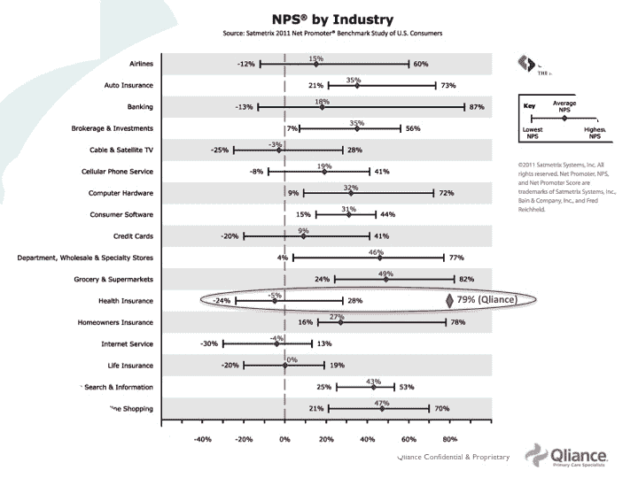

# 保险业独立宣言(第二部分):释放健康 IT 创业公司 

> 原文：<https://web.archive.org/web/https://techcrunch.com/2011/07/04/declaration-insurance-independence-ii-unleash-health-startups/>

 *戴夫·蔡斯是 TechCrunch Disrupt NYC 入围项目 [Avado](https://web.archive.org/web/20230205041940/https://avado.com/) 的创始人兼首席执行官。此前，他是埃森哲医疗保健业务的管理顾问，也是微软健康业务的创始人。这是两篇文章的第二部分。你可以在推特上关注他。*

[在第 1 部分](https://web.archive.org/web/20230205041940/https://techcrunch.com/2011/07/03/declaration-insurance-independence/)中，我概述了[保险独立性声明](https://web.archive.org/web/20230205041940/http://avado.com/declaration/)的驱动因素，包括以下内容:

*   用官僚化抗议医疗税
*   新的医疗和支付模式催生了新的医疗 IT 类别
*   来自电信和报业的医疗保健公司的警示故事

**推动行业颠覆的因素汇聚**

考虑以下因素的集合，以理解医疗保健创新需求的规模:

*   预计超过 1/3 的劳动力将成为永久自由职业者、承包商、顾问和企业家，对雇主提供的保险不抱任何期望。当他们直接支付自己的健康计划时，他们有很高的动机去了解健康经济学。尽管将近一半的人口将直接购买健康计划，而不是通过他们的雇主获得，但健康计划仍然是为团体而不是个人设计和销售的。
*   1.1 亿美国人被纳入所谓的自费计划。这意味着大雇主直接为员工支付医疗费用，而不是让保险公司来管理风险。他们正在积极寻求自己动手的医疗改革，而不是坐等 DC。
*   正如我们在马萨诸塞州的医疗改革中所看到的那样，当 2014 年保险指令生效时，一大批新的人群将被正式纳入医疗体系。这特别紧张了原有的初级保健医生的短缺。
*   众所周知，老龄化的婴儿潮一代将给这个系统带来前所未有的压力。
*   将近一半的美国人患有慢性病。这消耗了所有医疗支出的 75%，总计 1.8 万亿美元(是的，带“T”)。
*   超过一半的人不遵循医生的护理计划。虽然有些人明显无视医生的建议，但大多数人只是忘记或误解了医生给他们的指示。

解决这些因素的唯一希望是重塑医疗服务的提供和支付方式。除此之外，当务之急是提高效率——在这个领域，技术已经一次又一次地证明了它可以发挥作用。技术为医疗保健带来了效率的提升，而 Qliance 和 OneMedical 等组织则利用技术进行了彻底的变革。

亚马逊、aQuantive、戴尔、Expedia 和 Benchmark 等风险公司的创始人都支持他们，这并非巧合——所有这些组织都利用技术颠覆了他们的行业，从而极大地改变了他们的行业。下图显示了 Qliance 如何在一个平均净推广分数最低的行业中获得高于 Google 或 Apple 的净推广分数。你也可以在 Yelp 上看到对 qlian e 和 T2 MedLion T3 的评论，以获得更多的趣闻。

**花更多时间在病人身上意味着更好的健康结果和更少的时间&
金钱浪费**

有趣的是，在前面描述的[变革模型](https://web.archive.org/web/20230205041940/https://techcrunch.com/2011/06/19/the-most-important-organization-in-silicon-valley-that-no-one-has-heard-about/)中，医生一致告诉我，他们一半到三分之二的患者互动时间不需要面对面(传统保险报销模型需要面对面预约医生才能获得报酬)。他们可以在不与他们共处一室的情况下提供高质量的药物。通过减少在保险官僚机构上花费的时间，他们能够花 2 到 8 倍的时间在病人身上，并且仍然过着合理的生活。这些长期的任命不仅仅是一种奢侈。他们已经证明了他们可以节省资金并改善结果。在传统模式中，典型的 7 分钟预约仅允许医生有足够的时间解决一个症状，而解决潜在问题的时间有限。

一位在非保险初级保健模式下工作的医生给我举了一个女病人的例子，她描述了可怕的头痛症状。他说，在旧型号中，他会订购昂贵的 CT 扫描，以了解是否有什么事情发生。相反，经过更长时间的讨论，他发现这位女士的婆婆最近搬进了她的房子。相反，他“规定”了设定界限、散步和其他缓解压力的措施。

**政府推动的医疗改革的影响**

当然，医疗保健的重塑不仅限于 DIY 医疗改革运动。麦肯锡刚刚发布了一项关于雇主对新健康法反应的研究，这篇文章题为“雇主赞助的医疗保健是下一个侏罗纪公园吗？”

> 如果雇主一直在寻找雇主赞助的健康福利的出口，他们可能已经在新的医疗改革法中找到了。根据[麦肯锡公司](https://web.archive.org/web/20230205041940/http://www.mckinseyquarterly.com/How_US_health_care_reform_will_affect_employee_benefits_2813)刚刚发布的雇主调查，在接受调查的 1300 名雇主中，超过 30%的人“肯定或可能”会完全放弃医疗保险，而代之以支付政府规定的每位员工 2000 美元的罚款。如果把注意力集中在那些对新法律有很高认识的雇主身上，逃离率甚至会更高——超过一半(50%+)的雇主表示计划退出医疗福利。

抛开政治问题不谈，这意味着更多的人将成为医疗保健消费者，而他们之前已经有了为他们处理的决定。虽然我预计 DIY 医疗改革的影响会更直接，但机会只会随着政府推动的医疗改革而增加。美国首席技术官最近在下面的视频中展示了这个机会有多大。

**医疗 IT 企业家/投资者回归水中的时候到了**

由于初创公司在医疗 IT 领域处于焦土状态，主流风险投资者不愿投资是可以理解的。尽管我自己在医疗 IT 方面有很深的背景，但我有意避开，因为我对许多人说过“医疗 IT 是创业公司走向死亡的地方”，因为决策和走向市场的挑战的速度是史诗般的。许多人对美国医疗保健的反应类似于中东和平。也就是说，他们知道这是一个严重的问题，但似乎几乎没有希望。让我留给你最后一个想法，这个国家是如何解决另一个始于 100 年前的看似棘手的问题的。

二十世纪初，另一个不可或缺但成本高得难以管理的部门正在扼杀这个国家:农业。在 1900 年，超过 40%的家庭收入用于购买食物。与此同时，农业是高度劳动密集型的，几乎束缚了美国一半的劳动力。部分结果是，我们仍然是一个贫穷的国家。

正如 Atul Gawande 的[测试，测试文章](https://web.archive.org/web/20230205041940/http://www.newyorker.com/reporting/2009/12/14/091214fa_fact_gawande?currentPage=all)继续描述的那样，美国解决了这个巨大的问题，以至于我们现在花费 8%在食物上，而只有 2%的劳动力。

TechCrunch 撰稿人兼风险投资家[马克·苏斯特](https://web.archive.org/web/20230205041940/https://techcrunch.com/author/marksuster/)多次表示，企业家应该解决我们社会中真正的大挑战——健康、教育和能源——而不是创造另一种社交工具、基于位置的服务或琐碎的应用程序。正如经济学家[劳拉·泰森](https://web.archive.org/web/20230205041940/http://en.wikipedia.org/wiki/Laura_Tyson)如此雄辩地指出，“美国经济没有债务问题，我们有医疗保健问题。”坚持传统的日常医疗保健收费服务保险模式威胁着个人、企业和政府的预算。最容易实现的目标是取消 40%的“保险官僚税”,这就是为什么保险独立宣言将释放创新的新医疗和支付模式的浪潮，这将由技术行业的创新推动。忙起来！

[YouTube http://www.youtube.com/watch?v=33gs0kDfle0&w=560&h=349]