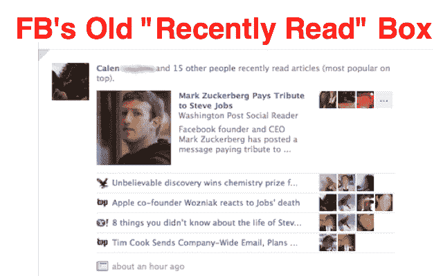
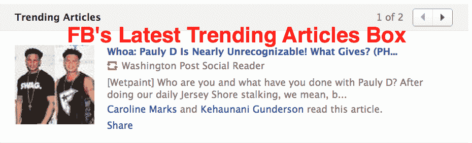
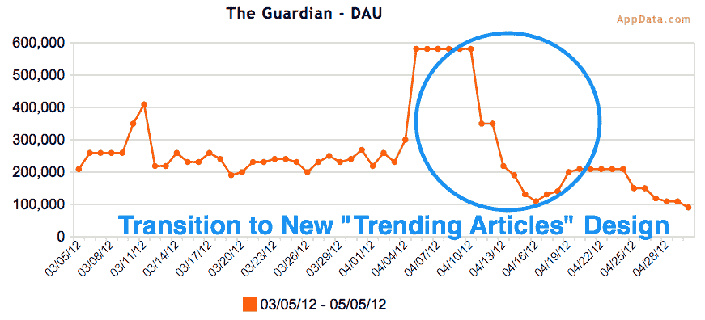
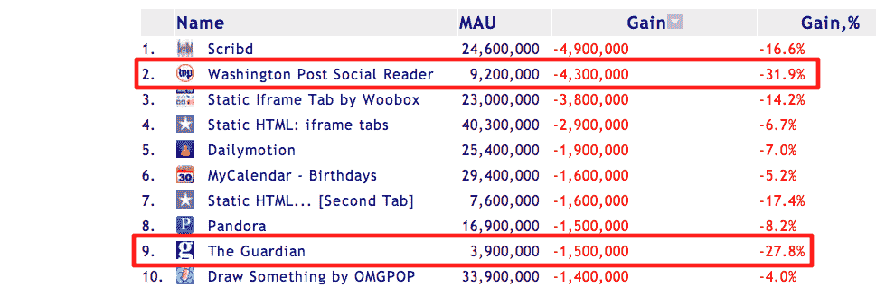
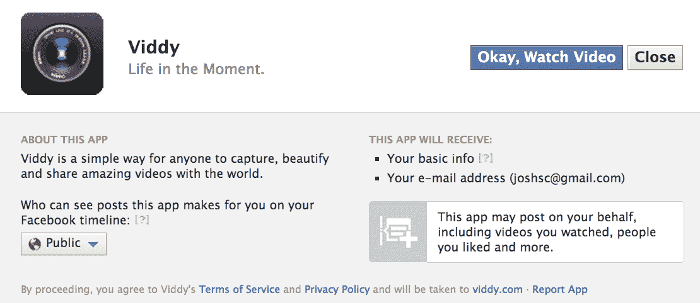

# 阅读器应用的下降可能是由于新闻提要的变化，表明脸书控制了流量龙头 

> 原文：<https://web.archive.org/web/https://techcrunch.com/2012/05/07/decline-of-facebook-news-readers/>

不，脸书新闻阅读器应用并没有因为用户突然厌倦了自动分享而下降。用户流失可能是由于向[【热门文章】](https://web.archive.org/web/20221217212448/http://www.insidefacebook.com/2012/04/17/facebook-tests-trending-articles-feature-to-encourage-users-to-try-social-reader-apps/)的过渡，这是一种新的方式，可以显示脸书正在测试的新闻提要中最近阅读的文章。更新:华盛顿邮报[证实了我的假设](https://web.archive.org/web/20221217212448/https://twitter.com/#!/rkellett/status/199595073158119426):“社交阅读器”崩溃是进化 FB 模块的 b/c。之前:“double-double”，在列表中向下 4-5 层，带有朋友图标——推动增长。”

此前，脸书一直在推动新闻阅读器应用的大量安装和重新使用，这种应用的“最近阅读的文章”框经常出现在新闻提要的顶部。但在 4 月中旬，在阅读器应用程序用户数量激增后，它用一个重新设计的“趋势文章”框取代了这个框，显示的文章更少，看起来也不那么突出。脸书可能没有显示任何“最近阅读的文章”框的过渡期可能是下降的原因，以及高峰的平稳和较弱的“趋势文章”设计带来的流量减少。

这些用户数量波动的真正含义是，脸书牢牢控制着从其新闻源获取流量的应用和内容类型。它可以调高或调低任何东西的存在，无论是照片、游戏、新闻阅读器，还是最近打开的 Graph video 应用程序，如 Viddy 和 SocialCam。这应该向企业家和风投发出信号:你不能仅仅因为一种产品目前在脸书表现良好，就建造它或投资它。

脸书正在寻找最吸引人的方式向你展示你朋友读过的文章。上面的第一个版本出现在 9 月到 4 月，经常出现在新闻提要的顶部。虽然它在推动流量方面很棒，但它没有为大多数文章显示图片或导语，因此可能会刺激耸人听闻的标题。

下面看到的新版本一次只显示一篇文章，经常隐藏在新闻提要的许多折叠中，它的大缩略图和缺少朋友的脸使它看起来像外国的。最近社交阅读器的下降可能是因为这个版本的点击量减少了，或者脸书只是显示它的频率比旧版本低了。

同样值得注意的是，根据应用增长跟踪服务 AppData 的说法，一些事情导致了四月初社交阅读器用户数量的激增。BuzzFeed 和 Forbes 引用的社交阅读器用户数量的大部分损失实际上只是高峰的平稳，这也可能是由于新闻 Feed 的变化。这些出版物看不到峰值，因为显然他们没有显示应用程序整个用户计数历史的 [AppData Pro 账户](https://web.archive.org/web/20221217212448/https://store.insidenetwork.com/)，而不仅仅是过去 30 天。由于脸书的数据报告错误将几天的增长集中到了 4 月 10 日，这一峰值显得更加突然。

从 4 月 11 日到 4 月 16 日的下降可能是由于脸书没有显示“趋势文章”框的形式，而从 4 月 17 日开始的适度增长可能是因为新版本开始出现。类似的用户数量波动也影响了《卫报》和《T2》、《华盛顿邮报》、《T4》、《独立报》和许多其他应用。不管你对自动分享的看法如何，对它的不满不会表现为跨阅读器应用程序用户数量的突然下降。

http://twitter.com/#!/rkellett/status/199595073158119426

更新:华盛顿邮报的互动制作人 Ryan Kellett 证实是新闻订阅的变化导致了阅读量的下降，而不是 BuzzFeed 的文章“脸书社交读者正在崩溃”中所说的用户不满。

脸书将继续测试新的格式，以寻找一种能带来大量推荐流量、但却是高质量文章的格式。新闻阅读器开发者应该抓紧时间，和他们的脸书代表谈谈这些变化是如何损害用户数量的，并希望“最近阅读的文章”的最佳版本很快出现。但是仅仅因为到目前为止有大量的有机推荐流量，并不能保证它会回来。

【T2

游戏开发者对这个教训太了解了。当脸书的应用平台推出时，对开发者来说是一个病毒式的财源，因为应用内的活动显著地出现在新闻提要中。游戏开发者蜂拥至脸书，但很快它就改变了其新闻源，因此游戏故事只会出现在其他玩家面前。突然间，有机种植变得更加困难了。你必须有大量的营销预算和应用程序来交叉推广，比如 Zynga，才能继续取得成功。类似的事情可能正在新闻阅读器应用程序上发生。

如果真的是用户对无摩擦分享阅读活动的不满导致了阅读量的下降，它就不会发生得如此迅速和明显。不同的用户在不同的时间开始使用应用程序，会遵循他们自己的不满曲线。他们不会同时逃走。这种下降也会打击其他类型的自动分享应用。[它还没有](https://web.archive.org/web/20221217212448/http://www.appdata.com/apps/facebook/125119214225766-viddy)。事实上，[非新闻阅读器](https://web.archive.org/web/20221217212448/https://techcrunch.com/2012/04/18/viddy-tops-app-store/) [自动出版 app](https://web.archive.org/web/20221217212448/https://techcrunch.com/2012/04/25/socialcam-millions-users-app-update/)同样的授权流程已经做得很好了。几乎没有严重不满的迹象。

事实是，脸书控制着新闻供稿，就像总编辑控制着报纸的头版。它决定用户能看到什么样的内容。就在上周，你可能已经注意到了关于朋友注册成为器官捐赠者的新闻报道。当脸书为了拯救生命而创建这个选项时，它将该功能创建的新闻报道的权重设置为“高”，以帮助增加注册，并且[成功了](https://web.archive.org/web/20221217212448/http://www.latimes.com/business/technology/la-fi-tn-facebook-impact-organ-donor-20120501,0,2705286.story)。

许多可疑的脸书交易可能会成为 Groupon 杀手，因为脸书可以将创收产品设置为不断出现在新闻提要中的[。但事实并非如此。脸书可能看到了低参与的故事，不想污染饲料，并最终扼杀了产品。](https://web.archive.org/web/20221217212448/http://www.insidefacebook.com/2011/03/17/facebook-deals-groupon/)

脸书通常不会过于公开地干预控制，如果干预的话，也是根据故事类型，而不是审查或推广某些内容主题。脸书通常希望尽可能创造最令人愉快的新闻，增加回访率和广告印象，这是一个很好的副作用。因此，虽然旧的“最近阅读的文章”部分可能已经获得了大量链接诱饵标题的点击，如“史努基怀孕了吗？”，这可能不是最好的用户体验。所以才没了。

*后记:很多人讨厌无摩擦的分享。其他人不介意它，我认为它有潜力推动数据驱动的内容发现，并在共享中提供有用的粒度——在不共享和明确发布内容之间的中间地带。这是一场关于策展未来的重要辩论，所以写下你自己的博文回应并发给我们，或者在推特上发表评论。*