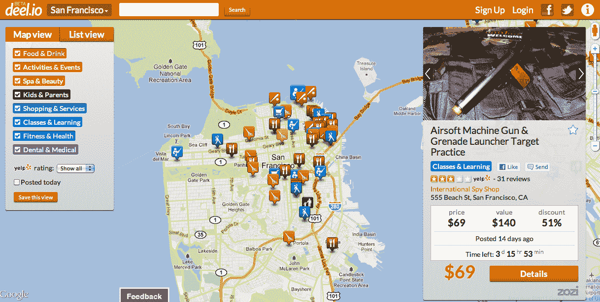

# deel.io:前谷歌工程师用新的搜索和发现平台 Dealmap 进行交易

> 原文：<https://web.archive.org/web/http://techcrunch.com/2011/11/03/deel-io-former-google-engineers-take-on-dealmap-with-new-search-and-discovery-platform-for-deals/>

每日交易空间一如既往地活跃。这意味着，一方面，这个领域有很多新模式的创新和实验，但另一方面，也有大量的衍生技术、克隆和噪音。这在很大程度上是因为进入壁垒非常低，如果不是不存在的话；每个人和他们的母亲似乎都有一个每日交易网站，或者正在使用。当然，这通常会导致交易超负荷、过期、混乱以及一千个其他棘手问题。

交易钱包、交易地图、二级转售市场等等已经出现来解决这些问题。今天，另一家初创公司进入了这个领域(处于测试阶段)，名为 [deel.io](https://web.archive.org/web/20230314040814/http://deel.io/) ，简而言之，它希望给混乱无序的交易领域带来一点组织性和简单性。

Deelio 的攻击方法并不完全是新的，因为它本质上是一个聚合器，让用户通过地图和基于列表的用户界面查看本地的交易。谷歌在 8 月份收购的[deal map 就是这么做的。](https://web.archive.org/web/20230314040814/https://techcrunch.com/2011/08/01/google-scoops-up-daily-deal-aggregator-the-dealmap/)[8 优惠券](https://web.archive.org/web/20230314040814/http://www.8coupons.com/)也有很棒的交易地图，等等。

当然，deelio 确实有搜索方面的专业知识。联合创始人 Sanjay Mavinkurve 和 Vijay Boyapati 都是前谷歌工程师。虽然交易聚合领域存在大量竞争，但马文库尔夫认为，没有人真正把搜索做得很好，作为前谷歌员工，“搜索是我们的天性”，他说。碰巧的是，Mavinkurve 是 HarvardConnection(后来被称为 ConnectU)的早期工程师之一，该公司由 Winklevosses 和 Divya Narendra 于 2002 年创立。Mavikurve 开始了 HarvardConnection 的早期工作，但于 2003 年毕业并为谷歌工作。在推荐马克·扎克伯格之前，维克托·高以兼职身份取代了马维库夫。其余的，正如他们所说，都是历史了。

虽然 deelio 的“交易搜索引擎”已经为十几个城市提供交易搜索，但就交易量而言，它还有一段路要走。但该网站仍处于测试阶段，这一天终将到来。除了易于使用的搜索功能，真正的价值主张是设计。交易地图和列表界面都非常简洁，响应和加载速度都很快，并且能够在搜索列表中查看 Yelp 评论，这是一个很棒的小功能。

在交易聚合器方面有大量的选择，提供一个很好的产品体验和一个吸引人的视觉布局可以对用户的获取和保留产生很大的影响。许多每日交易用户抱怨收到的交易或只能找到与他们喜欢的东西无关的交易。特别是对于那些不一定想要 50 美元水疗服务的人来说，提供不需要注册多个交易网站就能找到他们想要的东西的能力是关键。

此外，deelio 还整合了度假和度假套餐，这是一个通过所谓的“deelio Vacations”在日常交易网站上越来越受欢迎的垂直服务，它可以标出世界各地酒店的折扣，以便用户可以看到他们的目标目的地是否有交易。该团队目前还在致力于网站可用性的其他增强，包括个性化电子邮件摘要、附加分类和高级搜索标准等功能。

在疯狂的免费交易空间，deelio 简洁的设计和可导航的交易地图和搜索引擎绝对是受欢迎的补充。[请点击](https://web.archive.org/web/20230314040814/http://deel.io/)查看迪利奥的主页，并告诉我们您的想法。

**更新:**11 月 11 日，deelio 正式更名为[【The deal mix】](https://web.archive.org/web/20230314040814/http://www.thedealmix.com/)。