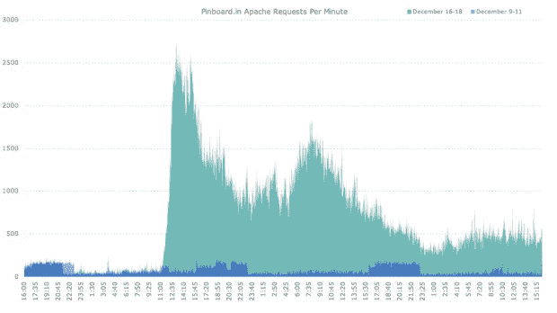

# 对于小型竞争对手来说,“美味大逃亡”是什么样子的

> 原文：<https://web.archive.org/web/https://techcrunch.com/2010/12/29/delicious-exodus-pinboard/>

# 对于 Pin 大小的竞争对手 Pinboard 来说,“美味大逃亡”是什么样子的

两周前，当[有消息传出](https://web.archive.org/web/20230307213249/https://techcrunch.com/2010/12/16/is-yahoo-shutting-down-del-icio-us/)称雅虎并非 100%致力于 Delicious 时，仍在使用书签服务的人们开始恐慌并寻找替代品。一些人转向的另一个竞争书签网站是 [Pinboard](https://web.archive.org/web/20230307213249/http://pinboard.in/) ，这是一个准系统书签网站，看起来很像 Delicious 早期的样子:精简，没有装饰，非常有用。该公司见证了流量和活动的涌入。上图显示了美味新闻发布后的三天内，与前一周相比，每分钟发送到其服务器的请求数。

几个小时前，Pinboard 在推特上发布了一条[链接](https://web.archive.org/web/20230307213249/http://idlewords.com/images/pinboard_spike.png)到图表:

http://twitter.com/#!/pinboard in/status/20323781167816704

这项服务一开始并没有处理大量的请求——高峰时每分钟几百个——但这个数字增加了大约十倍，达到每分钟 2500 多个请求。Pinboard 允许您从 Delicious 中导入书签。Mike [一年多前建议](https://web.archive.org/web/20230307213249/https://techcrunch.com/2009/07/06/back-to-basics-ditch-delicious-use-pinboard/)从美味转行。但据我所知，它只有大约 9000 名用户。您需要支付一次性费用才能注册，这有助于防止垃圾邮件发送者加入。目前的费用是 9.07 美元，是基于用户数量的。因此，并不是所有的美味用户都转向了 Pinboard，但这足以推动小型书签网站的发展。**更新** : [Pinboard 称](https://web.archive.org/web/20230307213249/http://twitter.com/#!/PinboardIN/status/20371829415743489)其拥有接近 16000 名用户。

美味在[炼狱](https://web.archive.org/web/20230307213249/https://techcrunch.com/2010/12/29/delicious-in-purgatory/)中停留的时间越长，越多的用户会去寻找像 Pinboard 这样的替代品。该网站甚至为那些考虑转换的人提供了一份诚实的利弊清单。