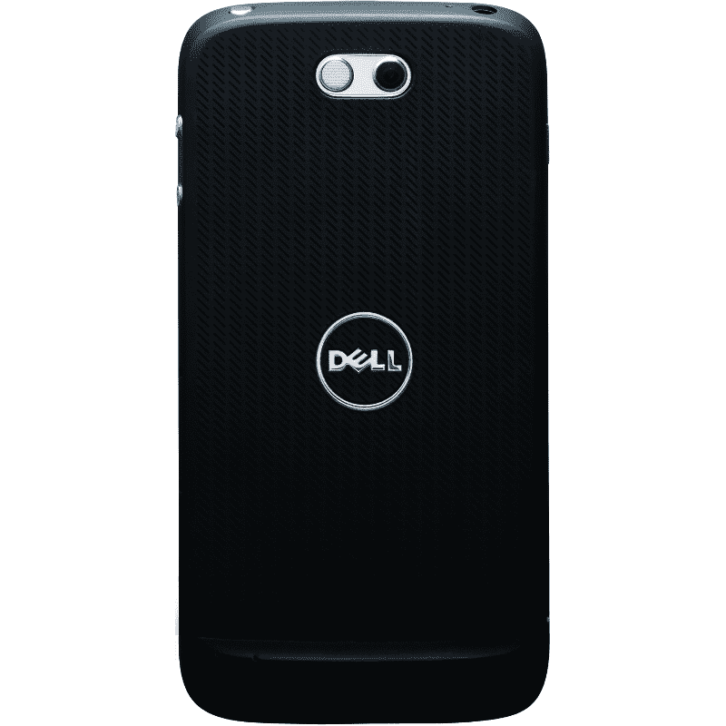

# 配备 Super AMOLED 显示屏的 DELL STREAK PRO 101DL(一款 Android 手机)将于 2012 年在日本上市 TechCrunch

> 原文：<https://web.archive.org/web/http://techcrunch.com/2011/09/29/dell-streak-pro-101dl-an-android-phone-with-super-amoled-display-to-hit-japan-2012/>

# 配备 Super AMOLED 显示屏的戴尔 STREAK PRO 101 dl(Android 手机)将于 2012 年在日本上市

这里是日本运营商[软银](https://web.archive.org/web/20230204143945/https://techcrunch.com/tag/softbank)的秋冬系列的第三款 [手机](https://web.archive.org/web/20230204143945/https://techcrunch.com/2011/09/29/android-phone-lumix-camera-panasonics-lumix-phone-101p-for-japan/)，它值得一篇专门的文章:它是所谓的[戴尔 STREAK PRO 101 dl](https://web.archive.org/web/20230204143945/http://www.softbankmobile.co.jp/ja/news/press/2011/20110929_07-page_10/)【JP】，该公司将于 2012 年 1 月开始向其订户提供这款手机(价格待定)。而且这不是安卓平板而是*手机*。

从规格来看，这将是一个相当不错的选择:

*   安卓 2.3
*   4.3 英寸 super AMOLED 屏幕，540×960 QHD 分辨率(大猩猩玻璃)
*   800 万像素 CMOS 摄像头
*   130 万像素副摄像头
*   1.5GHz 双核 MSM8260 CPU
*   [SyncUp](https://web.archive.org/web/20230204143945/http://www.dell.com/us/p/syncup/pd) 兼容
*   [预装戴尔 Stage 2.0](https://web.archive.org/web/20230204143945/http://www.dell.com/us/p/stage/pd)
*   蓝牙 2.1+EDR
*   IEEE802.11b/g/n 无线网络
*   全球（卫星）定位系统
*   microSDHC 卡插槽
*   W-CDMA、GSM
*   尺寸:65×126×10.3 毫米，重量:140 克

从背面看，这款手机是这样的:

日本科技新闻网站 [Keitai Watch](https://web.archive.org/web/20230204143945/http://k-tai.impress.co.jp/docs/news/20110929_480241.html) 报道称，戴尔 STREAK PRO 101DL 有全球销售计划，但日本将首先获得该设备。