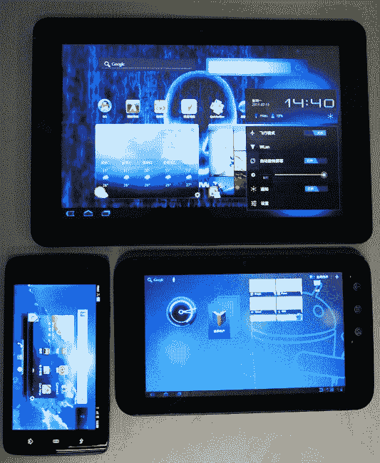

# 戴尔将在其 Android 产品线中增加一个 10 英寸条纹 

> 原文：<https://web.archive.org/web/http://techcrunch.com/2011/07/29/dell-will-add-a-10-inch-streak-to-its-android-line-up/>

# 戴尔将在其安卓产品线中增加一款 10 英寸的 Streak

戴尔 Streak 10 是戴尔本周在中国发布的一款 10 英寸蜂巢平板电脑，我们在这里[和](https://web.archive.org/web/20230204191807/https://techcrunch.com/2011/01/31/review-dell-streak-7/)[分别对其进行了评测。然而，关于这张图片有趣的是，戴尔 Streak 10 *和*戴尔 Streak 7 都运行 Honeycomb，对于那些背负着 Streak 过时操作系统的人来说，这是一个受欢迎的解脱。](https://web.archive.org/web/20230204191807/https://techcrunch.com/2010/07/28/review-dell-streak/)

这些平板电脑很奇怪，因为戴尔在亚洲制造和销售它们，而世界其他地区则是次要兴趣点。也许他们在中国有更多的市场牵引力，或者人们只是喜欢他们在那里的一些条纹，但无论如何，我们可以期待在未来几个月内看到 10 到达这里。

[引擎盖下毫无新意](https://web.archive.org/web/20230204191807/http://www.unwiredview.com/2011/07/28/dell-streak-10-pro-poses-next-to-the-streak-7-and-streak-5/)，然而:1280×800 像素分辨率，WiFi，500 万像素后置摄像头，200 万像素前置。它也有一个英伟达 Tegra 2 处理器。还没有定价，但请保持警惕。