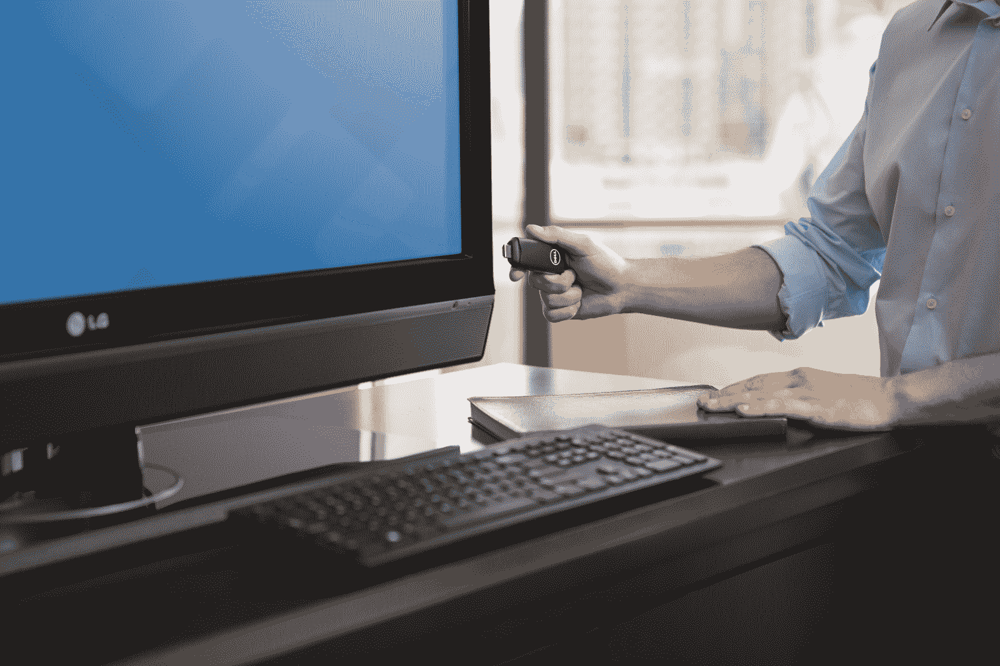
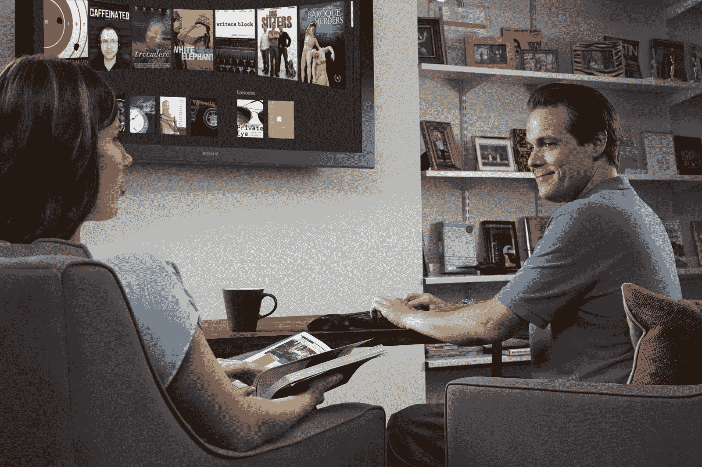

# 戴尔售价 129 美元的加密狗可通过 HDMI 输入将 Android 放在任何屏幕上 

> 原文：<https://web.archive.org/web/https://techcrunch.com/2014/01/29/dells-129-dongle-puts-android-on-any-screen-with-hdmi-input/>

# 戴尔售价 129 美元的加密狗可以将 Android 放在任何带有 HDMI 输入的屏幕上

戴尔继续在其计算产品阵容中押注 Android，推出了一款新的 129 美元设备，可以将谷歌的移动操作系统带到任何带有 HDMI 输入的电视或显示器上。这款新棒运行 Android Jelly Bean，还支持 MHL 连接(移动高清)，并提供蓝牙和迷你 USB，用于鼠标、键盘和其他设备连接。

除了板载蓝牙连接，新的 Dell Wyse Cloud Connect 还提供 802.11n 双频 Wi-Fi 和标准的 Android 软件 Google Play 商店。然而，这是一款专注于企业和业务的设备，还预装了戴尔的 Wyse PocketCloud 软件，以帮助它充当远程计算机的虚拟终端。

实际上，这应该是长期以来被吹嘘和追捧的瘦客户机 PC，你可以把它放在口袋里随身携带，它仍然能够提供对你所有文件、软件和通信的访问。当然，这并不意味着它不能为商务旅行者提供娱乐选择，因为它能够全高清输出，应该能够轻松运行网飞的 Android 应用程序。

“多核”Cortext-A9 ARM SoC 可能不是世界上最强大的移动处理器，但戴尔确实在其规格表中特别吹捧其高清和 3D 图形功能。它有 8GB 的板载存储，1GB 的内存，加上一个 micro SD 插槽，支持高达 72GB 的额外空间。

如果你是一个经常出差的人，仅仅基于表面印象，你可能会在旅途中疲惫的几个星期里在一台袖珍电脑上做得更差。有趣的是看到戴尔朝着这个方向前进，有效地从 Ouya 和 Gamestick 等设备的剧本中吸取了一页，但去掉了所有的废话，并用商业画笔描绘出来。

奇怪的是，至少在过去的五年里，这让我想要一台戴尔电脑。去想想。