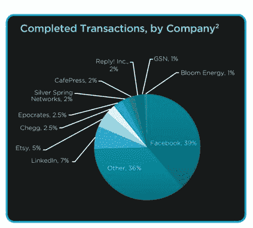
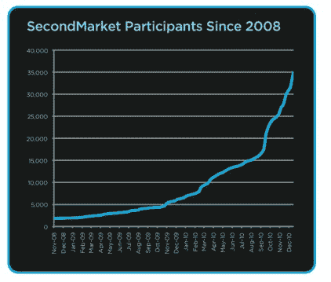
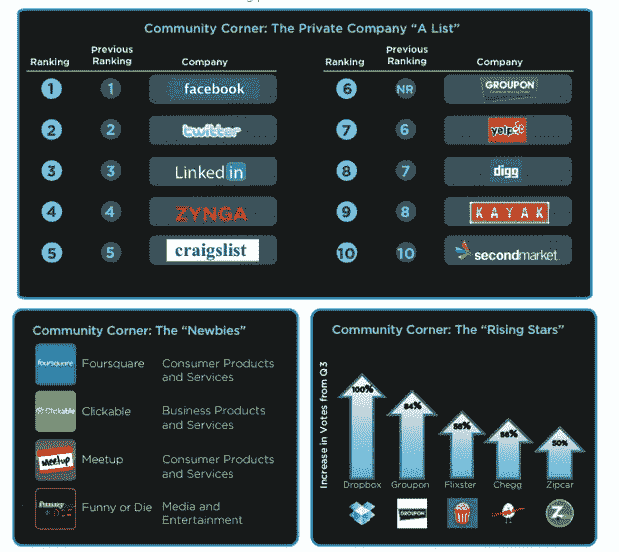

# SecondMarket 上私人股票的需求翻倍:第四季度报告 

> 原文：<https://web.archive.org/web/http://techcrunch.com/2011/01/21/demand-doubles-secondmarket-q4/>

# SecondMarket 对私人股票的需求翻倍:第四季度报告

随着脸书的股票最近在 second market[上的一次私人拍卖中达到了 700 亿美元的估值](https://web.archive.org/web/20230202233000/http://www.secondmarket.com/)，你可能会认为这些是唯一在私人股票市场交易的股票。脸书确实在 2010 年第四季度的交易中占了最大的份额(39%)，但是私人股票市场是广阔的，对各种股票的需求都很强劲，从 LinkedIn (7%)和 Etsy (5%)到 Chegg (2.5%)和 Bloom Energy (2.5%)。上个季度，SecondMarket 处理了价值 1 . 58 亿美元的私人股票交易，比第三季度的 7500 万美元翻了一番多一点。全年，SecondMarket 处理了价值 4 亿美元的私人交易。

在 SecondMarket 上交易的风险基金、对冲基金和富有个人的数量也在持续上升，自 2008 年以来累计达到约 35，000 名参与者。交易的增长，特别是与脸书有关的交易，正在引起美国证券交易委员会的审查，但是只要科技公司不上市，或者不能上市，SecondMarket 就会继续扩张。你可以点击阅读完整的第四季度报告[。](https://web.archive.org/web/20230202233000/http://www.secondmarket.com/pdf/documents/secondmarket-q4-2010-pcm-report.pdf)

在股票需求方面，脸书、Twitter、LinkedIn、Zynga、Craigslist 和 Groupon 排名靠前。后起之秀包括 Dropbox、Chegg、Flixter，还有 Clickable 和 Foursquare。需求大于份额，

