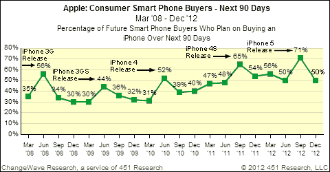
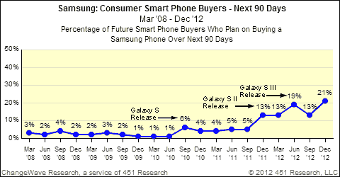

# 2013 年初，对三星智能手机的需求跃升至 23%，对 iPhone 的兴趣较上一季度下降了 21 个百分点 TechCrunch

> 原文：<https://web.archive.org/web/https://techcrunch.com/2013/01/15/demand-for-samsung-smartphones-jumps-to-23-for-early-2013-iphone-interest-down-21-points-from-last-quarter/>

# 2013 年初，对三星智能手机的需求跃升至 23%，对 iPhone 的兴趣较上一季度下降了 21 个百分点

ChangeWave 发布了季度消费者智能手机报告，该报告追踪北美对设备的需求以及对手机的满意度。该调查涵盖了未来 90 天内的计划购买量，并表明三星的销售在 2013 年早期可能会出现强劲增长，而对苹果 iPhone 的兴趣会受到打击。特别是三星的 Galaxy Note II 取得了令人鼓舞的表现，这意味着消费者渴望用手握住巨大的设备。

12 月份的调查发现，虽然有二分之一的北美人仍计划在 2013 年初购买 iPhone，但比上一季度的 71%有所下降。ChangeWave 指出，从历史上看，这仍然是苹果的一个很好的兴趣点，预计在新 iPhone 5 发布后的购买狂潮之后，需求会逐渐减少到正常水平。通常情况下，苹果的需求会在 iPhone 发布后立即飙升，然后回到较低的水平，但值得注意的是，iPhone 4S 发布后的需求仍然高于 iPhone 5。就消费者需求而言，苹果仍远远超过三星，但三星在此次调查中收获颇丰。

 以下是这家韩国公司的遭遇:一场 8 个百分点的游戏，将整体预期需求从 13%提升至 21%。ChangeWave 表示，在他们的调查历史中，大部分攀登是“前所未有的”。Galaxy S III 是三星手机中最受欢迎的，占总需求的 69%，但 Galaxy Note 2 是比赛中出人意料的黑马，占三星消费者兴趣的 23%。总体而言，消费者对“平板”设备相当感兴趣，27%的人表示他们想要至少 5 英寸的屏幕。4 到 4.9 英寸的类别仍然占 52%的兴趣，但显然，消费者正在对大屏幕移动设备的想法产生兴趣。

正如 Natasha Lomas 在周日的观点文章中所说，平板手机在许多方面都是“新常态”,消费者研究似乎也同意这一点。我仍然觉得这些东西难以置信地笨重，即使我的手很大，但更大的显示屏有明显的好处，越来越多的用户似乎愿意忍受这些屏幕尺寸带来的权衡。

至于移动操作系统的满意度，ChangeWave 报告了微软的一个惊喜——Windows Phone 8 现在在 4000 多名调查受访者中的排名高于 Android，54%的用户表示自己“非常满意”，而谷歌移动操作系统的这一比例为 48%。然而，iPhone 仍然在这一领域占据至高无上的地位，对 iOS 的满意度高达 71%。按 OEM 厂商划分，苹果以 70%的支持率独占鳌头，三星和诺基亚以 56%的支持率并列第二。