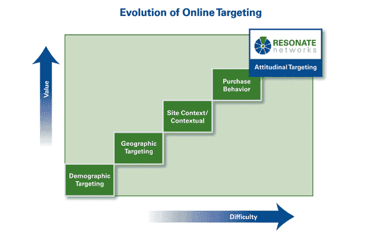

# Demand Media 执行副总裁和雅虎资深员工乔治·斯图尔特跳槽到初创公司共鸣 

> 原文：<https://web.archive.org/web/http://techcrunch.com/2010/12/01/demand-media-evp-and-yahoo-vet-george-stewart-jumps-to-startup-resonate/>

# 需求媒体执行副总裁和雅虎兽医乔治斯图尔特跳转到创业共鸣

在线广告技术初创公司 [Resonate Networks](https://web.archive.org/web/20230204195858/http://www.crunchbase.com/company/resonate-networks) ，刚刚[筹集了 500 万美元的融资](https://web.archive.org/web/20230204195858/https://techcrunch.com/2010/06/23/resonate-networks/)，已经[聘请了一位数字媒体重量级人物](https://web.archive.org/web/20230204195858/http://www.marketwire.com/press-release/Resonate-Welcomes-George-Stewart-as-Chief-Revenue-Officer-1362042.htm)担任其新的首席收入官。

[乔治·斯图尔特](https://web.archive.org/web/20230204195858/http://www.crunchbase.com/person/george-stewart)，前 [Demand Media](https://web.archive.org/web/20230204195858/http://www.crunchbase.com/company/demandmedia) 媒体销售执行副总裁，前 [Next New Networks](https://web.archive.org/web/20230204195858/http://www.crunchbase.com/company/next-new-networks) 广告销售 SVP，将直接与共鸣客户合作，通过利用羽翼未丰的公司的[“态度定位”](https://web.archive.org/web/20230204195858/http://www.resonatenetworks.com/attitudinal-targeting/)技术在网上建立品牌。

他将在纽约工作。

Stewart 于 1999 年在在线音乐初创公司 LAUNCH.com 开始了他的数字媒体职业生涯，当时他是广告销售副总裁——这家初创公司于 2001 年被雅虎收购。在雅虎工作期间，Stewart 担任全国销售总监和品类开发官。

成立于 2009 年的 Resonate 声称已经开创了一种全新的方法，根据消费者的价值观、信仰和态度来接触消费者，而不依赖于基于 cookie 的行为数据。该公司在上述解决方案上贴上了一个别致的标签，称之为[“态度定位”](https://web.archive.org/web/20230204195858/http://www.resonatenetworks.com/attitudinal-targeting.html)(更多关于其工作原理的信息[请点击](https://web.archive.org/web/20230204195858/http://www.resonatenetworks.com/attitudinal-targeting/how-does-attitudinal-targeting-work.html))。

