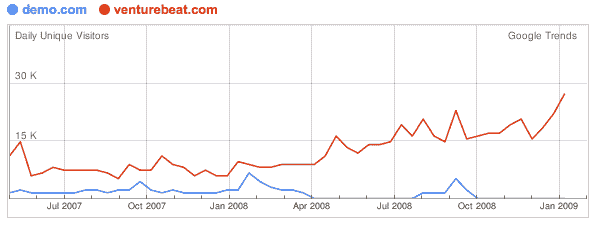

# 演示变得绝望:希普利出局，马歇尔加入 

> 原文：<https://web.archive.org/web/https://techcrunch.com/2009/02/18/demo-gets-desperate-shipley-out-marshall-in/>

# DEMO 绝望了:Shipley 出局，Marshall 上场

在与我们自己的 [TechCrunch50](https://web.archive.org/web/20221019082112/http://www.techcrunch50.com/2008/conference/) 会议竞争的 [DEMO](https://web.archive.org/web/20221019082112/http://www.demo.com/) 会议上，事情正在发生变化，这是 IDG 举办的创业和产品发布会议。13 年后，会议组织者克里斯·希普利将为 [VentureBeat](https://web.archive.org/web/20221019082112/http://venturebeat.com/) 的编辑马特·马歇尔让路。两人将共同制作 DEMO，然后由马歇尔接手。马歇尔表示，他将专注于在演示中“注入更深层次的主题”。

DEMO 肯定需要新血。VentureBeat 可以利用这笔交易带来的额外现金。(VentureBeat 将分享大会利润)。但是马歇尔要做的不仅仅是吸引观众中的下巴颏儿。他将不得不重振一个垂死的品牌。与其说是会议的主题，不如说是谁去参加会议。

在这里，马歇尔面临着一场艰难的战斗，因为演示会向参加演示的公司收取近 2 万美元的费用(相比之下，参加 TechCrunch 50 的演示公司是择优录取的，免费参加)。也许 IDG 今年会打折，但在目前的经济形势下，这很难做到。至少马歇尔说，如果有必要，他愿意重新评估这一模式:

> 我们将带来新的视角，并对其进行审查。我们将尽一切努力保持这个品牌的完整性

但是说服 IDG 改变其经济模式并不容易。我想马歇尔自己也意识到了这一点:

> 这是一个从 1991 年就有了的组织，经历了风风雨雨，不断有公司来。这些公司为市场推出真正的产品，这种模式似乎行得通。他们不断回来。

那为什么要改呢，对吧？如果 DEMO 坚持其勒索初创公司的模式，我们没有意见。

马歇尔有一个优势就是他的博客。VentureBeat 的读者与 IDG 希望吸引来演示的人群类型重叠，VentureBeat 让他们全年都参与到对话中。如果你想建立一个社区，博客是实现这一目标的途径。唯一一次有人费事去演示网站是在会议期间，观看免费视频，他们不想付费亲自观看。

我应该指出，虽然 VentureBeat 每天都在博客领域与 TechCrunch 竞争，但它也是我们举办的另一项活动[crunches Awards](https://web.archive.org/web/20221019082112/http://crunchies2008.beta.techcrunch.com/)的联合主办方。因此，这只是我们必须击败他们的另一个领域。这叫竞合。

