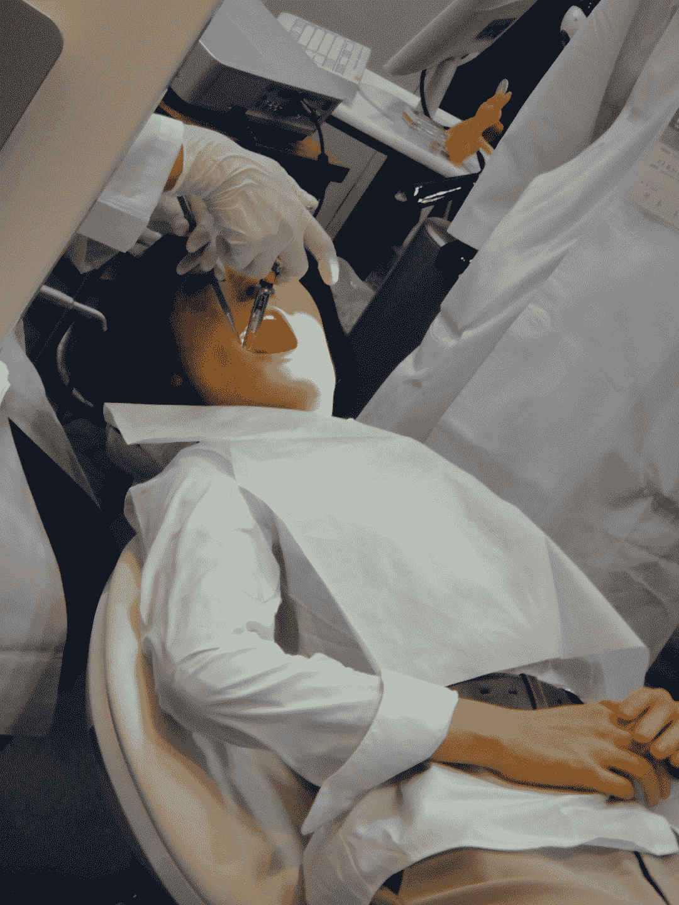
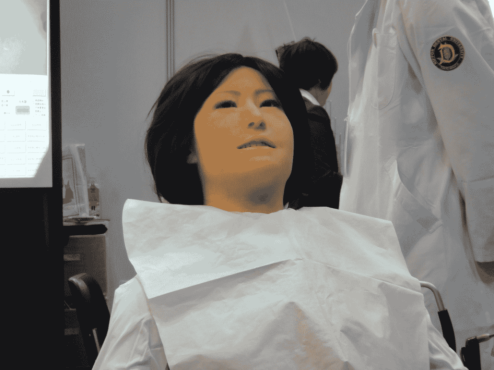

# 视频:超逼真的牙科训练人形机器人“Simroid”

> 原文：<https://web.archive.org/web/https://techcrunch.com/2011/11/24/dental-training-humanoid-simroid/>

# 视频:超逼真牙科训练人形“Simroid”

日本研发的超逼真牙科训练机器人 Simroid 在 2007 年首次亮相时，在全球新闻媒体中引起了轩然大波。当时的现实主义水平相当高，但几天前在东京展示的新版本更高。

其基本思想是，Simroid 通过尽可能真实地移动和说话来模拟牙科检查期间的人类患者，包括模拟医生意外触摸她的“乳房”时的呕吐反射或负面反应。两个摄像头正在记录治疗过程，这使得在每次培训后评估牙科学生的表现成为可能。

 

日本牙科大学教授 Hamura 解释道:

> 我们做的第一个改进是机器人现在有了语音识别功能。所以当你对它说话时，它会相应地移动。嘴巴里和周围也有传感器。所以，举例来说，如果有什么东西疼或者感觉不舒服，机器人可以做出反应。另一个改进，如你所见，是皮肤。机器人牙科病人必须“张大嘴巴”，所以如果皮肤是由硅树脂制成的，它可能会撕裂。所以我们使用了一种不同的材料，即使它被拉伸很多或者与牙科器械接触也不会撕裂。

最新版本是双语(英语和日语)，这意味着 Simroid 可能很快也会在美国和其他地方上市。

这段由 [Diginfo TV](https://web.archive.org/web/20221006180844/http://www.diginfo.tv/2011/11/24/11-0245-r-en.php) 拍摄的视频(英文)，提供了更多的洞察:
【YouTube = http://www . YouTube . com/watch？v = c 47 nhadfqso&w = 560&h = 315】