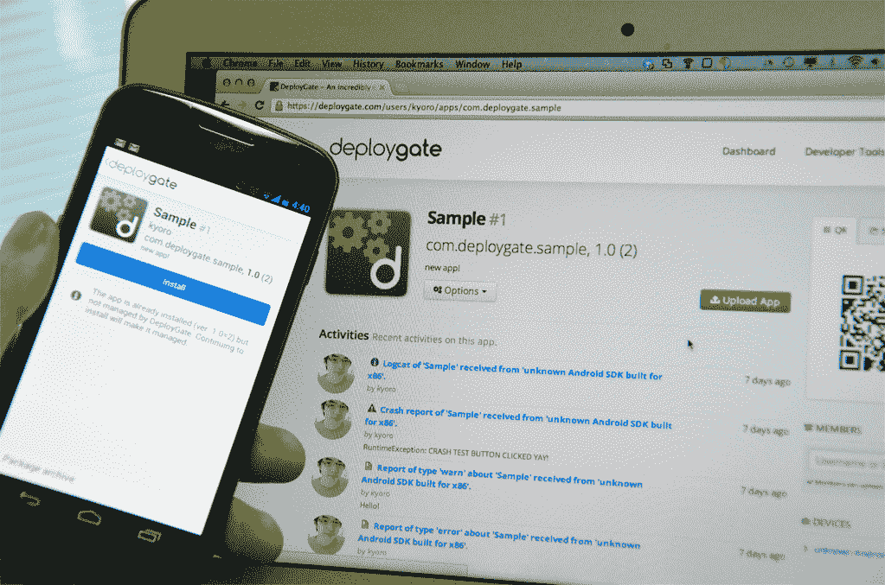

# 部署门户:Android TechCrunch 提供简单、无线、实时的应用测试版测试

> 原文：<https://web.archive.org/web/https://techcrunch.com/2012/09/18/deploygate-simple-over-the-air-real-time-app-beta-testing-comes-to-android/>

# 部署门:简单，空中，实时应用测试版测试来到 Android

众所周知，开发和测试 Android 应用程序可能会[困难](https://web.archive.org/web/20221208180143/https://beta.techcrunch.com/2012/05/11/this-is-what-developing-for-android-looks-like/) [困难](https://web.archive.org/web/20221208180143/https://beta.techcrunch.com/2012/06/02/android-qa-testing-quality-assurance/)，但一个新推出的名为 [DeployGate](https://web.archive.org/web/20221208180143/https://deploygate.com/) 的解决方案旨在减轻这一过程的部分痛苦。简而言之，DeployGate 使公司能够通过无线方式向团队成员分发当前正在开发的 Android 应用程序，并监控性能。

该服务允许用户通过在 DeployGate 仪表板中拖放未发布的 Android 应用程序来将它们上传到多个设备，收集日志和报告，或推送更新——同样，所有这些都是通过网络进行的。

与 [TestFlight](https://web.archive.org/web/20221208180143/http://testflightapp.com/) 的相似之处似乎显而易见，但 DeployGate 提供了许多关键功能，使其有别于流行的 iOS 应用测试服务。

例如，部署门:

*   目前专注于 Android 的协作开发
*   实时工作
*   不一定需要 [SDK](https://web.archive.org/web/20221208180143/https://deploygate.com/docs)
*   不需要设备 id
*   专门针对开发人员

更多技术细节可在[这里](https://web.archive.org/web/20221208180143/https://deploygate.com/docs)找到(该服务有英语和日语两种版本)。

虽然 DeployGate 对每个想尝试的人都是免费的，但对于个人 Android 开发者、小公司和大型企业项目，有三种不同的[价格计划](https://web.archive.org/web/20221208180143/https://deploygate.com/pricing)。

有趣的是，这项服务是由总部位于东京的 mixi 最近成立的一个特殊部门提供的，mixi 是日本最大的真实身份社交网络(2600 万用户)的运营商。

这个部门，即所谓的创新中心，应该会加速新的内部业务的创建，以扩大 mixi 的整体产品组合。作为这些新业务之一，DeployGate 被认为将利用该公司在开发智能手机应用程序方面的经验——类似于亚马逊通过 AWS 拓展电子商务。

DeployGate 由井上京介(其为 Mixi 提供的基于 NFC 的签到服务于 2011 年被 TechCrunch 报道)和由纪藤崎琴音(负责 Mixi 的[安卓客户端](https://web.archive.org/web/20221208180143/https://play.google.com/store/apps/details?id=jp.mixi&hl=en)的开发)共同创建。

这是 DeployGate 的官方宣传视频:

[https://web.archive.org/web/20221208180143if_/https://www.youtube.com/embed/4qaeSm9V3Hw?feature=oembed](https://web.archive.org/web/20221208180143if_/https://www.youtube.com/embed/4qaeSm9V3Hw?feature=oembed)

视频