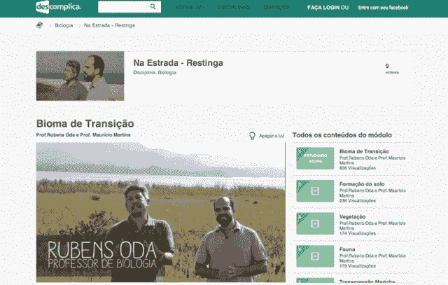

# Descomplica 从社交+资本获得 500 万美元，这是 AngelList 的第一个国际辛迪加，成为巴西最受欢迎的在线课堂 

> 原文：<https://web.archive.org/web/https://techcrunch.com/2014/02/06/descomplica-lands-5m-from-socialcapital-angellists-first-international-syndicate-to-become-brazils-go-to-online-classroom/>

互联网渗透率和社交媒体的使用在全球各个角落都在上升，但很少有人能比得上巴西的采用水平。根据联合国信息和通信技术专门机构互联网电信联盟(T1)的数据，巴西的互联网用户比例从 2002 年的 9%飙升至 2012 年的近 50%。此外，拥有超过 6000 万脸书用户的巴西现在是除美国和印度之外的第三大社交网络市场。

由于互联网使用率高，社交媒体越来越受欢迎，巴西正在经历数字化转型，这带来了许多充满希望的机会。虽然巴西的[电子商务增长吸引了大部分注意力，但](https://web.archive.org/web/20221206134632/http://www.lek.com/sites/default/files/0114_LEK_BrazilSpotlight_final(v3).pdf) [Descomplica](https://web.archive.org/web/20221206134632/http://www.descomplica.com.br/) 是越来越多看到巴西快速变化的教育格局巨大潜力的本地创业公司之一。

由于其分散化的教育框架，Descomplica 认为巴西不仅可以作为教育创新(和政策)的天然试验场，而且已经为真正的在线课堂做好了准备。Descomplica 于 2011 年 3 月推出，其使命是成为巴西最受欢迎的全方位服务在线课堂。

为此，该公司决定从高中市场开始，开发一个内容库和一套工具，旨在帮助学生更好地准备大学入学考试并提高考试成绩。从那以后，Descomplica 的主要关注点一直是内容，或者换句话说，是建立一个庞大的备考资料和学习指南库，并为学生提供尽可能多的方法来使用这些资料。

虽然这主要是以在线视频内容的形式出现的——正如联合创始人 Marco Fisbhen 告诉我们的那样，去年有超过 300 万名学生使用 Descomplica，超过 50 万人观看了直播的在线课程——但这家初创公司一直热衷于多元化。为了迎合巴西青少年越来越多的手机用户，Descomplica 还提供基于短信的学习工具，并正在与“巴西四大移动电话运营商中的三家”合作，创始人说。他补充说，现在有超过 20 万名学生在使用这家初创公司基于短信的移动教育服务。

Fisbhen 说，这种为巴西学生消费内容的所有方式提供全面覆盖的努力导致该公司为其内容库开发了一个 DVD 系列，最终销售了“数十万份”。到目前为止，所有的产品决策都是为了减少他们认为已经定义了巴西学习市场的不公正。(特别是 Fisbhen 所描述的高质量辅导服务的天价，这是唯一真正有价值的服务。)

随着数百万学生现在使用其在线辅导和学习资源，并通过其内容库(现包括 6，000 多个视频)建立了坚实的基础(计划在今年年底前进入 10K)，Descomplica 准备接受新一轮资本，开始第二阶段。Descomplica 创始人表示，虽然第一阶段的重点是内容和建设基础设施，但第二阶段的重点将是技术和分发。

为了帮助它投资于技术改进，比如改进它用来个性化其内容的工具，并帮助它不仅建立一个新的推荐系统，而且开发原生应用程序和一个真正的移动平台，Descomplica 已经在由 Social+Capital Partnership 牵头的 B 轮融资中筹集了 500 万美元。

这家初创公司的现有投资者，如彼得·泰尔的国际投资工具梵拉风险投资公司、Valor Capital Group 和 500 Startups，也为这轮融资做出了贡献，还有一些天使投资人。事实上，这些天使通过 AngelList 辛迪加投资了 Descomplica，创始人说这是 AngelList 上第一个进行国际投资的财团，包括平台自己的 Naval Ravikant 以及 Eric Ries 和 David Sacks 等投资者。

作为新一轮融资的一部分，这家初创公司的总融资额刚刚超过 700 万美元，Social+Capital 合伙人刘丽珍(Brigette Lau)将加入 Descomplica 的董事会。

无论是现在还是未来，Descomplica 价值主张的关键在于，它在产品开发战略和企业哲学上都采取了真正以学生为中心的方法。Colingo 联合创始人、de complica 投资者 Lee Jacobs 重申，这是 de complica 在拉丁美洲教育市场中与其他参与者不同的地方。他说，这反映在平台的参与度上。

至少在“第一阶段”，关键是开发一个学习平台，而不仅仅是提供预先录制的视频课程。该平台提供每周 7 天的直播课程，以及直播辅导，包括评论，反馈和准备论文的分数，以及测验和“实时答案”。

正如 Fisbhen 在我们第一次交谈时告诉我们的那样，要在巴西建立一个成功的在线教育公司，“归根结底，重要的不是算法，”他说，“而是找到一种令人信服的、适应性强的方式，从巴西顶级教育工作者那里传递主题。”如果 Descomplica 能够找到创造性的方法来实现这一承诺，它很可能成为引领巴西在线教育新时代的风笛手之一。

