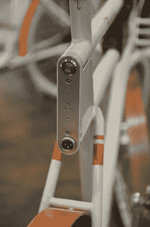

# 设计竞赛催生未来自行车 TechCrunch

> 原文：<https://web.archive.org/web/http://techcrunch.com/2011/10/07/design-competition-yields-bikes-of-the-future/>

# 设计竞赛催生未来自行车

位于波特兰的非营利组织俄勒冈州清单(Oregon Manifest)在过去的几个月里一直在举办一场比赛，学生和专业团队在比赛中努力创造下一代城市自行车。这不是关于速度(就像[迈凯轮复仇](https://web.archive.org/web/20230203071813/https://techcrunch.com/2011/03/25/specialized-and-mclaren-claim-the-fastest-complete-performance-bike-in-the-world/))或概念设计(就像[维也纳自行车](https://web.archive.org/web/20230203071813/https://techcrunch.com/2011/08/01/folding-electric-vienna-bike-is-dorky-but-practical/))，而是关于创造一种自行车，为那些想要丢弃汽车的人提供最大的效用。

这些从竞争中创新的活动真的很火爆；最近有很多旨在创造一切的东西，从超级节能汽车到电动飞机。这一次有 34 名参赛者，他们大多有一些电动辅助货运自行车的变体，但他们都在执行中有所不同。不过，我不得不同意人们的选择，IDEO 和 Rock Lobster 的合作(如图)。

 [你可以在这里看到其他获奖者](https://web.archive.org/web/20230203071813/http://oregonmanifest.com/2011/09/26/the-constructors-design-challenge-winners/)(我喜欢校园自行车和双座车)，但[法拉第](https://web.archive.org/web/20230203071813/http://oregonmanifest.com/2011/05/03/ideo-x-rock-lobster-cycles/)，作为 IDEO-Rock 龙虾自行车的名字，真的只是击中了我未来的骨头。除去一些稍微有点复古的服饰，我可以想象成千上万的这些东西挤满了街道。这个设计是经过深思熟虑的。

前轮有一个轮毂电机，由座位下面的电池供电。这种电池可以在插座上快速充电，实际上与雪佛兰 Volt 的电池类型相同。porteur 风格的前支架已被带入 21 世纪，带有可拆卸的平板支架，通过弹簧螺栓在几秒钟内连接或拆卸，支撑管的前端隐藏了一对 LED 头灯。机架安装在车架上，而不是货叉上，提高了稳定性。我一直是帕尼耶的粉丝，但这个也很好。让我想起了[这个弯木自行车篮](https://web.archive.org/web/20230203071813/https://techcrunch.com/2010/06/24/thats-one-elegant-bike-basket/)。Core77 有一个不错的项目设计日记，IDEO 也有一个页面。

它确实有一些设计问题需要解决:它相当高，座位和车把的关系不协调，它需要一个更有效的制动系统。但是这个设计仍然有一种奇怪的优雅。

像这样一辆价格合理的自行车将大大有助于取代城市中许多人的汽车。人力驱动，紧凑，简单，但能够长途跋涉和携带食品杂货。真正买得起电动助力自行车还需要一段时间，但电动助力自行车的承诺，已经在世界其他地方生效，似乎注定要来到我们的海岸，只要还有人创造法拉第和其他参赛作品这样的东西。

[第二张图片来源:[BikePortland.org](https://web.archive.org/web/20230203071813/http://bikeportland.org/2011/09/23/best-e-bike-ever-the-ideorock-lobster-oregon-manifest-entry-59542)