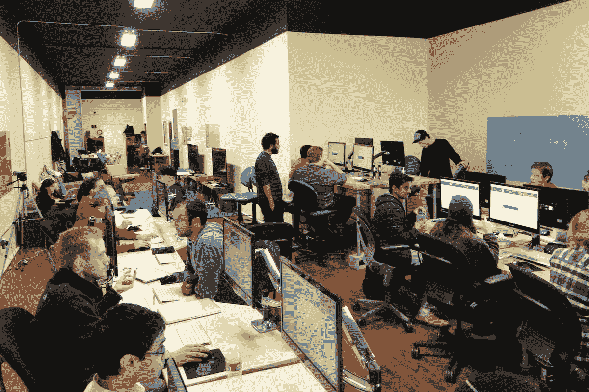

# 初创公司向 Dev Bootcamp 的 Ruby 毕业生献殷勤:88%的毕业生出价平均为 7.9 万美元 

> 原文：<https://web.archive.org/web/https://techcrunch.com/2012/05/10/dev-boot-camp-is-a-ruby-success/>

没有别的办法，不仅在湾区，而且在全国范围内，对开发人员和工程师的需求都很高。正如我们在这里提到的，这是一场争夺人才的战争，寻找一种新的方法不仅能吸引人才，还能培养人才，这是非常值得的。如今，私立大学的计算机科学学位可能意味着一流的教育，但成本很高。或者，也有像 [CodeAcademy](https://web.archive.org/web/20230118123309/https://techcrunch.com/2012/05/10/dev-boot-camp-is-a-ruby-success/) 这样的服务可以免费教你，或者收费的 Lynda.com 工程课程等等。有足够多的加速器，但那不是你从零开始学习如何编码的地方，所以，当谈到完全沉浸时，没有太多的选择。

这就是为什么 Shereef Bishay 创办了 [Dev Bootcamp](https://web.archive.org/web/20230118123309/http://devbootcamp.com/) ，这是一个为初学者和有经验的程序员设计的为期 10 周的项目，总部设在旧金山市中心。这个项目特别关注 Ruby On Rails，正如它的名字所暗示的，让学习者经历 400 多个小时的高强度技术培训。费用为 11，200 美元，提前注册可以享受 1，000 美元的折扣，可以一次性支付，也可以在两年内按月支付。虽然这听起来很多，但与 4 年教育的成本相比，这是很少的。当然，这一切都是关于价值和你付出什么得到什么。

Dev Bootcamp 的目标是让开发人员在项目结束时做好工作准备。它的第一次会议于 3 月 30 日结束，有超过 30 名雇主到场“速配”新培养的 Ruby 开发人员。就价值而言，根据黑客新闻[社区的回应来判断，](https://web.archive.org/web/20230118123309/http://www.hnsearch.com/search#request/all&q=dev+bootcamp)有不少人说，在他们认识的那些既独立学习又参加过 Dev Bootcamp 的人中，后者“更有成效”，HN 用户 shawndrost 说。

在 Dev Bootcamp 第一期收到的大约 200 份申请中，有 20 人被选中参加该计划，他们的年龄从十几岁到 40 多岁不等。至于选拔过程，Bishay 筛选提交的申请，并安排与申请人的 Skype 面试，以了解他们有多大的热情，有多愿意学习——以及他们是否愿意接受两个半月的技术知识填鸭式学习。

Dev Bootcamp 并不保证该项目结束后会雇用其学生，但如果他们被雇用，Bishay 会收到一笔中介费，他会将这笔费用投入到项目中，并报销学生总学费的 5000 美元。

但真正的问题是:在项目结束时准备好工作的 17 名开发人员中，迄今为止，有 14 人获得了工作机会，占 88%，平均工资为 79，000 美元。至于是谁提供的？一名参与的学生告诉我们，ThoughtWorks、Ooyala、DailyKos、Inigral、MochaLeaf、Zendesk、Milyoni 和 GeneralThings 都向 Dev Bootcamp 的学生发出了邀请，并确认学生已经接受了后四家初创公司的初级职位。

对于 2.5 个月的工作来说还不错。

6 月 11 日至 8 月 17 日举行的 Dev Bootcamp 第二届会议已经满员，但秋季会议(10 月 1 日至 12 月 7 日)目前已开始接受申请。Bishay 说，随着学习曲线变平，团队教育开发人员的过程变得越来越有效。对于第二轮，他们已经开放给 40 名学生，其中有 5 名教师。

但是，凭借它已经吸引的人才，以及已经在收到工作邀请的人数中显而易见的投资回报率，用不了多久，等待名单就会出现——或者直到 Bishay 开始考虑在其他城市或国家推出这种服务。

这是一个很好的模式，Bishay 和他的其他四名教师团队做了很多工作，以尽量减少对学生钱包的影响，同时仍然设法为参与者建立有利可图的运营潜力。

这足以让我认真考虑与鲁比共舞。

更多信息，请点击查看 Dev Bootcamp。