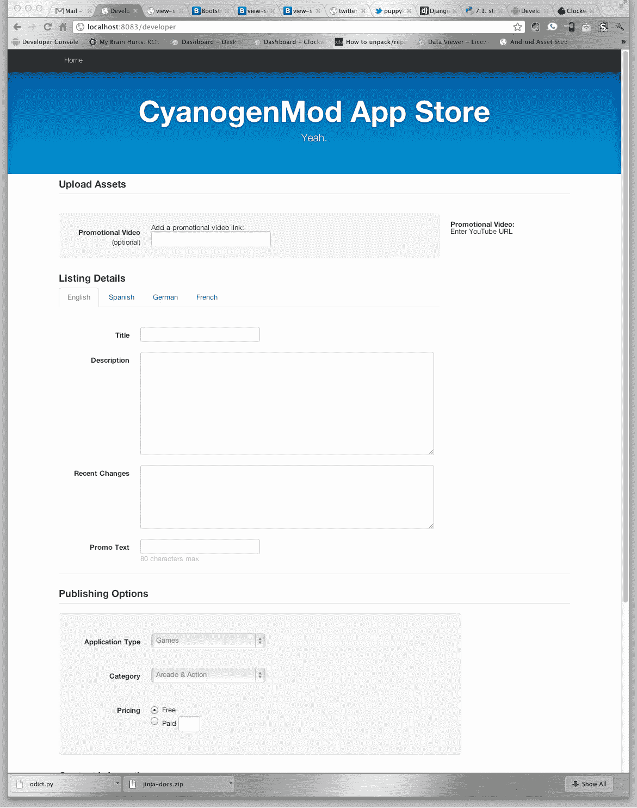

# 开发者正在为被禁的 Android 应用建立应用商店 TechCrunch

> 原文：<https://web.archive.org/web/https://techcrunch.com/2012/01/20/developer-is-building-an-app-store-for-banned-android-apps/>

一位名叫 Koushik Dutta 的 Android 开发者正在建立一个替代性的 Android 应用商店，其中将存放被谷歌官方 Android 市场禁止的应用。这将包括定制的[rom](https://web.archive.org/web/20221209103646/https://plus.google.com/103583939320326217147)(Android 操作系统的定制版本)，因版权投诉而退出的经典游戏模拟器，在移动运营商的要求下移除的非官方共享应用程序，可视语音邮件应用程序，一键寻根应用程序，等等。

这位网名为“Koush”的开发者，[在本月早些时候提出了这个想法，并收到了数百个积极的回应。今天，他](https://web.archive.org/web/20221209103646/https://plus.google.com/103583939320326217147/posts/ViJ665K38Xa)[发布了一个进度更新](https://web.archive.org/web/20221209103646/https://plus.google.com/103583939320326217147/posts/izarYrkb7SV)，展示了正在建设的商店的早期版本。(见下文)。

Dutta 在 Android 黑客圈很出名，他是 CyanogenMod 团队的成员，也是为 Android 设备定制的恢复控制台 ClockworkMod 的创造者。对于外行人来说，这些术语指的是定制版本的 Android 软件，用户可以在启动手机后将其安装在自己的设备上，这一过程使他们能够完全控制自己的手机。

类似于 iPhone 版越狱的 root 已经在 Android 社区中普及，今天有许多软件应用程序，技术不太好的用户(即没有编程知识的用户)可以使用它们来为他们的设备 root。然而，这仍然是一项有风险的任务，所以要小心行事——如果你搞砸了，你可能会把你的手机变成一个漂亮的镇纸。

生根之后，用户可以安装替代固件，如史蒂夫·孔迪克创建的 CyanogenMod，它提供了一个定制版本的 Android OS，不受运营商的控制和定制。现在 CyanogenMod 的活跃用户已经超过 100 万。这是一个相当大的社区。

假设项目进展顺利，这些用户将可以在项目完成后访问新的替代应用商店。今天发布的截图显示了一个非常基本的应用提交页面——看起来不像成品。但是很有希望。

虽然修改一直是极客 Android 人群中的一项受欢迎的活动，但有趣的是，当涉及到应用程序时，他们现在面临着许多与他们的 iPhone 同行相同的限制。Android 可能会提供一个更加开放的应用发布流程——不涉及审查委员会或等待时间——但仍有规则。某些应用是不允许的，特别是如果它们侵犯了版权或者移动运营商需要从增值服务(如网络共享)中获得收入。

这应该是一个值得关注的有趣项目。

