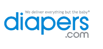

# Diapers.com 即将售出 5 亿片尿布，融资 2000 万美元

> 原文：<https://web.archive.org/web/https://techcrunch.com/2010/04/20/diapers-com-on-its-way-to-selling-half-a-billion-diapers-raises-20-million-debt-round/>

“今年我们将售出 5 亿片尿布，”Diapers.com 的首席执行官马克·洛尔告诉我。那是一大堆尿布。事实上，据传说，Diapers.com 的纸尿裤销量是网上第二大纸尿裤销售商亚马逊的四倍。他说，2009 年，Diapers.com 获得了 1.82 亿美元的收入，高于 2008 年的 8900 万美元。今年，Diapers.com 的收入有望达到 2.75 亿美元。该公司可能有一天会成为尿布和婴儿用品的捷步达康。(相比之下，Zappos 去年赚了 12 亿美元，现在是亚马逊的一部分)。

总部位于新泽西州蒙特克莱尔的公司今天宣布从 Pinnacle Ventures 获得最新一轮 2000 万美元的融资。(其实公司名字叫 Quidsi。Diapers.com 只是品牌名称)。去年 10 月，它在 E 轮融资中从 NEA、Accel 和 Bessemer 获得了 3000 万美元的股权。自 2006 年以来筹集的资本总额现已达到 7850 万美元。

Lore 和他的联合创始人 Vinit Bharara 不断将他们筹集的资金投入到营销中，从去年的 1500 万美元预算增加到 2010 年的 3000 万美元。他们说他们目前收支相抵。

Diapers.com 卖的不仅仅是尿布。它还出售，配方奶粉，婴儿床，婴儿车，汽车座椅和玩具。该网站有 12，000 种婴儿用品，到今年年底将增加到 60，000 种。例如，该网站每月销售 10，000 个汽车座椅，这可能使其成为网上最大的婴儿汽车座椅零售商。纸尿裤还是[育婴中心](https://web.archive.org/web/20220706233550/http://www.babycenter.com/)的独家电子商务合作伙伴。

“我们想通过消费品建立关系，”Lore 解释说，但随后开始销售利润更高的商品，而不仅仅是尿布、湿巾和配方奶粉。“运输高利润产品的增量成本很小，因为我们已经在运输尿布了，”他说。事实上，50 美元或以上的订单可以免运费，80%的订单不仅仅是尿布。平均订单规模为 100 美元。

为了从运营中榨取每一分钱，Diapers.com 开发了自己的供应链管理系统和盒子选择软件。box 软件根据纸板、填料和 UPS 运输的成本，计算出 Diapers.com 应该在库存中携带的每种尺寸的箱子的数量。单单选择正确的盒子就可以节省大约一个百分点的利润。再加上价格更高的商品和大规模商业的魔力，你会发现这个行业发展得非常快。