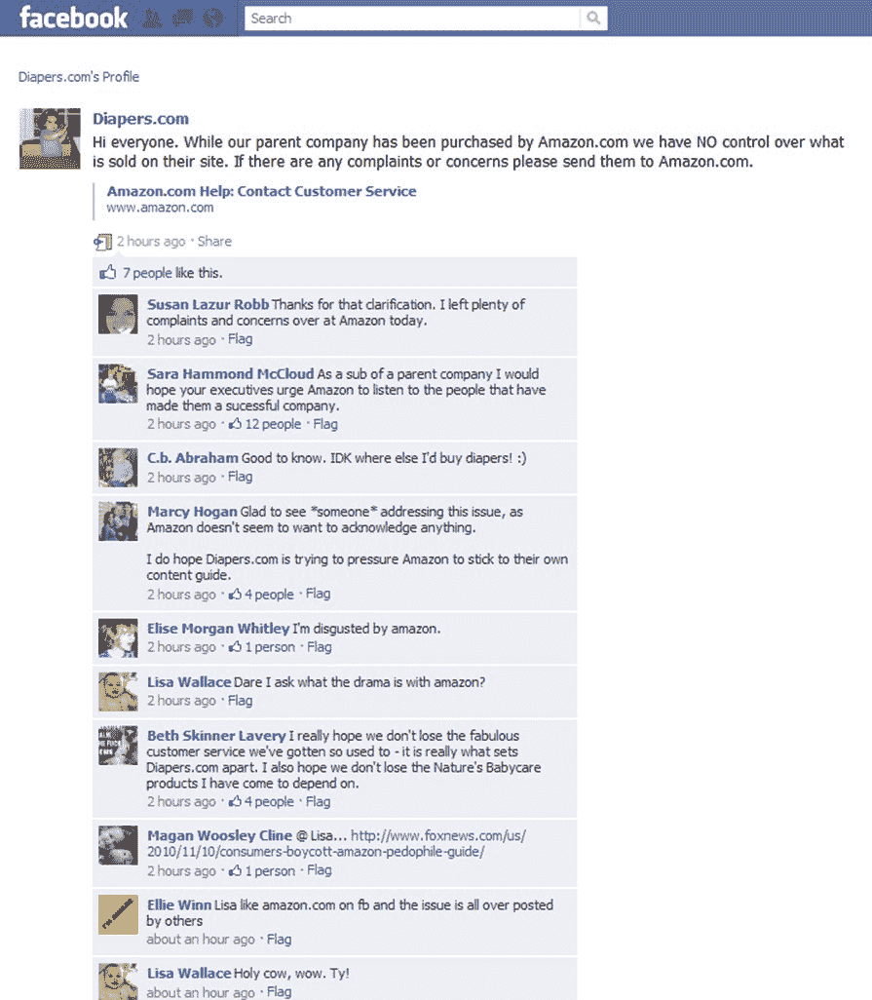

# Diapers.com 不想与亚马逊的恋童癖扯上任何关系

> 原文：<https://web.archive.org/web/http://techcrunch.com/2010/11/10/diapers-com-wants-nothing-to-do-with-parent-amazons-pedophilia-philia/>

# Diapers.com 不想与新父母亚马逊的恋童癖扯上任何关系

今天早些时候，TechCrunch 报道称，亚马逊正在销售一本名为《恋童癖者的爱与快乐指南》的书，当天晚些时候，[亚马逊为其销售进行了辩护。更令人恶心的是，人们真的买了它——它破了](https://web.archive.org/web/20230202213755/https://techcrunch.com/2010/11/10/amazon-defends-pedophile-how-to-guide/)[百强](https://web.archive.org/web/20230202213755/https://techcrunch.com/2010/11/10/amazon-fail/)。

随着这个令人作呕的传奇故事的上演，一些真正有趣的事情正在幕后发生。猜猜亚马逊上周以 5 . 45 亿美元收购了谁[？](https://web.archive.org/web/20230202213755/https://techcrunch.com/2010/11/08/confirmed-amazon-spends-545-million-on-diapers-com-parent-quidsi/)[Diapers.com](https://web.archive.org/web/20230202213755/http://www.diapers.com/)。猜猜 Diapers.com 把产品卖给谁？是的——带着小孩的父母。

看看这条来自 Diapers.com 官方回应的 FaceBook 帖子。妈妈们愤怒了。Diapers.com 不想有任何联系。

> “大家好。虽然我们的母公司已被 Amazon.com 收购，但我们无法控制他们网站上销售的商品。如果有任何投诉或问题，请发送至 Amazon.com”

很明显，这次收购的时机可能对两家公司都不利。但由于一个更微妙的原因，销售如此糟糕的书对亚马逊来说可能更糟。

Diapers.com 和亚马逊的客户群极有可能高度重叠，因为两者都是占主导地位的电子零售商。Diapers.com 消费者不仅不太可能从亚马逊或 Diapers.com 购买尿布(以抵制即将到来的收购)，而且也不太可能从亚马逊购买任何东西。毫无疑问，他们会在这两个地方网上购物。

这也是一个具有讽刺意味的时机，因为我可以保证，如果 Diapers.com 仍然是独立的，他们会通过公开说一些谴责的话，把亚马逊打得落花流水。请记住，在上周的收购之前，两家公司正在全力进行价格战。

这是为什么这对亚马逊很重要的财务背景。从星巴克(Starbucks)到亚马逊(Amazon)等公司都在不懈地追踪“[客户终身价值](https://web.archive.org/web/20230202213755/http://en.wikipedia.org/wiki/Customer_lifetime_value)”或 CLV，这取决于获得一名客户的成本，以及该客户终身的保留率(或流失率)。最大化 CLV 的最大决定因素是——到目前为止——保留。当你失去她时，CLV 会掉下悬崖。

这种东西在品牌领域也是一件大事。2010 年，Interbrand 宣布亚马逊是第 36 位[最受尊敬的品牌](https://web.archive.org/web/20230202213755/http://www.interbrand.com/en/knowledge/best-global-brands/best-global-brands-2008/best-global-brands-2010.aspx)，在前 50 名中，只有苹果和谷歌的同比增幅高于亚马逊。

当这个恋童癖传奇的新闻成为主流时，它可能会永久地影响亚马逊的形象。现在，在谷歌新闻上搜索“恋童癖亚马逊”，会有越来越多的点击返回到像洛杉矶时报这样的主流新闻网站。很快人们就会发现亚马逊出售的其他一些完全疯狂的书。

因此，除了令人厌恶的是亚马逊为自己的行为辩护之外，正如迈克所写的那样，这也可能是一个非常糟糕的财务决定。就我个人而言，我正在考虑取消我的亚马逊 Prime 账户，去其他地方购物。外面的妈妈们是怎么想的？