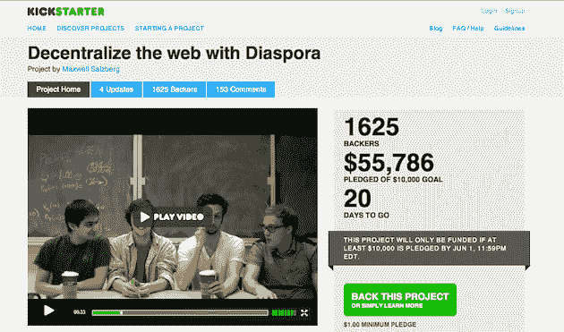

# Diaspora，开放的脸书备选方案，小额融资飙升超过 5 万美元[更新:现已超过 10 万美元]

> 原文：<https://web.archive.org/web/https://techcrunch.com/2010/05/12/diaspora-open-facebook-project/>

# “散居者”( Diaspora ),开放的脸书备选方案，小额融资飙升至 50000 美元以上[更新:现已超过 100000 美元]

每当一项服务流行起来，一个“开放”的替代者通常紧随其后。问题是，这些替代品中的大部分永远不会出现，更不用说接近它们试图取代的服务了。但是 [Diaspora*](https://web.archive.org/web/20221208133103/http://www.joindiaspora.com/) (希望成为新脸书的开放项目)获得资金的速度越来越快，不容忽视。

《纽约时报》昨天对这个位于纽约的项目进行了简介，指出这个由四名 NYU 学生组成的团队给自己 39 天时间通过在线筹资网站 [Kickstarter](https://web.archive.org/web/20221208133103/http://www.kickstarter.com/) 筹集了 1 万美元。正如 NYT 指出的，他们仅用了 12 天就超过了这个目标。截至昨天下午，他们有 23，676 美元的资金。仅仅一天后的今天，总数达到了惊人的 58，315 美元。他们还有 20 天的筹款时间。

任何时候任何东西在一天内翻倍，这都令人印象深刻，但更令人印象深刻的是，Diaspora 的筹款都是通过 Kickstarter 上的小额融资完成的。到目前为止，大约有 1，625 人捐赠了 58，000 美元。最低认捐额是 1 美元，但到目前为止，最多的人认捐了 25 美元(638 人认捐)，第二位是 5 美元(334 人认捐)。超过 100 人捐赠了超过 50 美元，5 人甚至捐赠了超过 1000 美元(其中 2 人捐赠了超过 2000 美元)。

他们正在吸引一些大人物参加募捐活动。VC [Fred Wilson](https://web.archive.org/web/20221208133103/http://www.crunchbase.com/person/fred-wilson) 刚刚[捐赠了](https://web.archive.org/web/20221208133103/http://twitter.com/fredwilson/status/13882434038)一笔未披露的金额。昨天，推特的[利奥·拉波特](https://web.archive.org/web/20221208133103/http://www.crunchbase.com/person/leo-laporte) [也捐赠了](https://web.archive.org/web/20221208133103/http://twitter.com/leolaporte/status/13832313467)。这场运动正在迅速升温。事实上，就在我写这篇文章的时候，资金又增加了 3000 美元。

当然,“散居”是否成功是一个完全不同的故事。这个项目的编码(目标是让每个人在自己的机器上控制自己的社交网络，尽管也会有一个类似 WordPress.com 的解决方案)要到今年夏天才会开始。但是随着脸书争议的白热化，这些孩子肯定选择了正确的时间开始这个项目。同样，他们还有 20 多天的资金筹集时间。100，000 美元似乎是一个锁定(甚至可能在未来几天)，如果他们通过这笔小额资金获得更多，不要感到震惊。

如果他们需要的不止这些，我相信像弗雷德·威尔逊这样的投资者会很乐意谈的。

**更新**:截至今天早上(5/13)，该项目 how now 的资金已超过 10 万美元，有超过 2500 名支持者。这使得它成为 Kickstarter 上迄今为止最大的项目——还有 19 天。

*【感谢* [*蒂姆*](https://web.archive.org/web/20221208133103/http://twitter.com/timhaines/status/13882771691)