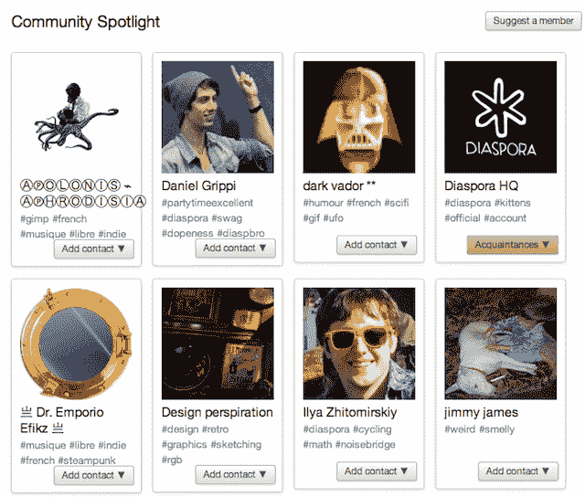

# 创始人去世后，Diaspora 向受邀者开放了重新设计的 Alpha 版 TechCrunch

> 原文：<https://web.archive.org/web/https://techcrunch.com/2011/11/13/diaspora-redesign/>

Diaspora 今天发出了新一轮邀请，邀请其重新设计的开源社交网络 alpha 版本。这些邀请是在 22 岁的创始人 Ilya Zhitomirskiy 最近去世的令人悲伤的消息传出之前发出的。自从一年前首次管理邀请以来，该服务已经推出了标签关注、直接消息、状态更新(如按钮)、通知频道等等。Diaspora 还增加了对其第一个应用程序 Cubbi.es 的支持，该应用程序允许用户通过浏览器扩展立即将他们在互联网上找到的照片发布到该服务上。

虽然它失去了一位具有前瞻性思维的创始人，但邀请函表明 Diaspora 将继续追求 Zhitomirskiy 的目标，即创建一个去中心化的社交网络，“让你做你自己，想怎么分享就怎么分享，不管有没有真名。”

因为 [Diaspora](https://web.archive.org/web/20230203082854/https://joindiaspora.com/) 是分散的，那些有邀请的人加入一个建立在独立托管服务器上的独特的用户群，而不是一个连接所有人的中心。用户可以选择从头开始建立一个身份，或者选择连接他们的脸书帐户，以导入他们的真实姓名，个人资料照片，并允许从散居地交叉发布。

脸书在入职过程中的出现可能会让一些人感到惊讶，他们认为 Diaspora 是试图推翻马克·扎克伯格高度集中的网络。相反，可选的脸书集成显示了散居团队对开放和低摩擦用户体验的奉献。

一旦你选择了一些要关注的标签，你就被带到了你的新主屏幕，这里显示了来自朋友和这些标签的内容流。一个熟悉的发布者允许更新被公开分享，或者与特定的朋友圈分享，散居者称之为建立在不对称关注系统上的“方面”。发布的更新还可以整合到脸书、Twitter 和 Tumblr 账户上。

按照网站的原则，你可以很容易地下载你的照片或。xml 的个人资料，并关闭您的帐户。该网站的加载时间比脸书或 Google+要长，但这是一个初创社交网络的预期。要真正起飞，Diaspora 需要一种更好的方式让用户找到并联系脸书的朋友和他们在 Twitter 上关注的人。不过，它确实提供了一个名为“社区聚焦”的建议用户列表，其中显示了所选成员的个人资料图片和关注标签，以帮助新注册者在他们的信息流中填入相关内容。

为了展示其应用平台的潜力，Diaspora 正在其侧边栏中推广 [Cubbi.es](https://web.archive.org/web/20230203082854/http://cubbi.es/) 。一旦用户通过了 Diaspora 账户的认证，并下载了 Chrome 或 Firefox 扩展，他们只需按住 shift 键，点击他们在网上看到的任何照片，就可以公开分享了。

Diaspora 现在已经覆盖了基础，成为那些对加入领先社交网络所需的控制妥协感到不安的人的满意解决方案。即使它没有增长到数亿用户，Diaspora 的工作替代方案可能会影响关于社交网络应该是什么的对话。这可能会激励脸书和 Google+采纳 Diaspora 的一些灵活性，扩大伊利亚理想的影响。

*【感谢戴夫·米勒的提示】*

