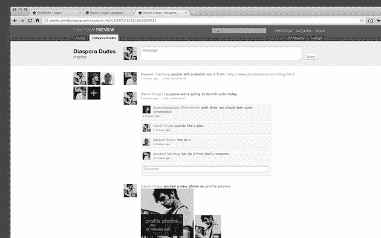
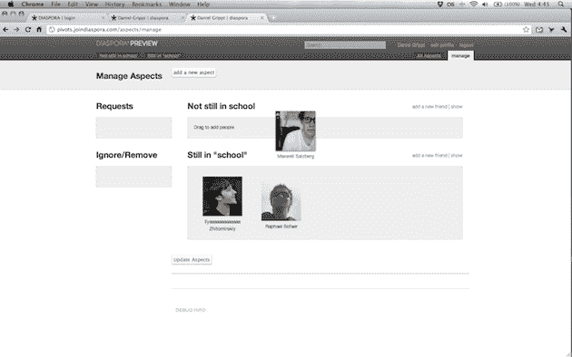
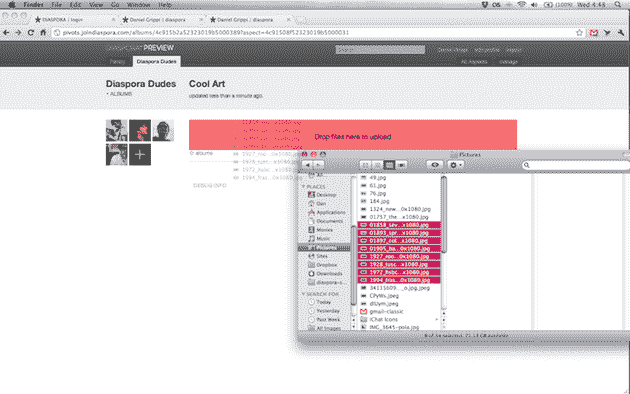
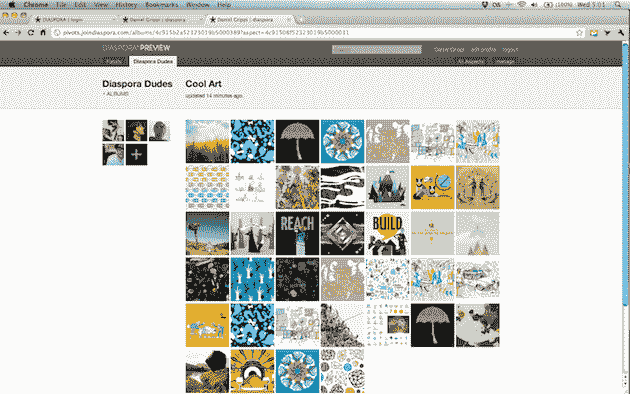

# 脸书竞争对手 Diaspora 透露:稀疏，但干净；发布源代码 

> 原文：<https://web.archive.org/web/https://techcrunch.com/2010/09/15/diaspora-revealed/>

# 脸书竞争对手 Diaspora 透露:稀疏，但干净；源代码已发布

一篇[帖子](https://web.archive.org/web/20221224170305/http://www.joindiaspora.com/2010/09/15/developer-release.html)刚刚出现在 [Diaspora 的](https://web.archive.org/web/20221224170305/http://www.joindiaspora.com/)博客上，首次披露了该项目的实际情况。虽然[还没有准备好](https://web.archive.org/web/20221224170305/https://techcrunch.com/2010/08/30/diaspora-october/)向公众发布，但开源社交网络项目正在向世界展示它今天的样子，并按照承诺[发布项目代码](https://web.archive.org/web/20221224170305/https://techcrunch.com/2010/08/26/diaspora-facebook/)。

乍一看，这个预览版的 Diaspora 看起来很稀疏，但很干净。奇怪的是，凭借其大幅图片和流媒体，它看起来并不像苹果新推出的 Ping 音乐社交网络混合了是的，脸书。他们注意到一些特征:

*   通过“方面”与您的朋友私下和近乎实时地共享状态消息和照片。
*   无论散居 seed 位于何处，都可以通过互联网交友。
*   使用“方面”管理朋友
*   上传照片和相册
*   所有流量都经过签名和加密(目前照片除外)。

但不管 Diaspora 现在是什么样子，关键是要有许多不同的版本托管在各地。有些看起来会与其他的不同——所以有一个简单、干净的基础来构建是有意义的。

该团队指出，该项目的公共 alpha 版本仍在 10 月进行，将立即包括脸书集成，以及数据可移植性。

将源代码交到开发人员手中是我们为上下文共享制作一个简单而实用的工具的第一次尝试。该团队今天写道:“散居还处于起步阶段，但我们最初的想法已经有了。"*今年夏天，我们的大部分精力都集中在向你的朋友群体发布内容上，不管他们的种子可能生活在哪里。这绝不是没有错误或功能完整，但它是让我们，用户，处于控制中的重要一步*，”他们继续说。

Diaspora 是一个特别有趣的项目，因为它首次亮相的时候，脸书正面临着大量的用户反弹，因为隐私问题和正在进行的改变。这帮助项目[通过 Kickstarter 筹集了超过 20 万美元的众包资金](https://web.archive.org/web/20221224170305/https://techcrunch.com/2010/06/02/diaspora-project/)。

当然，脸书还在继续增长，现在已经超过了 5 亿用户，因为几个月前存在的大部分争议已经平息，正如预期的那样。该项目还面临着试图推广开源项目的障碍——这些项目通常在纸上听起来很棒，但在实践中并不太好。也就是说,《散居》仍然很有趣，我们支持这些人完成它。

开发者们，开始构建吧——你可以在 github 上找到代码[这里是](https://web.archive.org/web/20221224170305/http://github.com/diaspora/diaspora)。但是请注意他们的警告:

> 你可以试着在你的机器上运行并使用它，但是我们不能保证。我们知道存在安全漏洞和缺陷，您的数据还不能完全导出。如果你发现了什么，一定要记录在我们的 bugtracker 中，我们会喜欢截图和浏览器信息。

