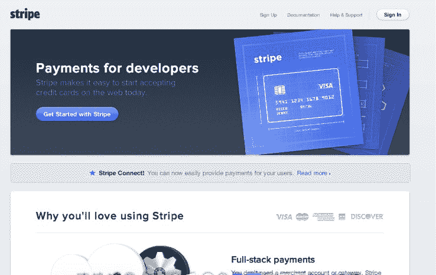
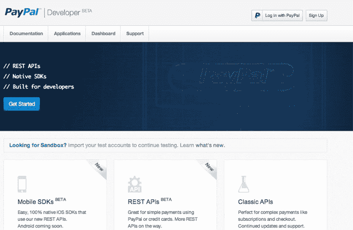
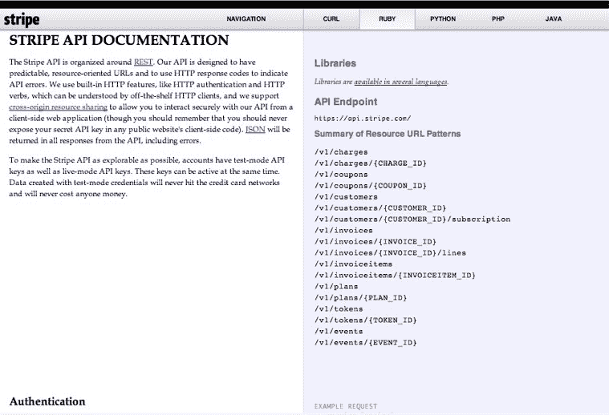
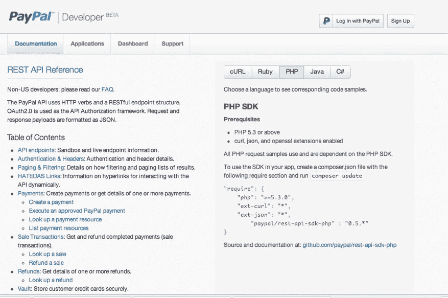

# PayPal 是不是只是克隆了 Stripe 的 API 文档？TechCrunch

> 原文：<https://web.archive.org/web/https://techcrunch.com/2013/03/08/did-paypal-just-clone-stripes-api-documentation/>

# PayPal 是不是只是克隆了 Stripe 的 API 文档？

模仿是最真诚的奉承吗？正如我们今天早上报道的，PayPal [今天刚刚发布了](https://web.archive.org/web/20221209211109/https://beta.techcrunch.com/2013/03/08/paypal-separates-developer-platform-from-x-commerce-launches-simpler-mobile-apis-and-more/)一些新的 API 和一个全新的开发者门户。这也包括发布新的 REST APIs。许多[注意到](https://web.archive.org/web/20221209211109/https://twitter.com/patio11/status/310067793129267200)的一件事——竞争对手 Stripe 的 REST API 文档看起来非常相似。

从截图中可以看出，PayPal 的文档结构是 API 文档在页面的左侧，示例代码在页面的右侧。这种布局与 Stripe 布局其 REST API 的方式相同。PayPal 在其开发者主页上也有其标志的蓝图，这与 Stripe 在初创公司主页上的蓝图类似。

你可以在 Twitter [上看到关于相似之处的讨论。](https://web.archive.org/web/20221209211109/https://twitter.com/search/realtime?q=stripe+paypal&src=typd)就连 Stripe 的创始人帕特里克·科利森[也在推特上发表了看法，](https://web.archive.org/web/20221209211109/https://twitter.com/patrickc/status/310065847668441088)在推特上说，“Stripe 推出 16 个月后，PayPal 的回应是……Stripe 的 API 文档的克隆。”

PayPal 似乎没有抄袭任何实际语言，但许多[似乎认为](https://web.archive.org/web/20221209211109/https://twitter.com/paulca/status/310096591748993025)这个支付巨头抄袭了 Stripe 的文档设计。这并不违法，但这是开发人员社区在发生时呼吁的事情。

PayPal 的一位发言人发表了这份声明:“在大卫[马库斯]的领导下，我们重新专注于为我们所有的客户——消费者、商家和开发者——创造简单美丽的产品。开发人员页面的设计符合这一理念，让开发人员尽可能容易地快速获得他们需要的内容。它与我们已经在 paypal.com 为消费者做的事情和我们在 www.paypal.com/merchants.为商家做的 PayPal 页面相匹配"

Stripe 推出了对开发者友好的在线支付系统，允许开发者避免设立商家账户和与银行交易，同时仍确保交易安全。这项服务因其简单而受到开发者的欢迎。该公司不仅与 PayPal 竞争，还与 Braintree 竞争；并得到了通用催化剂、红杉、彼得·泰尔、麦克斯·拉夫琴和埃隆马斯克的支持。

去年，Curebits 因从 37 个信号中提取设计元素和代码而被[调出](https://web.archive.org/web/20221209211109/https://beta.techcrunch.com/2012/01/28/curebit-apologizes-for-copying-37signals/)。Zynga 已经就游戏设计起诉了 Vostu [。当然，这些是不同的情况，但潜在的事实是设计被抄袭了。这是一个令人惊讶的举动，这家公司实际上是另一家上市公司易贝的一部分。值得注意的是，这个设计是从一个非常活跃、发展迅速的竞争对手那里抄袭来的。](https://web.archive.org/web/20221209211109/http://bits.blogs.nytimes.com/2011/07/20/zynga-is-hit-with-countersuit-over-game-designs/)