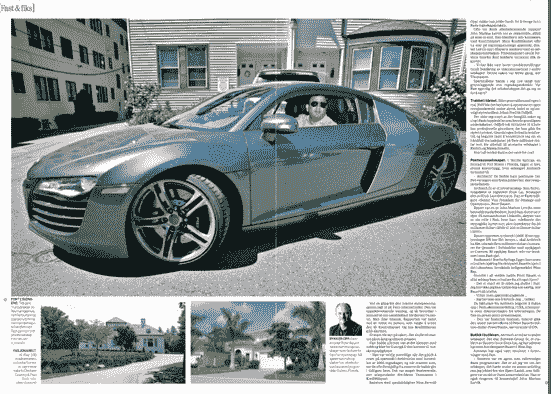

# “挪威的安然”欺骗了微软吗？关于 Fast Search & Transfer TechCrunch 混乱的更多细节

> 原文：<https://web.archive.org/web/https://techcrunch.com/2008/07/03/did-the-enron-of-norway-pull-a-fast-one-on-microsoft-more-details-about-the-mess-at-fast-search-transfer/>

# “挪威的安然”欺骗了微软吗？更多关于 Fast Search & Transfer 混乱的细节

 甚至早在一月份，当微软同意支付[12 亿美元](https://web.archive.org/web/20221007011909/http://www.beta.techcrunch.com/2008/01/08/microsoft-has-announced-a-takeover-bid-for-fast-search-transfer-priced-at-12-billion/)收购企业搜索公司 [Fast Search &转让](https://web.archive.org/web/20221007011909/http://www.fastsearch.com/)时，它就深陷会计丑闻，其股票已经暂停交易。它对从未实现的虚假交易的激进会计为其赢得了“挪威的安然”的绰号但是更多肮脏的细节不断从挪威媒体的顽强报道中浮出水面。

最新的报道刊登在 6 月 28 日出版的挪威杂志《Dagens nringsliv》上。在 Trond Sundnes，Dagens nringsliv，ran Skaalmo 撰写的一篇文章中，该杂志详细描述了这家挪威公司如何将免费软件试用作为收入，以及其高管如何为所谓的自我交易目的建立空壳公司。这篇文章的翻译版本(见下文)正在 Fast 的竞争对手和微软内部流传。

Fast 的问题本质上是财务问题，与过于激进的销售文化有关，这一点可以说是微软可以解决的。但这确实表明了微软的某种盲目，或者至少是愿意换个方式看问题，因为它执着地寻求成为搜索领域的一员(见雅虎和 T2 的 Powerset)。这也引发了对 Fast 底层搜索技术的质疑。如果 Fast 在完成产品交易时遇到了困难，那么它的技术究竟能有多好？

根据这篇文章，Fast 登记了 5000 万美元的虚假收入，2000 万美元的虚构合同，与首席执行官 Markus Lervik 关系密切的前高管将 600 万美元转移到他们控制的空壳公司。Lervik 继续领导这项业务，目前是微软负责企业搜索的副总裁。

文章中的一些细节包括:

> —该公司采取了一种激进的做法，给予企业客户免费试用期，并将其标为试探性交易。
> 
> —其中之一是与澳大利亚电信公司 Telstra 的一笔 1800 万美元的大交易，该公司在 2006 年末将这笔交易确认为收入。但交易随后未能实现。
> 
> 第二笔交易是与另一家可疑的搜索公司 Accoona 签订的，Fast 从未收到过付款。
> 
> —一项审计发现了对佛罗里达州迈尔斯堡一家名为 Archtech 的空壳公司的未经授权的付款，该公司由 Fast 前副总裁 Peter Bauert 和 Fasts 前首席财务官 Ali Riaz 所有(通过他控制的另一家名为 Bluebird Collabo 的公司)。上图中奥迪里的是里亚兹。

勒维克从未回应过记者的多次置评请求，但微软回应了。它发送了 2006 年和 2007 年的调整后年度报告，其中指出，超过 3000 万挪威克朗(600 万美元)被“不定期”支付和“错误批准”给:

> *。。。交易时由关系密切的人拥有或控制的公司。*

这显然是指 Archtech 和其他据称转售快速软件的空壳公司。根据微软提供的文件，问题在于这些相关公司“购买”了价值 350 万美元的软件许可证，而 Fast 从未实际支付过这笔费用。

我一直想知道快速搜索和传输的“传输”部分指的是什么。

[http://documents.scribd.com/ScribdViewer.swf?document _ id = 3809691&access _ key = key-1 ymq 88 S8 xiyj 1 gsqee 6y&page =&version = 1&auto _ size = true](https://web.archive.org/web/20221007011909/http://documents.scribd.com/ScribdViewer.swf?document_id=3809691&access_key=key-1ymq88s8xiyj1gsqee6y&page=&version=1&auto_size=true)