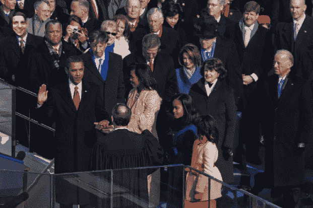

# 没去成就职典礼？假装你做了。

> 原文：<https://web.archive.org/web/https://techcrunch.com/2009/01/21/didnt-make-it-to-the-inauguration-just-pretend-you-did/>

# 没去成就职典礼？假装你做了。

昨天没能去华盛顿 DC 参加就职典礼，或者没能买到前排座位？没人需要知道。

只要去由在线照片编辑软件提供商[提供支持的](https://web.archive.org/web/20230127034301/http://www.crunchbase.com/company/fotoflexer)[MyInauguralPhoto.com](https://web.archive.org/web/20230127034301/http://www.myinauguralphoto.com/)，假装你就在那里，就在美国新总统宣誓就职的时候。

你能看到迈克·阿灵顿吗？

