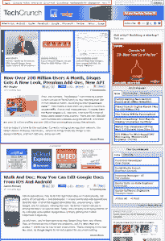
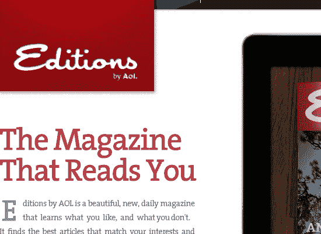
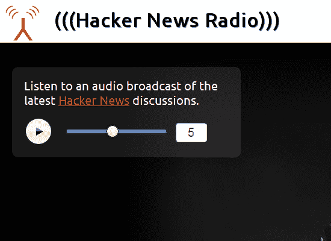

# Diffbot 像人们一样看待网络，现在对开发者免费 

> 原文：<https://web.archive.org/web/http://techcrunch.com/2011/08/25/diffbot-sees-the-web-like-people-do-now-free-for-developers/>

Diffbot 是一项极客且令人难以置信的有趣技术，它使用机器人、算法、计算机视觉和人工智能来像人类一样处理网络上的内容。“整个互联网可以被分解成 30 种不同的页面类型，”联合创始人 Mike Tung 解释说，他也被称为“Diffbot Mike”，而“Diffbot 可以识别它们。”Diffbot 知道社交网络个人资料、博客文章、网站首页、产品页面、活动页面和许多其他页面之间的区别。

今天，Diffbot 发布了它的第一组 API，现在对所有开发者免费开放。该产品的推出有可能极大地影响开发者可以构建的应用类型，对于消费者来说，这意味着一大批智能应用即将出现。

**新的 API:按需&紧随**

 现在有了这两个 API，开发人员可以构建自动从页面中提取含义的应用程序，理解什么是趋势和谁在谈论它的应用程序，提供以前没有的 RSS 提要的应用程序，以及只大声朗读网页相关部分，忽略广告、页眉和页脚的应用程序。

这只是开始。未来的 API 将使开发人员能够自动将活动页面转换为日历约会，将社交网络档案转换为 vCards，或者自动从产品页面中提取运费或评论，等等。虽然 Diffbot 没有设定路线图，但它预计将在未来几个月内推出这些额外的 API。

今天，前两个可用的 API 是:

*   **按需 API:** 这个 API 分为页面类型“Frontpage”和“Article”前者用于分析站点主页和索引页面，使用常见的布局标记，如标题、署名、图像、文章、广告等。文章 API 提取干净的文章文本、图片和标签。(例如，看[ready](https://web.archive.org/web/20230204232017/http://readab.ly/)。)
*   **Follow API:** 这是用来跟踪对任何网页的更改或更新。Diffbot 自动确定开发人员想要跟随的页面部分，并提取元数据，如标题、图像、文本摘要等，然后将页面分割成有意义的部分(见上图)。

**diff bot 实际能做什么？**

语音识别系统制造商 Nuance、AOL *(声明:TechCrunch 归 AOL 所有)*、社交媒体监测公司 SocMetrics 等公司已经在使用这些 API。

AOL 使用 Diffbot 提取标题、作者、图像、文本、视频、主题和其他元数据，用于其新的 iPad 杂志。 [Nuance](https://web.archive.org/web/20230204232017/http://nuance.com/) 在一款面向医生的产品中使用该技术来改进其自然语言处理，这需要理解复杂的医学术语。 [SocMetrics](https://web.archive.org/web/20230204232017/http://socmetrics.com/) 向 Diffbot 发送 [bit.ly](https://web.archive.org/web/20230204232017/http://bit.ly/) 缩短的链接，以获取完整的文章文本和主题，因此它可以确定哪些社交媒体用户谈论哪些主题最多。

这些只是几个[大牌](https://web.archive.org/web/20230204232017/http://www.diffbot.com/showcase)的例子。还有更小的，但同样创新的用例。比如像[黑客新闻电台](https://web.archive.org/web/20230204232017/http://hackernewsradio.com/)，它给你读黑客新闻和评论。或者 [FeedBeater](https://web.archive.org/web/20230204232017/http://feedbeater.com/) ，它可以很容易地将任何 URL 自动转换为 RSS 提要([diff bot 的第一批发明之一](https://web.archive.org/web/20230204232017/https://techcrunch.com/2008/10/27/stanfords-sse-ventures-funds-diffbot))。或者[这个 Diffbot 生成的 Twitter feed](https://web.archive.org/web/20230204232017/http://twitter.com/#!/prefeituraSP) ，它跟踪巴西圣保罗市的网页变化(因为它缺少 RSS)，并在 Twitter 上发布更新。

新的开发人员自助服务平台每月可免费调用 50，000 个 API。云计划提供 100，000 个 500 美元的呼叫，然后是 0.002 美元/呼叫。企业托管计划需要自定义定价。

Diffbot 由迈克·东(Mike Tung)和利斯·阿卜杜拉(Michael Abdulla)创建，两人都是斯坦福大学的博士生，他们请假创建了这家公司。这个想法源于董的愿望，即通过使用技术，在班级网站上自动跟踪新的作业。Diffbot 也是第一家由斯坦福的孵化器计划资助的创业公司，现在名为 StartX(前身为 SSE Labs)。