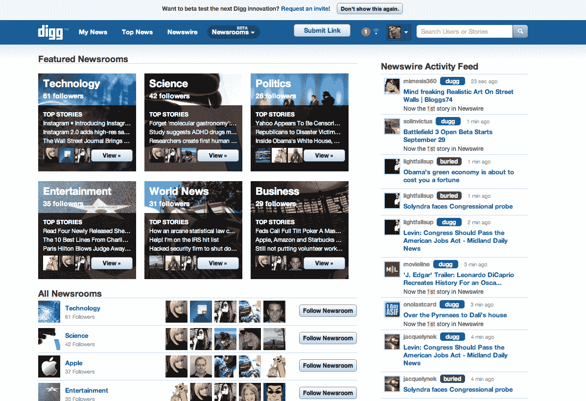

# Digg 尝试主题新闻编辑室，通过“最有意义”的故事聚合新闻 TechCrunch

> 原文：<https://web.archive.org/web/https://techcrunch.com/2011/09/20/digg-experiments-with-topic-newsrooms-aggregates-news-by-most-meaningful-stories/>

# Digg 尝试主题新闻编辑室，通过“最有意义”的故事来聚合新闻

新闻聚合网站 Digg 每月有 1700 万用户可供其支配，它正试图克服因 2010 年 8 月底不受欢迎的第 4 版重新设计而导致的[用户流失](https://web.archive.org/web/20230203132022/https://techcrunch.com/2010/09/02/reddit-digg-traffic-chris-slowe/)，如果它想超越硅谷的警示故事，就需要找到一种方法来保持其用户参与和增长。

是溶液？Topic Newsrooms beta 将新闻分为顶级类别，如科技、娱乐、世界新闻，甚至还有 Lady Gaga 或苹果等细分主题。基本上，Digg 正试图围绕对特定新闻的兴趣重建其用户社区。“有很多迹象表明，”Digg 首席执行官马特·威廉姆斯告诉我，他将 Digg 第 4 版的遭遇描述为一场“悲剧”，他说，“很难区分出在某个特定话题上什么是有意义的，什么是流行的。”

新闻编辑室将由两个元素组成，一个是首页，让人想起 Digg 的“热门”页面，另一个是新闻专线页面，这是针对给定主题提交的所有故事的实时提要。Digg 算法将会关注最近、喜欢、LinkedIn 分享和推文等信号，以确定一个故事是否会登上新闻编辑室的头版。

为了登上新闻编辑室的头版，一个故事还必须获得足够数量的 Diggs 和 Digg 用户的评论，这意味着一个故事的“意义”，就像过去故事在 Digg 上变得流行一样。来自新闻编辑室的最“有意义”的故事最终会登上头条新闻，或者整个 Digg 首页。

在这个新的测试版中，Digg 还尝试实时显示用户活动，并奖励用户参与徽章，如“王牌记者”徽章，用户在新闻编辑室首页提交给 Digg 的故事可以获得该徽章。

行得通吗？“总的来说，我认为‘新闻编辑室’项目是 Digg 引入新用户和一些老用户的大胆尝试，”Hasai 社交媒体的 BizDev 长期高级用户和副总裁 John Boitnott 说，“然而，他们最好准备好坚持己见，让这个新的测试版长期工作。”

威廉姆斯说，这个测试版最初只被邀请，现在正慢慢扩展到数百名用户，最终将达到数千人。我想 Digg 已经吸取了突然变化的教训。