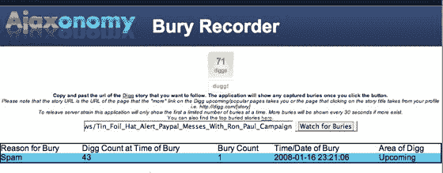

# Digg 有超级用户还是讨厌罗恩保罗 

> 原文：<https://web.archive.org/web/https://techcrunch.com/2008/01/17/digg-has-super-users-or-hates-ron-paul/>

# Digg 有超级用户或者讨厌罗恩·保罗

 一个锡纸帽 24 小时贴不够。:-)

1 月 16 日(昨天我写这篇文章的时候)[我写了关于](https://web.archive.org/web/20230220084144/https://techcrunch.com/2008/01/16/tin-foil-hat-alert-paypal-messes-with-ron-paul-campaign/)关于 Paypal 暂停罗恩·保罗支持者团体的账户，有效地阻止了保罗的支持者为新罕布什尔州的重新计票付费。好消息是(至少对保罗的支持者来说)当局批准了延期，一位支持者挺身而出，及时提供了所需的资金(原始资金仍被 Paypal 冻结)。

但是这可能是件坏事:要么是 Digg 有超级用户可以独自在 Digg 上埋下故事，要么是他们在审查罗恩·保罗的帖子。

我刚好在 Twitter 上读到一项名为“[Ajaxonomy Bury Recorder](https://web.archive.org/web/20230220084144/http://www.ajaxonomy.com/buryrecorder/)(ABR)”的服务，这项服务于去年推出，允许您查看 Digg 故事在每次埋葬时的埋葬数量、原因以及埋葬在投票过程的哪个阶段。想到罗恩·保罗的故事可能会得到一些选票，我决定在 ABR 上放一下午，看看会发生什么。

在 43 票的时候，这个故事因为垃圾邮件被埋没了，然后它在 Digg 的侧边栏中的特定类别中完全消失了。我在 Digg 上搜索 TechCrunch 的帖子(最新的，通过 URL ),看看是否有；什么都没有，点击了包含被埋没的故事帖子:答对了，帖子出现在列表中。

过去有传言说 Digg 的某些用户拥有“特殊权力”,所以我看到的可能只是那些可以在投票过程的任何阶段独自埋葬提交给 Digg 的故事的用户之一。或者(带着锡纸帽)Digg 可能已经决定禁止罗恩保罗。没有办法知道，Digg 从不谈论它的内部工作方式，所以我们没有办法找出它是哪一种，或者甚至它是两者的结合。不知道 Digg 上的人要多久才能埋没这个帖子？感谢上帝 [Reddit](https://web.archive.org/web/20230220084144/http://www.reddit.com/) ，呃；-)

**更新:** Pronet 注意到 Digg 自己在 2007 年 5 月把故事埋回了[。](https://web.archive.org/web/20230220084144/http://www.pronetadvertising.com/articles/digg-is-censoring-content-by-burying-stories-internally3452.html)

