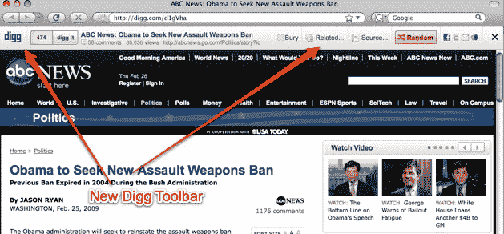

# Digg 正在开发一个工具栏来追踪 StumbleUpon、TinyURL 和所有其他的 

> 原文：<https://web.archive.org/web/https://techcrunch.com/2009/02/26/digg-is-working-on-a-toolbar-to-go-after-stumbleupon-tinyurl-and-all-the-rest/>

# Digg 正致力于开发一个工具栏来追踪 StumbleUpon、TinyURL 和其他网站

一个超级秘密的 Digg 工具栏在被发现。我们找到了一个测试版测试者，他给了我们一些关于它的基本特性。工具栏可以让你挖掘或隐藏你所在的页面，并显示已经被挖掘了多少次。还有显示相关页面的链接，以及来自同一来源的被 Digg 社区高度评价或标记为即将到来的更多页面。

然后是“随机”按钮，其工作原理类似于 StumbleUpon。它会把你带到一个基于你过去的输入和 Digg 投票随机生成的页面。从这个按钮的突出来看，这似乎是 Digg 想要强调的一个特性。用户也可以通过脸书、推特或顶部的图标分享页面。抽屉向下滑动，露出附加功能。

现在，有趣的是。对于每个页面，工具栏会创建一个类似于 TinyURL 或 bit.ly 的缩写 URL，以 http://digg.com/.开头。。后面是六个字符的代码，如“http://digg.com/d1gVha。”当你通过 Twitter 或脸书分享一个页面时，使用的就是这个简短的网址。事实上，对于 beta 测试人员来说，只要在任何 URL 前面加上“http://digg.com/”就可以将工具栏环绕在任何页面上，然后将它转换成一个简短的版本。这种技术也适用于从未被挖掘过的页面。我可以看到这个特性最终会作为浏览器插件的一部分出现，这样只需点击一下就可以创建 Digg 的 URL。

工具栏不是现有浏览器的附加组件。它实际上是在原始网页周围创建一个大的 i-frame，并在 Digg.com 域上发布。用户可以点击 X 来摆脱工具栏框架，并被带到原始页面，原始页面也会被点击。(这是一种类似于 Ginx 对其网络共享 Twitter 客户端所做的[的技术)。但是通过在自己的域中运行所有的推荐页面，Digg 可以对每个页面进行各种分析，比如有多少人浏览了它，人们点击了哪里，等等。](https://web.archive.org/web/20230207093741/https://techcrunch.com/2009/01/14/pierre-omidyar-is-getting-his-ginx-on-co-founder-status-confirmed/)

令人惊讶的是，Twitter 单枪匹马创造了这种对缩短网址的需求，而像 Digg 这样相对较大的玩家现在也想在这个市场上分一杯羹。

点击下面的[截图](https://web.archive.org/web/20230207093741/http://flickr.com/photos/smeinzer/3311758201/)查看大图:

【T2