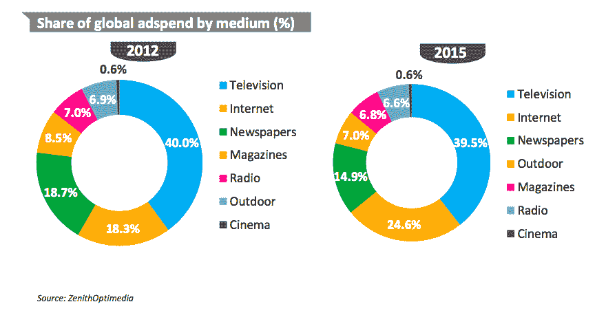
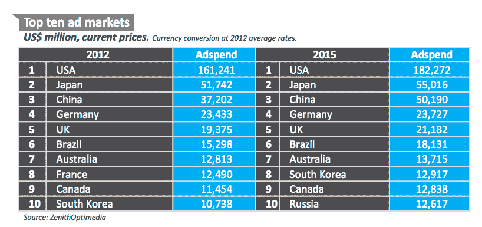
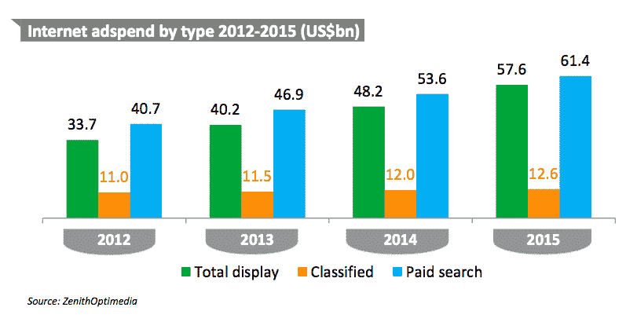

# 2013 年，数字广告将占美国全部广告支出的 22%，移动广告占 3.7%；2013 年全球广告支出总额 5030 亿美元 TechCrunch

> 原文：<https://web.archive.org/web/https://techcrunch.com/2013/09/30/digital-ads-will-be-22-of-all-u-s-ad-spend-in-2013-mobile-ads-3-7-total-gobal-ad-spend-in-2013-503b-says-zenithoptimedia/>

根据阳狮旗下广告公司 ZenithOptimedia 今天发布的数据，2013 年全球广告支出将稳步增长 3.5%，到年底将达到 5030 亿美元，互联网广告支出将继续增加。在美国这个绝对最大的单一广告市场，2013 年数字广告将占全部广告支出的 21.8%(1097 亿美元)，高于上年的 19%。与此同时，移动广告仍然是少数:在美国，移动广告将占全部广告支出的 3.7%(62 亿美元)。

当谈到目前推动广告增长的最大因素时，移动设备继续领先，今年在美国市场增长了 81%，2014 年这一比例将降至 61%，2015 年将降至 53%，届时移动设备将占广告支出的 8.4%。相比之下，互联网广告正以约 16%的速度增长，到 2015 年将占美国广告总支出的 27.8%。

这些数字在美国以外的市场同样令人印象深刻。在全球范围内，2012 年移动广告价值 83 亿美元，占互联网支出的 9.5%，占所有媒体广告的 1.7%。“到 2015 年，我们预测这一总额将上升至 331 亿美元，占互联网支出的 25.2%，占总支出的 6.0%，”分析师写道。

实力传播的分析师表示，移动互联网支出的增长速度是桌面互联网支出的 7 倍，2013 年移动广告增长了 77%，2014 年增长了 56%，2015 年增长了 48%。，受智能手机和平板电脑快速普及的推动。在全球范围内，互联网广告将以平均每年 10%的速度增长。

移动广告的快速增长不足为奇。除了一些人认为平板电脑的销量将在今年年底[超过个人电脑](https://web.archive.org/web/20221209004307/http://www.idc.com/getdoc.jsp?containerId=prUS24129713)的事实之外，对于美国的许多消费者来说——或许在其他市场更是如此——智能手机正在成为他们上网的主要方式。在这方面，这实际上只是有时行动缓慢的广告业在迎头赶上——不仅仅是在媒体购买者关注眼球方面，而是(可能更重要的是)广告技术和出版业想出了更令人信服的方式来证明这些广告确实产生了影响。

实力传播没有透露谁是移动广告领域的领军人物，尽管多年来该领域的超级领导者一直是谷歌，它在移动搜索和显示广告领域都占据主导地位。然而，事情正在慢慢改变和开放。千禧传媒(Millennial Media)收购 JumpTap(T1)、Twitter 收购 MoPub(T2)以及脸书不断增长的移动广告收入，这三个例子说明了我们如何看到越来越多的资源整合，以及对移动广告领域的更大关注。

“经过多年的炒作，移动广告终于到来了。实力传播北美首席执行官蒂姆·琼斯在一份声明中写道:“随着广告商和广告公司抓住它提供的机会，并提高其衡量和交付投资回报的能力，它的重要性只会在未来几年内增加。”。是的，我很确定我在过去的几年里也读过这句话；但像 Twitter 这样的举动，以及实际的数十亿美元收入，让这些词终于有了一些实际意义。

还有很长的路要走。尽管我们都听说了纸质书的[衰落](https://web.archive.org/web/20221209004307/http://www.theguardian.com/media/2013/sep/01/abc-newspaper-sales-falling-readership)和多少[老派出版商感受到了危机](https://web.archive.org/web/20221209004307/https://beta.techcrunch.com/2013/08/05/jeff-bezos-acquires-the-washington-post/)，以及人们如何关掉收音机去听 Spotify 等服务，但广告的连锁效应需要更长时间才能显现。如果你看看 2012 年，报纸和杂志的广告支出总和仍然超过互联网支出。如果你把收音机也算进去，到 2015 年，它们仍将超过互联网支出。

虽然我们谈论互联网视频和网飞等绕过商业广告的 OTT 流媒体服务的崛起，但电视广告仍然是最大的一块蛋糕——2012 年占 40%，到 2015 年仅下降了 0.5 个百分点。这很好地说明了为什么 Twitter 如此关注它计划如何与电视行业同步发展其广告和营销服务。

实力传播主要关注美国发生的事情，因为现在和未来几年，它仍将是广告支出的最大市场。2012 年，美国市场的支出约为 1610 亿美元，到 2015 年将增至 1820 亿美元。第二大市场是日本，价值不到三分之一，增长更慢(2012 年为 520 亿美元；到 2015 年达到 550 亿美元)。

中国和巴西是去年仅有的两个进入前 10 名的新兴市场，但到了 2015 年，俄罗斯也将包括在内。在金砖四国中，中国是最大的，2012 年广告支出约为 370 亿美元，2015 年将升至 500 亿美元，几乎肯定会在后年超过日本，如果不是更早的话。

与此同时，在互联网广告领域，搜索仍然是最大的收入来源，尽管富媒体技术的进步以及设备上宽带速度和处理器的提高，正在帮助 display 进一步缩小两者之间的差距，分类广告远远排在第三位。

